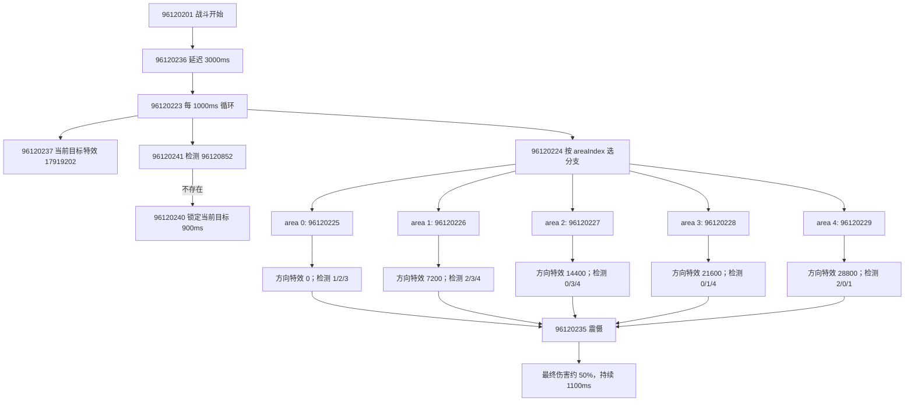
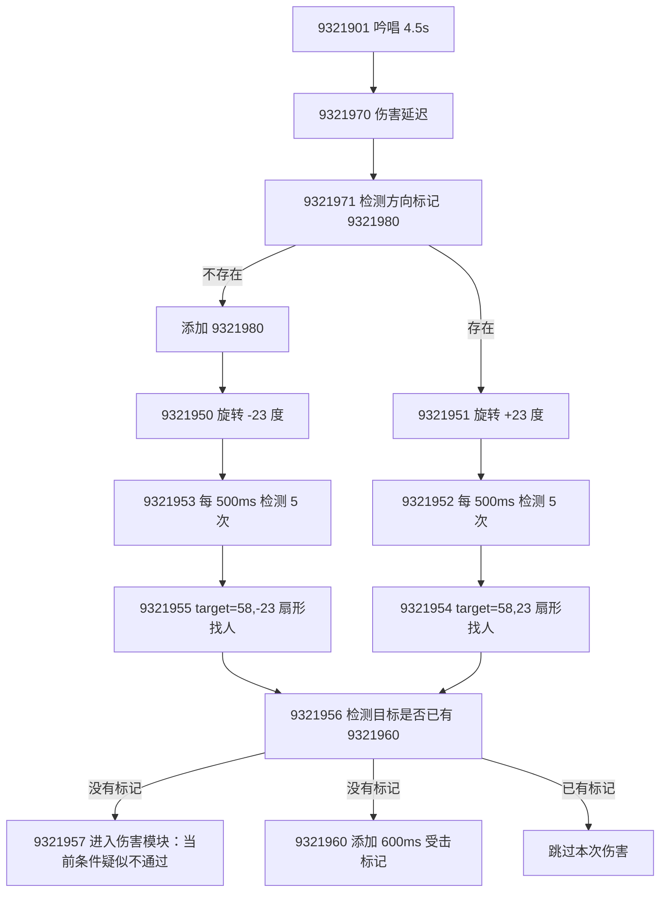
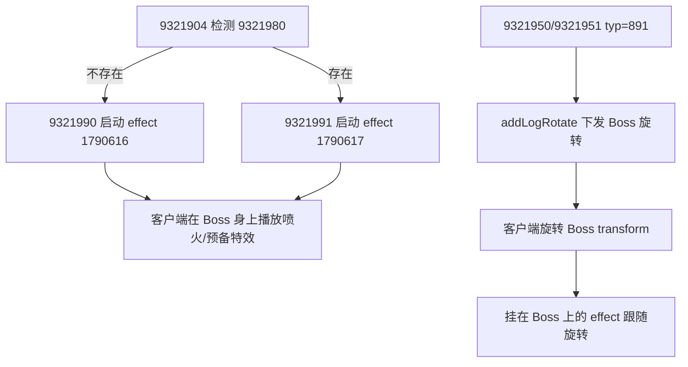

# Battle 技能机制问答

## 目录

- [[#Q1: 961202 特性双首技能机制]]
- [[#Q2: 93219 雷霆喷吐技能机制]]
- [[#Q3: 9321990 怎么控制特效随着 Boss 喷火一起旋转]]

## Q1: 961202 特性双首技能机制

### 问题

阅读 `skill_entry_model_monster3.json` 表、`battle_entry_action` 中 `961202XX` 的技能机制。

### 回答

`961202` 是怪物被动技能「特性：双首」。

配置与文本描述表达的是：共命鸟有【法首】和【非法首】两个头，两个头分别朝向不同且相邻的板块；【法首】是首领主目标朝向，只有【法首】会普通攻击。【法首】转向时，【非法首】跟随转向。角色如果站在双首以外的其他板块，会获得【震慑】状态，造成伤害降低。

### 核心机制

1. 战斗开始后延迟 3 秒启动循环。
2. 每 1 秒检测一次玩家所在板块。
3. 以当前目标所在的音游板块 `navAreaInfo.areaIndex` 作为【法首】方向，映射出相邻的【非法首】方向与安全板块。
4. 不在双首覆盖板块内的敌方角色会获得 `96120235`【震慑】。
5. 【震慑】持续 1.1 秒，每秒循环刷新；效果为最终伤害额外系数 `305` 增加 `-50`，也就是造成伤害约变为 50%。
6. 若不存在 `96120852` 标记，则本轮额外触发 `96120240`，把首领目标锁定 0.9 秒。

### 启动与循环

| 模块 | 作用 |
|---:|---|
| `96120201` | `typ=20003`，战斗开始监听，触发 `96120236` |
| `96120236` | 延迟 3000ms 后触发 `96120223` |
| `96120223` | 永久存在，每 1000ms 运行一次，触发 `96120237`、`96120224`、`96120241` |

### 板块分支

`96120224` 是 `typ=10051`，`data=[5,41,96120225,96120226,96120227,96120228,96120229]`。`10051 case 5` 会用区域配置 `41` 计算 `source -> target` 的圆形板块 ID，然后用板块 ID 选择后续模块。

| 当前目标板块 | 分支模块 | 法首方向特效 | 震慑检测板块 |
|---:|---:|---:|---|
| 0 | `96120225` | `96120242`，角度 `0` | 1、2、3 |
| 1 | `96120226` | `96120243`，角度 `7200` | 2、3、4 |
| 2 | `96120227` | `96120244`，角度 `14400` | 0、3、4 |
| 3 | `96120228` | `96120245`，角度 `21600` | 0、1、4 |
| 4 | `96120229` | `96120246`，角度 `28800` | 2、0、1 |

`96120242~96120246` 都是 `typ=10074` 的带初始坐标 buff/特效模块，使用同一个特效 `17919227`，区别在最后一个角度参数。

### 震慑判定

`96120230~96120234` 是实际给目标加【震慑】的板块筛选模块。

- 目标配置为 `target=[96,41,N]`。
- `targetType=96` 表示「指定配置和区域内的角色」。
- `41` 是区域配置索引。
- `N` 是要命中的区域编号。
- 命中后 `next=[96120235]`。

`96120235` 是【震慑】本体：

- `typ=305`：`entryTypeFinDamageMakeExtra`，造成最终伤害额外系数。
- `data=[2,-91]`：`dataFun=2` 表示取负数，`-91` 表示技能参数 `value1`。
- `monster_skill.json` 中 `961202.value1=[50]`，所以最终值是 `-50`。
- `305` 在伤害计算中以 `100 + value` 的形式参与最终伤害额外系数，因此该状态会让造成伤害约变为 `50%`。
- 持续 `1100ms`，主循环每 `1000ms` 刷新一次，所以持续站在非双首覆盖板块内会稳定续上。

### 目标切换与锁定

| 模块 | 作用 |
|---:|---|
| `96120220` | `typ=20052`，首领切换目标时触发 `96120222`、`96120221` |
| `96120222` | `typ=10018`，清除敌方队伍身上的 `96120221`；带 `dataCondition`，清除时走 `clearNotNext()` |
| `96120221` | `typ=20064`，点击 UI 位移结束事件，更像挂在当前目标上的事件/标记模块 |
| `96120241` | `typ=30000`，检测目标是否存在 `96120852`，不存在则触发 `96120240` |
| `96120240` | `typ=892`，`data=[2]`，把 `source.ai.skillLockTarget` 设置为当前模块目标，持续约 900ms |

### 分支图



## Q2: 93219 雷霆喷吐技能机制

### 问题

阅读 `skill_entry_model_monster.json` 表、`battle_entry_action` 中 `93219XX` 的技能机制。

### 回答

`93219` 是怪物主动技能「雷霆喷吐」。文本描述为：选定当前目标方向开始吟唱，吟唱完毕后持续对前方造成大量伤害，耶梦加得在喷射时会以一定角度缓慢旋转。

从配置和 `battle_entry_action` 看，它的实际链路是：吟唱结束后先记录当前目标位置，再进入持续引导；引导期间每 500ms 左右按正/反方向旋转喷吐中心线，选择扇形内目标，若目标没有本轮受击标记则进入伤害模块并加短暂标记，防止同一目标在短时间内重复进入同一轮判定。

### 技能参数

来自 `monster_skill.json`：

| 参数 | 值 | 用途 |
|---|---:|---|
| `cast` | `4.5` | 吟唱时间 |
| `guideTime` | `10.5` | 引导/持续喷吐时间 |
| `cooldown` | `60` | 冷却 |
| `begincd` | `35` | 初始冷却 |
| `value1` | `30` | 未在本组核心伤害链直接使用 |
| `value2` | `20` | 未在本组核心伤害链直接使用 |
| `value3` | `700` | `9321957` 的伤害值 |
| `value4` | `35` | `9321957` 的条件概率参数 |
| `value5` | `10` | 未在本组核心伤害链直接使用 |

### 主链路

| 模块 | 作用 |
|---:|---|
| `9321901` | `time=[-90,1,0,0]`，`-90` 是吟唱时间；吟唱结束后触发 `9321970` |
| `9321970` | `time=[-80,1,0,0]`，`-80` 是伤害延迟表现；随后触发 `9321971` |
| `9321971` | 检测自身是否存在 `9321980`，存在走 `9321951`，不存在先加 `9321980` 再走 `9321950` |
| `9321980` | 持续 300000ms 的状态标记，用来决定下一次喷吐旋转方向 |
| `9321950` | `typ=891`，按 `-23` 度方向旋转喷吐；触发 `9321953` |
| `9321951` | `typ=891`，按 `+23` 度方向旋转喷吐；触发 `9321952` |
| `9321952` | 每 500ms 触发 `9321954`，共 5 次 |
| `9321953` | 每 500ms 触发 `9321955`，共 5 次 |
| `9321954` | 选择 `+23` 度方向扇形内敌人，进入受击判定 |
| `9321955` | 选择 `-23` 度方向扇形内敌人，进入受击判定 |
| `9321956` | 检测目标是否已有 `9321960`，没有则触发 `9321957` 和 `9321960` |
| `9321957` | 伤害模块，但当前条件配置疑似不会通过，见「伤害与防重复」 |
| `9321960` | 600ms 短标记，防止同一目标在短时间内重复受击 |

### 坐标记录与锁定

| 模块 | 作用 |
|---:|---|
| `9321902` | `typ=892`，锁定/朝向当前目标；`data=[0]` 不改变 `skillLockTarget`，但会下发锁定日志 |
| `9321903` | `typ=282`，`data=[1,3]`；保存当前目标位置，并写到来源自身的 `skillPos` |
| `9321904` | 检测自身是否有 `9321980`，有则触发 `9321991`，没有则触发 `9321990` |
| `9321990` | 表现特效 `1790616` |
| `9321991` | 表现特效 `1790617` |
| `9321905` | `typ=398`，屏蔽嘲讽，持续引导时间 |

`9321903` 是后续旋转喷吐的关键：`typ=282` 的 `data=[1,3]` 表示取「当前目标的位置」，然后因为 `data[0]=1`，最终保存到来源自身的 `skillPos`。`9321950/9321951` 的 `typ=891` 使用 `data[0]=2`，会从 `source.ai.skillPos` 取初始方向点。

### 旋转喷吐

`9321950` 与 `9321951` 都是 `typ=891`，对应 `actionTypeRotate`：

- `data=[2,50,-23]`：以 `skillPos` 为初始方向点，每次旋转 `-23` 度。
- `data=[2,50,23]`：以 `skillPos` 为初始方向点，每次旋转 `+23` 度。
- `data[1]=50` 是旋转日志里的时间参数。
- 每次执行后会调用 `actionRun(mod)`，因此会继续触发后续检测链。

方向交替由 `9321980` 控制：

- 第一次没有 `9321980`：`9321971` 的 `not_pass_trigger` 先添加 `9321980`，再进入 `9321950`，即 `-23` 度方向。
- 后续存在 `9321980`：进入 `9321951`，即 `+23` 度方向。

### 扇形找目标

`9321954` 与 `9321955` 的目标配置为：

- `target=[58,23]`
- `target=[58,-23]`

`targetType=58` 是 `targetTypeKindLastPosAngle`，代码逻辑是：

1. 回溯到上一个旋转模块保存的 `targetPos`。
2. 取旋转模块的 `runCount`。
3. 使用 `角度 * runCount` 计算当前喷吐中心线。
4. 以来源当前位置为圆心，筛选位于该中心线附近的敌方目标。

代码中使用 `dot > cos(angle/2)` 判断是否落在扇形内，所以 `23` 约等价于一个 23 度宽的前方扇形，半角约 11.5 度。

### 伤害与防重复

`9321956`：

- `typ=30000`，检测上个目标是否存在 `9321960`。
- 如果不存在，则触发 `9321957` 和 `9321960`。
- 如果已存在，则不再触发伤害。

`9321960`：

- 持续 `600ms`。
- 作为短暂受击标记。

`9321957`：

- `typ=97`：直接按 `data` 取伤害值。
- `data=[0,1,-93]`
  - 元素 `0`。
  - `dataFun=1` 默认取值。
  - `-93` 是技能参数 `value3`。
  - `value3=700`，因此基础伤害值为 `700`。
- `dataCondition=[[9,212,-94]]`
  - `9` 是「当前正在使用的技能类型」条件。
  - 当前代码里的 `conditionCheckUseSkillType` 要求 `condition[1] == 1` 且目标正在引导技能时才返回 true。
  - 这里的 `condition[1]` 配的是 `212`，不是 `1`。
  - `-94` 是 `value4=35`。
  - 因此按当前实现，这个条件会返回 false，`9321957` 的伤害疑似不会真正生效，除非运行前有其他逻辑改写条件或该配置字段另有生成期约定。

### 整体流程图



### 机制摘要

`93219` 的关键不是单次大范围命中，而是持续喷吐中的多段扇形扫描。技能先锁定并记录当前目标方向，然后在引导期内沿固定角度步进旋转；每次扫描会挑出扇形内、且没有 `9321960` 短标记的目标进入伤害判定。需要特别注意：`9321957` 的 `dataCondition=[[9,212,-94]]` 按当前代码疑似始终不通过，这是这组配置最值得复核的风险点。`9321980` 控制喷吐方向在不同释放间切换，`9321990/9321991` 则提供对应方向的表现特效。

## Q3: 9321990 怎么控制特效随着 Boss 喷火一起旋转

### 问题

`9321990` 怎么控制特效随着 boss 喷火一起旋转的？

### 回答

结论：`9321990` 本身不负责计算旋转；它只负责启动一个挂在 Boss 自身上的特效资源 `1790616`。真正控制喷火方向旋转的是后续 `9321950/9321951` 的 `typ=891`，也就是 `actionTypeRotate`。

### 关键配置

`9321990`：

```json
{
  "id": 9321990,
  "time": [-90, 1, 0, 0],
  "target": [1],
  "kind": 1,
  "typ": 1,
  "effect": 1790616,
  "buff": 3
}
```

`9321991` 与它对应，只是 `effect=1790617`。

这两个模块的作用是根据当前方向状态选择一套表现特效：

| 模块 | 特效 | 触发条件 |
|---:|---:|---|
| `9321990` | `1790616` | `9321904` 检测不到 `9321980` 时触发 |
| `9321991` | `1790617` | `9321904` 检测到 `9321980` 时触发 |

### 特效是怎么启动的

服务端添加 `9321990` 后，会走 `BattleEntry.addModel()`：

1. `mod.start()`
2. `ent.syncModelShow(mod)`
3. `syncModelShow` 发现模块有 `effect`，调用 `addLogEffectStart(mod)`

`addLogEffectStart` 会把以下关键信息发给客户端：

- 模块唯一 key：`mod.key`
- 特效 ID：`1790616`
- 技能 ID
- 目标 key：这里 `target=[1]`，也就是 Boss 自己
- 来源 key：Boss
- 模块类型、模块 ID
- `targetPos`
- 持续时间、已运行时间

所以 `9321990` 的实际语义是：在 Boss 身上启动 `1790616` 这个 effect/buff 表现。

### 旋转是谁控制的

喷火旋转由 `9321950/9321951` 控制：

```json
9321950: "typ": 891, "data": [2, 50, -23]
9321951: "typ": 891, "data": [2, 50, 23]
```

`typ=891` 对应 `actionTypeRotate`。它会：

1. 首次运行时读取 `source.ai.skillPos` 作为初始朝向点。
2. 按 `angle * runCount` 计算每一帧/每次运行后的旋转目标方向。
3. 通过 `source.mgr.log.addLogRotate(...)` 下发 `logActionRotate`。

`addLogRotate` 发给客户端的核心字段是：

- Boss 的 role key
- 旋转时间
- 旋转目标点 `x/y/z`
- 旋转角度

也就是说，服务端旋转的是 Boss 角色朝向，不是直接旋转 `9321990` 这个 effect 模块。

### 为什么特效会跟着喷火转

因为 `9321990` 的特效是以 Boss 为目标/来源启动的表现模块，客户端收到的是「Boss 身上的 effect start」。后续 `9321950/9321951` 持续给同一个 Boss 下发旋转战报，Boss 的 transform/朝向在客户端发生变化。

如果 `1790616` 这个资源配置本身是挂在 Boss 骨骼、挂点或角色朝向上的喷火表现，那么它自然会跟着 Boss 的朝向一起转。

所以完整关系是：



### 机制一句话

`9321990` 只选并启动喷火特效；“跟着 Boss 喷火一起旋转”靠的是 `9321950/9321951` 持续旋转 Boss，而特效资源 `1790616/1790617` 作为 Boss 身上的挂载表现跟随 Boss 朝向变化。
