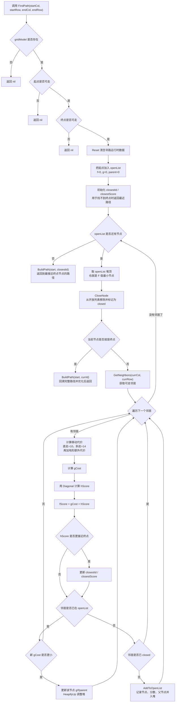

# 目录

- [[#Q1: TTDBL-41297 肉鸽地图加载提交做了什么]]
- [[#Q2: 肉鸽客户端战斗流程是怎样的]]
- [[#Q3: 客户端怎么实现战斗技能效果]]
- [[#Q4: 如何把肉鸽客户端战斗逻辑抽离成可单独运行的 C#]]
- [[#Q5: RoguelikeMonsterSpatialGrid.lua 是做什么的]]
- [[#Q6: Roguelike 战斗寻路的 A* 是怎么使用的]]
- [[#Q7: RoguelikeAStar:HasLineOfSight 是怎么判断直线通路的]]
- [[#Q8: RoguelikeAStar:FindPath 的流程图是什么]]
- [[#Q9: Bresenham 中 e2 > -dy 和 e2 < dx 为什么这样比较]]
- [[#Q10: Bresenham 走 Y 轴时为什么 err 要加 dx]]
- [[#Q11: Bresenham 中 err 加 dx 和减 dy 的数学原理是什么]]
- [[#Q12: A* 中邻居不在 openList 后为什么还要判断是否 closed]]
- [[#Q13: RogueLikeMap_001.json 这张图是怎么通过工具生成的]]
- [[#Q14: 地图编辑器中 preserveAspect 的 Sprite 实际显示区域怎么理解]]
- [[#Q15: HandleMouseInput 在点击的时候为什么会触发]]
- [[#Q16: Unity IMGUI 中 Event.current 和 Use 是做什么的]]
- [[#Q17: RoguelikeVirtualJoystick.lua 详细介绍]]
- [[#Q18: Trajectory 目录下的文件介绍]]
- [[#Q19: RoguelikeBulletTrajHoming 详细介绍]]
- [[#Q20: RoguelikeBulletTrajCurve 详细介绍]]
- [[#Q21: 子弹是怎么检查命中造成伤害的]]
- [[#Q22: RoguelikeSceneCamera 详细介绍]]
- [[#Q23: {normFwd, normRight} 和 curveSpawnProgress 分别是什么]]
- [[#Q24: _ToWorldOffsetXY 怎么理解]]
- [[#Q25:  f70a2f777912afbaaf0de4bbf8c08b09e7c01bad 查看这条提交优化了什么内容]]
- [[#Q26: 将上述优化对应的主要源代码分别贴出来]]

## Q1: TTDBL-41297 肉鸽地图加载提交做了什么

### 问题

介绍 Git 提交 `5db5c752387`：`TTDBL-41297【关卡】【程序】肉鸽开发---地图加载` 的内容。

### 回答

#### 提交概览

- 提交：`5db5c752387d177add9dbf3238529dc96fe95f8f`
- 作者：`zhangyafei <zhangyafei@xd.com>`
- 时间：`2026-05-28 18:21:23 +0800`
- 规模：8 个文件变更，约 271 行新增、23 行删除。

这次提交围绕肉鸽战斗场景的地图加载补齐了两条链路：一条是按关卡配置加载肉鸽地图背景图集，另一条是把场景 prefab 中预摆的环境怪节点扫描出来，并接入战斗逻辑与表现层。

#### 主要改动

1. 新增肉鸽地图图集加载能力

- 在 `GlobalAtlas.TextureType` 中新增 `RoguelikeMap` 类型。
- 新增资源配置：`atlas/Activities/Roguelike/RoguelikeMap/{mapName}`，按地图名动态加载 SpriteAtlas。
- 新增接口：`GlobalAtlas.GetRoguelikeMapSprite`、`GlobalAtlas.SetRoguelikeMapSprite`、`GlobalAtlas.UnloadRoguelikeMap`。
- `UnloadDynamicAtlas` 被调整为兼容 `pathPrefix + atlasName` 的动态 atlas 卸载方式。

2. 场景进入时按配置替换地图背景

- `RoguelikeSceneMain.lua` 新增 `_SetupSceneBgSprites()`。
- 逻辑是读取 `RoguelikeBattleInfoConfig.GetSceneInfo(sceneId)` 的 `bgImage` 字段。
- 如果 `bgImage` 存在，就加载对应肉鸽地图图集，并遍历 `SceneBg` 子节点替换 Image sprite。
- 退出肉鸽战斗主界面时新增 `GlobalAtlas.UnloadRoguelikeMap()`，释放地图图集。

3. 新增环境怪表现实体 `RoguelikeEnvMonsterEntity`

- 新文件：`RoguelikeEnvMonsterEntity.lua`。
- 用途是承载场景 prefab 中预先摆好的固定怪物节点。
- 不走普通怪物对象池，不实现 AI 或位移，坐标直接读取节点 `anchoredPosition`。
- `roleKind` 仍使用 Monster，方便复用技能、受击、AOE 命中等已有链路。
- 初始化时会把环境怪坐标同步给 `RoguelikeBattleHandleManager.UpdatePosition`。
- 支持受击变色闪烁 `FlashHit`，`Dispose` 只还原颜色和状态，不销毁 prefab 节点。

4. `RoguelikeSceneManager` 接入环境怪生命周期

- 新增 `envMonsterEntities` 表，用 `roleId -> RoguelikeEnvMonsterEntity` 管理环境怪表现实体。
- `InitSceneCamera` 中缓存 `sceneMonsterRoot = SceneMapLayer/SceneMonster`。
- 新增 `InitEnvMonsters(battleManager)`：扫描 `SceneMonster` 下所有子节点，将节点名转成 `monsterId`，调用 `battleManager:AddEnvMonster(monsterId)` 创建逻辑 role，再创建环境怪表现实体。
- 如果 `battleManager` 比 `sceneMonsterRoot` 更早初始化，会先缓存到 `_pendingEnvBattleMgr`，等 `InitSceneCamera` 完成后补跑环境怪初始化。
- `UpdateScene` 每帧更新环境怪受击闪烁等被动表现状态。
- `ShowHurtColor` 和 `GetSceneRoleByUid` 都扩展为同时查普通怪和环境怪。
- `ClearBattleEntities` 和 `DestroySceneData` 会清理环境怪逻辑引用，但保留场景节点。

5. 战斗启动流程接入环境怪初始化

- `RoguelikeSceneMainLayer.lua` 的 `InitBattleData` 在创建并初始化 `RoguelikeBattleManager` 后调用 `sceneManager:InitEnvMonsters(battleManager)`。
- 这使得战斗开始时，场景里预摆的怪可以被注册成战斗 role。

6. prefab 增加环境怪挂点

- `RoguelikeSceneMain1.prefab` 的 LFS 指针更新。
- 当前工作区内容显示 prefab 中新增/存在 `SceneMonster` 节点，作为环境怪扫描根节点。

#### 运行链路

1. 打开肉鸽战斗场景。
2. `RoguelikeSceneMain.OnEnter` 保存 `sceneManager`，设置特效根节点，并调用 `_SetupSceneBgSprites()`。
3. `_SetupSceneBgSprites()` 根据当前 `sceneId` 的 `bgImage` 加载肉鸽地图图集并替换背景图。
4. `InitBattleData` 创建 `RoguelikeBattleManager`，初始化玩家、波次和服务端战斗参数。
5. `sceneManager:InitEnvMonsters(battleManager)` 扫描 `SceneMonster` 下的预摆节点。
6. 每个可转成数字的节点名会作为 `monsterId`，注册为环境怪逻辑 role，并绑定一个 `RoguelikeEnvMonsterEntity`。
7. 战斗中通过 `GetSceneRoleByUid`、`ShowHurtColor` 等接口，环境怪可以被技能、伤害表现和特效系统查到。
8. 退出战斗时卸载肉鸽主图集、地图图集、特效图集和怪物图集，并清理环境怪引用。

#### 需要关注的风险

- 当前工作区没有搜到 `RoguelikeBattleManager:AddEnvMonster` 的定义，但本提交在 `RoguelikeSceneManager:InitEnvMonsters` 中调用了它。若该方法没有在其他分支或后续提交补上，运行到环境怪初始化时会报 nil method。
- `SceneMonster` 子节点名必须是可转换为数字的 `monsterId`，否则会被跳过。
- `GlobalAtlas.GetRoguelikeMapSprite` 调用 `LoadDynamicAtlas` 后立刻 `getSprite`，依赖 `GlobalAsset.Load` 是否同步完成；如果加载是异步回调，首次取图可能为空，需要实际运行验证。
- 环境怪没有加入 `monsterSpatialGrid`，范围查询如果只依赖空间网格，可能查不到环境怪；如果命中逻辑走的是 `RoguelikeBattleHandleManager` 的位置缓存，则问题较小。

#### 总结

这次提交的核心价值是把肉鸽场景从固定 prefab 背景和动态刷普通怪，推进到按关卡配置加载地图背景并支持场景预摆环境怪。它为关卡侧制作肉鸽地图提供了基础承载：地图图集由配置驱动，场景中的固定怪物节点也能进入战斗逻辑。不过 `AddEnvMonster` 的缺失需要优先确认，否则这条环境怪链路还不能闭环。

## Q2: 肉鸽客户端战斗流程是怎样的

### 问题

分析 `RoguelikeBattleManager` 及相关脚本，总结肉鸽客户端战斗流程。

### 回答

#### 一句话概览

肉鸽客户端战斗是一个“服务端状态推送驱动开局/暂停/事件，本地客户端逐帧模拟战斗表现与部分逻辑”的系统。`RoguelikeSceneMainLayer` 负责 UI 入口和服务端 push，`RoguelikeBattleManager` 负责战斗逻辑主循环，`RoguelikeBattleWaveManager/RoguelikeBattleWave` 负责波次出怪，`RoguelikeBattleRole/Skill/Entry` 负责角色、技能和词条时间轴，`RoguelikeSceneManager + RoguelikeBattleViewManager` 负责场景表现。

#### 入口与场景初始化

1. 打开肉鸽战斗界面时，入口在 `RoguelikeSceneMainLayer.OnEnter(battleId)`。
2. 根据 `battleId` 读取 `RoguelikeBattleInfoConfig.GetBattleInfo(battleId)`，再通过 `sceneId` 读取场景配置。
3. 关闭主线战斗相机、隐藏主线场景 root，避免肉鸽 UI 场景和主线场景叠在一起。
4. 注入肉鸽场景 prefab 路径：`RoguelikeBattle/RoguelikeScene/{sceneInfo.scenePath}`。
5. 创建 `RoguelikeSceneManager.new(battleSceneId)`，调用 `InitGridModel()` 初始化地图网格和 A*。
6. `AcquirePartial("SceneItem", ..., sceneManager)` 加载场景表现层 `RoguelikeSceneMain.lua`。
7. 调用 `BattleService.GetOperBattleData(InstanceType.Roguelike)` 向服务端拉取/等待当前战斗数据。

#### 服务端推送驱动战斗状态

核心监听在 `PostEvent[ViewEvent.OnPushOperBattleData]`：

- `BattleReady`：如果没选英雄，打开选英雄界面；如果已有英雄，初始化战斗数据并打开技能选择。
- `Fighting`：第一次进入战斗态时调用 `BattleStart()`。
- `BattlePause`：表示服务端让客户端暂停战斗并打开事件/选技能/选英雄等 UI。
- `BattleEnd`：标记暂停，后续结算上传由本地 `BattleEnd` 事件处理。

`eventID` 的含义大致是：

- `0`：无事件。
- `1`：选英雄。
- `2`：升级选技能。
- `>2`：肉鸽事件，根据 `eventType` 打开宝箱、Joker、Lucky、LuckyCycle、Valkyrie 等界面。

#### 战斗数据初始化

`InitBattleData(playerData, wave, rogueMode, levelUpgradeRate)` 做这些事：

1. 清理上一场残留的场景实体、玩家血条、经验 UI 状态。
2. 调用场景 partial 的 `UpdatePlayer(heroId)`，创建玩家表现节点。
3. 初始化摇杆 `sceneManager:InitSceneJoyStick(...)`。
4. 把 `sceneManager` 注入 `RoguelikeBattleViewManager.InitSceneMgr(sceneManager)`，之后逻辑层可以通过 ViewManager 创建怪、子弹、AOE、掉落等表现。
5. 创建 `battleManager = RoguelikeBattleManager.new()`。
6. 调用 `battleManager:Init(battleID, playerData, wave)`：
   - 初始化 `RoguelikeBattleHandleManager` 的全局 battleMgr 引用。
   - 读取战斗配置。
   - `Reset()` 清理旧状态。
   - `InitEntryManager()` 初始化技能轴管理器。
   - `_InitPlayer(playerData)` 创建玩家逻辑 role，并把玩家 roleId 传给表现层。
   - `_InitWaves(playerData)` 初始化波次管理器，并配置出怪回调。
7. 调用 `battleManager:SetServerBattleData(rogueMode, levelUpgradeRate)`，写入服务端下发的战斗模式和升级经验倍率。
8. 调用 `sceneManager:InitEnvMonsters(battleManager)` 尝试把场景预摆环境怪注册进战斗。

#### 战斗开始

`BattleStart(rogueData, frame)` 会：

1. 确认 `battleManager` 已初始化。
2. 根据服务端玩家技能快照刷新主动/被动技能栏。
3. 调用 `battleManager:StartBattle(rogueData.battleInFrameNum, frame)`。
4. `StartBattle` 内部重置暂停、结束、结果、时间帧信息，然后调用 `waveManager:StartWaves()` 启动波次。

#### 每帧主循环

帧循环在 `RoguelikeSceneMainLayer.OnLateUpdate()`：

1. 如果客户端 UI 处于暂停，直接 return。
2. 如果 `WaveWarning` 正在显示，只刷新告警倒计时、经验和波次 UI，不更新场景/战斗。
3. 正常情况下先调用 `sceneManager:UpdateScene(dt)`：
   - 更新摇杆和相机。
   - 同步玩家位置到 `RoguelikeBattleHandleManager.UpdatePosition`。
   - 更新玩家、怪物、环境怪、子弹、AOE、Buff、特效等表现。
   - 更新怪物空间网格和对象池预热。
4. 再调用 `battleManager:Update(dt)`：
   - 更新波次管理器。
   - 更新所有怪物逻辑 role。
   - 更新玩家逻辑 role。
   - 做玩家与怪物接触碰撞检测。
   - 更新 `entryManager` 中所有运行中的词条时间轴。
   - 自动拾取经验。
   - 检查战斗结束条件。
   - 定时聚合上传肉鸽战报。
5. 更新玩家血条、经验条、战斗时间和波次显示。

#### 波次与出怪

波次由 `RoguelikeBattleWaveManager` 统一调度：

- `Init(waveIds, waveMax)` 读取一组波次配置。
- `StartWaves()` 启动第一波，重连时会根据 `waveInfo` 找到未完成波次恢复。
- `_LaunchWave(waveIndex)` 创建单个 `RoguelikeBattleWave`。
- 每个 `RoguelikeBattleWave` 负责自己的刷怪计时、`monsterGroup1/2/3` 并行刷怪、`groupTimes`、`rate`、`groupRandom`、`forceTime`、`killNum`、清场判断。

怪物创建链路：

1. `RoguelikeBattleWave:_SpawnGroup()` 抽取怪物组。
2. `_CreateMonster(monsterId)` 创建 `RoguelikeBattleRole`，写入 `battleManager.monsters[roleId]`。
3. 通过回调 `onMonsterSpawn` 调用 `RoguelikeBattleViewManager.AddMonster(uid, groupId, monsterId)`。
4. `RoguelikeSceneManager:AddMonster()` 从对象池取怪物 prefab，初始化 `RoguelikeMonsterEntity`，插入空间网格。

下一波触发条件有三类：

- `killNum` 达成。
- `forceTime` 到期。
- 出怪结束后自然清场。

#### 角色、技能、词条

`RoguelikeBattleRole` 是玩家和怪物的共同逻辑载体，存血量、攻击、防御、暴击、攻速、技能、Buff、护盾、位置、经验和统计数据。它每帧更新状态、无敌计时、技能 CD、Buff、护盾、属性修改器；玩家还会做与怪物的接触碰撞。

`RoguelikeBattleRoleSkill` 管技能 CD 和自动释放：

- 初始化时根据技能 `modelId * 100 + 1..9` 找到起始词条轴。
- 被动技能 `Activate()` 时直接启动词条轴，并保持激活。
- 主动技能按 `beginCD -> cooldown -> Ready -> 自动 Cast` 的节奏循环。
- Ready 后每帧自动尝试释放，释放成功后通过 `battleManager:StartSkillEntries(owner, skill)` 把技能起始轴加入 `entryManager`。

`RoguelikeBattleEntryManager` 管所有运行中的词条：

- `StartSkillEntries(source, skill)` 按技能起始 entryId 创建 `RoguelikeBattleEntry`。
- `GetAddEntryByTarget()` 通过 `RoguelikeBattleTarget` 选择目标。
- `AddEntry()` 按 `refresh` 策略决定新增、刷新、覆盖或叠层。
- `Update(dt)` 每帧推进所有运行中的 entry。

`RoguelikeBattleEntry` 负责 delay、duration、count、rate、dataCondition、trigger/next 链式触发、bind 子轴生命周期绑定、结束时清理子弹/AOE/Buff/特效/冲锋等表现。

真正执行效果在 `RoguelikeBattleEntryAction.RunAction(entry)`：属性类词条通常不主动执行，而是作为运行中模块被角色属性查询读取；行为类词条会创建子弹、AOE、Buff 表现、冲锋、护盾、眩晕、召唤、伤害、回血、加技能等。

#### 伤害、死亡、掉落、升级

伤害链路：

1. 词条行为 `Damage` 或 `Damage100` 计算伤害。
2. 调用目标 `RoguelikeBattleRole:TakeDamage(finalDamage, attacker, damageType, hitColor)`。
3. `TakeDamage` 处理真无敌、护盾、致命伤免疫、扣血、受击变色、跳字、死亡。
4. 实际造成伤害后触发目标身上的 `EventWhenRoleTakeDamage`、攻击者身上的 `EventWhenRoleMakeDamage`，并记录运营战报技能伤害。

死亡链路：

1. `RoguelikeBattleRole:_OnDeath(killer)` 设置死亡状态。
2. 触发击杀者的 `EventWhenKillEnemy`、`EventWhenKillNumMeet`。
3. 清 Buff。
4. 回调 `battleManager:OnRoleDead(role, killer)`。

怪物死亡后：

- 记录击杀战报。
- 根据死亡位置生成经验掉落。
- 通知表现层移除怪物。
- 通知波次管理器 `waveManager:OnMonsterDead(role)` 推进 killNum/清场逻辑。

经验拾取：

- `battleManager:_UpdateAutoPickup()` 每帧检查玩家拾取范围。
- 范围内掉落会触发 `EventWhenPickUp`，移除掉落表现，并调用 `player:AddExp(...)`。
- 玩家升级后 `OnRoleLevelUp` 触发 `RoleLevelUp` 事件，刷新 UI，并立即 flush 战报聚合。

#### 战斗结束与退出清理

`battleManager:_CheckBattleEnd()` 每帧检查：

- 玩家死亡：故事模式失败，其他模式按成功结算。
- 有波次配置时：所有波次完成且所有怪死亡，判定胜利。

结束时 `_EndBattle(result)` 标记 `isEnded` 和 `battleResult`，生成统计信息，发送 `RoguelikeBattleEvent.BattleEnd`。UI 层收到后调用 `OperBattleLogService.UploadRoguelikeBattleReport(battleManager, result)` 上传战报。

`RoguelikeSceneMainLayer.OnExit()` 会恢复主线相机和场景显示状态，释放 partial，卸载肉鸽相关图集，清理跳字和血条，`battleManager:Reset()` 清理战斗逻辑、波次、entryManager、战报上传状态，解除 `RoguelikeBattleViewManager` 对 `sceneManager` 的引用，并销毁场景数据。

#### 关键脚本分工

- `RoguelikeSceneMainLayer.lua`：肉鸽战斗 UI 总入口，处理服务端 push、状态切换、暂停事件、技能选择、帧循环、退出清理。
- `RoguelikeBattleManager.lua`：战斗逻辑核心，管理玩家、怪物、波次、战斗时间、死亡、掉落、经验、结算、战报。
- `RoguelikeBattleWaveManager.lua`：波次总调度，负责启动波次、重连恢复、下一波触发、全部完成判断。
- `RoguelikeBattleWave.lua`：单波刷怪逻辑，负责 monsterGroup、rate、time、forceTime、killNum、清场。
- `RoguelikeBattleRole.lua`：角色模型，负责属性、技能、Buff、护盾、血量、经验、碰撞、死亡。
- `RoguelikeBattleRoleSkill.lua`：技能 CD、自动释放、被动激活、起始词条轴收集。
- `RoguelikeBattleEntryManager.lua`：技能词条时间轴管理，负责创建、刷新、更新、清理 entry。
- `RoguelikeBattleEntry.lua`：单个词条轴，负责 delay/duration/rate/count、触发、next、bind、结束清理。
- `RoguelikeBattleEntryAction.lua`：词条行为实现，负责伤害、子弹、AOE、Buff、召唤、控制、特效等实际效果。
- `RoguelikeBattleEvent.lua`：监听型词条事件分发，例如受伤、造成伤害、击杀、拾取、升级。
- `RoguelikeBattleViewManager.lua`：逻辑层到表现层的桥，统一把 AddMonster/AddBullet/AddAOE 等请求转给 SceneManager。
- `RoguelikeSceneManager.lua`：场景表现核心，负责相机、摇杆、实体对象池、怪物/子弹/AOE/特效表现更新。
- `RoguelikeBattleHandleManager.lua`：全局逻辑桥，供表现层或外部系统更新位置、取技能、取移速、添加技能、自伤等。

#### 当前观察到的注意点

- 客户端战斗有明显的本地模拟成分：技能、伤害、拾取、波次推进都在客户端跑，同时通过 `OperBattleLogService` 上传过程日志。
- 服务端 push 主要负责战斗大状态、玩家技能快照、选项事件和重连数据。
- 主动技能是自动释放，不是玩家手动点技能。
- 场景位置是表现层和逻辑层共享的关键：玩家/环境怪通过 `UpdatePosition` 同步，普通怪由表现实体移动并被逻辑/表现查询使用。
- `InitEnvMonsters` 调用了 `battleManager:AddEnvMonster`，但当前代码中没有搜到该方法定义；这条环境怪注册链路仍需要确认是否缺提交。

## Q3: 客户端怎么实现战斗技能效果

### 问题

客户端怎么实现肉鸽战斗技能效果？

### 回答

#### 总体机制

客户端不是为每个技能单独写一段硬编码逻辑，而是用一套配置驱动的技能模块系统实现技能效果：

`技能配置 RoguelikeSkill -> 技能对象 RoguelikeBattleRoleSkill -> 起始词条 Entry -> EntryManager 时间轴调度 -> EntryAction 执行具体效果 -> ViewManager/SceneManager 创建表现`

简单说，技能本体只负责“什么时候释放”和“从哪些模块开始”，真正的效果由一串 `RoguelikeBattleEntry` 词条模块组合出来。

#### 技能如何变成时间轴

`RoguelikeBattleRoleSkill:Init(config)` 会读取技能配置：

- `kind`：主动/被动。
- `beginCD`、`cooldown`：初始 CD 和循环 CD。
- `modelId`：技能模型 ID。
- `value1 ~ value7`：技能参数，供词条公式引用。
- `levelAdvance`：技能等级突破后替换参数。
- `group`：技能组，用于弹道数量、颜色、穿透、AOE 半径等运行时覆盖。

关键点是起始词条 ID 的生成方式：

```lua
entryId = modelId * 100 + 1..9
```

客户端会检查 `modelId * 100 + 1` 到 `modelId * 100 + 9` 这些模块是否存在，存在就加入 `startEntryIds`。所以一个技能可以有多条并行起始轴。

#### 主动技能与被动技能

技能加入角色后会调用 `skill:Activate()`：

- 被动技能：立即调用 `battleManager:StartSkillEntries(owner, skill)`，把起始词条挂到 `EntryManager`。被动通常表现为持续属性模块、监听事件模块、持续 Buff 等。
- 主动技能：先走 `beginCD`，再进入 `cooldown`。CD 结束后状态变成 `Ready`，每帧自动尝试释放，不需要玩家手动点技能。

主动技能每帧更新逻辑在 `RoguelikeBattleRoleSkill:Update(dt)`：

1. 等待 `beginCD`。
2. 施法中则推进 `castTime`。
3. 冷却中则递减 `currentCooldown`。
4. Ready 后自动 `_TryStartCast(true)`。
5. 释放成功后进入 `Casting`，并启动技能起始词条。

#### EntryManager 怎么调度技能模块

`RoguelikeBattleEntryManager` 是技能效果的时间轴管理器。

释放技能时：

1. `StartSkillEntries(source, skill)` 读取 `skill.startEntryIds`。
2. `AddEntryByIds()` 为每个 entryId 创建 `RoguelikeBattleEntry`。
3. `GetAddEntryByTarget()` 通过 `RoguelikeBattleTarget` 选目标。
4. `AddEntry()` 按 `refresh` 策略处理已有模块：
   - 直接新增。
   - 按 entryId/source/target 刷新。
   - 按 entryType/target 覆盖。
   - 按 source/entryType/target 覆盖。
   - 刷新时可叠层或重置计时。
5. 每帧 `entryManager:Update(dt)` 推进所有运行中的 Entry。

#### 目标选择

目标选择由 `RoguelikeBattleTarget` 根据词条配置决定，不由技能代码硬写。

常见目标类型包括：

- `Self`：自己。
- `Ally`：友方。
- `Enemy`：敌方，并受攻击距离限制。
- `EnemyNoRange`：敌方，不受攻击距离限制。
- `LastModTarget`：上一个模块的目标。
- `EventTarget`：事件触发时记录的目标。
- `MonitorDamageSource`：伤害来源。
- `MonitorDamageTarget`：伤害目标。
- `EventTargetAlliesInRadius`：事件目标半径内友方。

目标还能按血量百分比、距离、随机等方式排序，再按 `maxTargetCount` 截取。

#### Entry 单个模块如何执行

`RoguelikeBattleEntry` 表示一个技能模块，自己维护：

- `delay`：延迟多久触发。
- `duration`：持续多久。
- `count`：触发次数。
- `rate`：多次触发间隔。
- `dataCondition`：执行条件。
- `trigger`：触发时立刻拉起的后续模块。
- `next`：模块结束时拉起的后续模块。
- `bind`：生命周期绑定的子模块。
- `data`：模块参数。

Entry 开始后：

1. `Start()` 初始化计时。
2. 到达 `delay` 后 `_DoTrigger()`。
3. `_DoTrigger()` 先检查 `RoguelikeBattleCondition.CheckAll(entry)`。
4. 条件满足后调用 `RoguelikeBattleEntryAction.RunAction(entry)`。
5. 持续时间结束后 `Finish()`，触发 `nextIds`，并清理表现对象。

#### EntryAction 实现哪些技能效果

具体效果集中在 `RoguelikeBattleEntryAction.lua`。它按 `entry.entryType` 分发到不同实现。

主要类型可以分几类：

1. 表现与命中类

- `Bullet`：从 source 发射弹道。
- `Bullet2`：从 target 位置发射弹道，方向仍按 source 到 target。
- `AOEWarning`：创建 AOE 预警圈。
- `LockTargetWarning`：锁定目标当前位置或跟随一段时间后锁定。
- `AOEEffect`：点位 AOE 动效，到期后收集命中目标。
- `AOEBuffEffect`：持续 AOE 区域，每隔一段时间 tick 命中。
- `FollowSourceAoeBuffEffect`：跟随 source 移动的持续 AOE。
- `BuffShow`：给目标挂 Buff 表现。
- `ChargeArrow`：冲锋预备箭头。
- `AddEffect`：挂接普通特效，可挂在角色或另一个特效上。

2. 伤害与生命类

- `Damage`：纯数值伤害。
- `Damage100`：按攻击、防御、暴击、增伤/受伤乘区等公式计算伤害。
- `CurrentHp`：修改当前血量。
- `MaxHp`：修改最大血量。
- `Shield`：添加护盾。

3. 属性模块类

这些通常不主动执行，而是作为运行中的模块，被角色属性查询时读取：

- `Attack`
- `Defense`
- `AttackSpeed`
- `Crit`
- `CritDamage`
- `MoveSpeed`
- `ChangeBulletSize`
- `ChangeBulletSpeed`
- `AtkDistance`
- `FinalDamageAdd`
- `FinalDamageMul`
- `FinalDamageHitMul`
- `PickUpRange`
- `DropExpRange`

4. 控制与位移类

- `Stun`：眩晕目标，冻结移动和技能更新。
- `StopMovement`：冻结 source 的 AI 位移。
- `Charge`：让 source 冲锋到目标点，碰撞目标时触发后续模块。
- `ClearMod`：清除目标身上的指定模块。

5. 技能修改与召唤类

- `GetSkill`：给角色添加技能。
- `Summon`：创建召唤物，并可以让召唤物作为 source 触发后续模块。
- `ChangeBulletNumAndAngle`：修改某技能组弹道数量和角度。
- `ChangeBulletMultyValid` / `ChangeBulletValidCount`：修改弹道穿透/有效次数。
- `ChangeBulletColor`：修改弹道颜色。
- `ChangeSkillAOERadius`：修改某技能组 AOE 半径。

6. 事件监听类

- `EventWhenRoleMakeDamage`
- `EventWhenRoleTakeDamage`
- `EventWhenKillEnemy`
- `EventWhenKilled`
- `EventWhenPickUp`
- `EventWhenTargetLevelUp`
- `EventWhenKillNumMeet`
- `EventWhenRoleCollider`

这些监听模块通常作为被动技能或持续模块挂在角色身上。当对应事件发生时，`RoguelikeBattleEventHandler.TriggerTargetListener()` 找到目标身上对应类型的 Entry，再触发它的 `triggerIds`。

#### 子弹技能怎么实现

以 `Bullet` 为例：

1. EntryAction 读取 `data[1]` 得到 `bulletId`。
2. 读取 `data[2]` 得到弹道轨迹 ID，`data[3]` 得到角度，`data[4]` 得到弹道数量，`data[5]` 得到扇形角度。
3. 根据 source 身上的模块读取弹速、弹体大小加成。
4. 根据技能组读取运行时覆盖：弹道数量、角度、穿透次数、颜色。
5. 为每颗子弹分配 `bulletUid`。
6. 调用 `RoguelikeBattleViewManager.AddBullet(...)`。
7. ViewManager 转给 `RoguelikeSceneManager:AddBullet()` 创建表现实体。
8. 子弹命中时回调 `colTargetId`：
   - 找到命中角色。
   - 写入 `entry.eventTarget`。
   - 写入命中颜色 `_hitColor`。
   - 调用 `entry:_TriggerImmediateEntries()` 触发后续模块，通常后面接 `Damage100`。
   - 命中次数达到上限后移除子弹。

所以子弹本身不直接造成伤害，它只是命中检测和触发器；真正伤害通常由后续 `triggerIds` 接的伤害模块执行。

#### AOE 技能怎么实现

AOE 通常拆成两段：

1. 预警模块

- `AOEWarning` 或 `LockTargetWarning` 创建预警圈。
- 可以按轨迹配置生成多个点，也可以锁定目标。
- 预警结束后触发后续模块，或把锁定坐标记录到 Entry 上。

2. 命中模块

- `AOEEffect` 在点位生成命中特效，到期收集范围内目标并触发后续模块。
- `AOEBuffEffect` 是持续区域，每隔 tickInterval 收集一次目标并触发后续模块。
- `FollowSourceAoeBuffEffect` 每帧跟随 source，半径可受技能组 AOE 半径加成影响。

命中目标后同样不是 AOE 自己直接扣血，而是把命中目标写到 `entry.eventTarget`，再触发 `triggerIds`，由后续伤害或控制模块处理。

#### 伤害怎么计算

`Damage100` 是主要战斗伤害公式，流程在 `RoguelikeBattleEntry:CalculateDamage100()`：

1. 先用 `RoguelikeBattleData.GetFinalValue(entry.data, context)` 算出基础系数。
2. 读取攻击者最终攻击 `GetFinalAttack()`。
3. 读取暴击率、暴击伤害。
4. 读取固定加伤 `AtkAddDamge`。
5. 读取最终伤害加算 `FinalDamageAdd`。
6. 读取最终伤害乘算 `FinalDamageMul`。
7. 读取目标受到伤害乘算 `FinalDamageHitMul`。
8. 读取目标防御，并按 `defense / (defense + 500)` 做减伤。
9. 判断暴击。
10. 加上不吃增伤链的固定伤害 `AtkFinalAddDamage`。
11. 返回最终伤害。

扣血由 `RoguelikeBattleRole:TakeDamage()` 完成：

- 真无敌直接免疫。
- 先扣护盾。
- 致命伤前触发 `EventWhenKilled`，允许致命伤免疫模块生效。
- 扣血后发跳字和受击变色。
- 血量归零后走死亡流程。
- 实际造成伤害后触发造成伤害/受到伤害监听，并记录战报。

#### 参数公式怎么实现

技能和词条参数由 `RoguelikeBattleData.GetFinalValue()` 解释。

配置里的 `data` 不是只能填固定数字，还能表达：

- 原始值。
- 取负。
- 百分比。
- 当前攻击力。
- 最大生命百分比。
- 当前生命。
- 角色等级。
- 召唤者攻击/血量。
- 每损失一定生命获得数值。
- 加法、乘法。

技能参数可以用负数占位符引用，例如：

- `-80`：`warningTime`
- `-90`：`castTime`
- `-91 ~ -97`：`value1 ~ value7`
- `-200`：`guideTime`

因此同一套 Entry 模块可以被不同技能复用，只要技能配置里的 value 不同，实际效果数值就不同。

#### 表现层如何接入

逻辑层不直接操作 prefab，而是通过 `RoguelikeBattleViewManager`：

- `AddBullet`
- `AddAOE`
- `AddAOEEffect`
- `AddAOEBuffEffect`
- `AddBuffShow`
- `AddEffect`
- `AddCharge`
- `AddMonster`

`RoguelikeBattleViewManager` 根据 roleId 找到场景实体，再调用 `RoguelikeSceneManager`。`SceneManager` 负责对象池、实例化、更新、回收和命中检测回调。

这让技能逻辑和 Unity 表现有一层隔离：EntryAction 只描述“我要创建一个子弹/AOE/特效”，具体 prefab 怎么取、怎么挂、怎么回收交给 SceneManager。

#### 总结

客户端技能效果的核心是“模块化时间轴”。技能配置只定义起始模块和参数，释放时由 `EntryManager` 把模块串起来；模块通过 target、condition、trigger、next、bind 组合成完整技能；具体行为由 `EntryAction` 执行；表现通过 `ViewManager/SceneManager` 落地。这样一来，策划可以用配置组合出子弹、AOE、Buff、监听、召唤、控制、属性加成等复杂技能，而客户端代码只需要维护通用模块能力。

## Q4: 如何把肉鸽客户端战斗逻辑抽离成可单独运行的 C#

### 问题

把 `RoguelikeBattle` 相关的客户端战斗逻辑单独抽离出来，改写成 C#，使得客户端可以自己单独跑战斗，不依赖服务器返回的数据；有些数据可以读表，读不到就先写死。

### 回答

#### 已完成的实现

新增了一套独立 C# 战斗核心，目录：

`Assets/Scripts/RoguelikeBattle/Standalone/`

新增文件：

- `RoguelikeBattleTypes.cs`：战斗枚举、基础结构、启动参数、事件结构。
- `RoguelikeBattleConfig.cs`：配置数据结构、配置读取接口 `IRoguelikeBattleConfigProvider`、默认硬编码兜底配置 `RBDefaultConfigProvider`。
- `RoguelikeBattleManager.cs`：本地战斗主循环，负责启动、更新、角色、怪物、掉落、经验、结算、事件派发。
- `RoguelikeBattleRole.cs`：角色逻辑，负责属性、技能、血量、护盾、经验、死亡、受击。
- `RoguelikeBattleSkillEntry.cs`：技能、词条管理器、词条时间轴。
- `RoguelikeBattleTargetFormulaAction.cs`：目标选择、参数公式、词条行为执行器、事件监听触发。
- `RoguelikeBattleWave.cs`：波次管理和单波刷怪。
- `RoguelikeStandaloneBattleRunner.cs`：纯 C# runner，方便无 Unity 场景时直接跑模拟。
- `RoguelikeStandaloneBattleDriver.cs`：Unity `MonoBehaviour` driver，可挂到场景里跑本地战斗并输出事件日志。

#### 当前 C# 战斗核心的运行方式

纯 C# 使用：

```csharp
var runner = new RoguelikeStandaloneBattleRunner(new RBDefaultConfigProvider(), 7);
runner.Start();
runner.RunUntilEnd(0.05f, 120f);
```

Unity 场景使用：

1. 新建空 GameObject。
2. 挂载 `RoguelikeStandaloneBattleDriver`。
3. 勾选 `autoStart`。
4. 运行场景后会用默认配置启动本地肉鸽战斗，并通过 `Debug.Log` 输出事件。

#### 抽离后的核心链路

1. `RoguelikeBattleManager.StartLocalBattle()` 本地启动战斗，不需要服务端 push。
2. 通过 `IRoguelikeBattleConfigProvider` 读取战斗、角色、技能、词条、波次、怪物组配置。
3. 读不到真实配置时，`RBDefaultConfigProvider` 使用硬编码兜底数据。
4. `RBWaveManager` 根据本地配置启动波次并刷怪。
5. `RBRole` 每帧更新技能。
6. `RBSkill` 按 CD 自动释放。
7. `RBEntryManager` 启动技能词条时间轴。
8. `RBEntryAction` 执行伤害、回血、护盾、眩晕、召唤、虚拟子弹/AOE触发等效果。
9. `RoguelikeBattleManager.Update()` 每帧推进波次、角色、词条、拾取、结算。
10. 所有关键节点通过 `EventEmitted` 派发 C# 事件，可由表现层监听并自行创建特效/子弹/UI。

#### 当前支持的能力

- 本地启动战斗。
- 本地波次刷怪。
- 玩家与怪物 role 创建。
- 技能 CD 自动释放。
- Entry 时间轴。
- 目标选择：自己、友方、敌方、无距离敌方、上个模块目标、事件目标。
- 参数公式的基础求值。
- `Damage` / `Damage100`。
- 攻击、防御、攻速、暴击、伤害加成、拾取/经验倍率等属性型模块读取。
- 护盾、眩晕、回血、最大血量修改。
- 召唤物。
- 掉落经验和自动拾取。
- 玩家升级。
- 胜负结算。
- 事件日志输出。

#### 与 Lua 版的差异

- 这是第一版独立 C# core，重点是让客户端脱离服务端数据也能跑完整战斗闭环。
- 子弹、AOE 目前以“虚拟命中触发”的方式处理，没有接 Unity 表现层物理/碰撞实体；后续可以把 `EventEmitted` 接到真正的 C# Scene/Projectile 层。
- 配置读取先用 `IRoguelikeBattleConfigProvider` 抽象出来，默认实现是硬编码。后续可以新增一个 Provider 去读导出的表数据。
- 事件监听、条件、复杂 AOE、弹道轨迹、Buff 表现、对象池等还没有完全等价迁移，需要按技能覆盖范围继续补。

#### 已验证

用本地 C# 编译器验证独立核心可编译：

```bash
csc -target:library -out:/tmp/rogue_cs_check/RogueStandalone.dll \
  Assets/Scripts/RoguelikeBattle/Standalone/RoguelikeBattleTypes.cs \
  Assets/Scripts/RoguelikeBattle/Standalone/RoguelikeBattleConfig.cs \
  Assets/Scripts/RoguelikeBattle/Standalone/RoguelikeBattleManager.cs \
  Assets/Scripts/RoguelikeBattle/Standalone/RoguelikeBattleRole.cs \
  Assets/Scripts/RoguelikeBattle/Standalone/RoguelikeBattleSkillEntry.cs \
  Assets/Scripts/RoguelikeBattle/Standalone/RoguelikeBattleTargetFormulaAction.cs \
  Assets/Scripts/RoguelikeBattle/Standalone/RoguelikeBattleWave.cs \
  Assets/Scripts/RoguelikeBattle/Standalone/RoguelikeStandaloneBattleRunner.cs
```

并用纯 C# runner 跑过默认兜底战斗，结果可以在 120 秒内跑到 `Win`。

## Q5: RoguelikeMonsterSpatialGrid.lua 是做什么的

### 问题

介绍 `RoguelikeMonsterSpatialGrid.lua` 这个脚本。

### 回答

#### 脚本定位

`RoguelikeMonsterSpatialGrid.lua` 是肉鸽战斗表现层里的“怪物空间哈希网格”。

它的作用是把场景按固定大小的格子切开，然后把怪物实体登记到自己所在的格子里。子弹、AOE 做命中检测时，不再遍历全场所有怪物，而是只查询命中区域覆盖到的几个格子里的怪物候选。

核心收益是把范围查询从：

`O(怪物总数)`

降低到：

`O(查询覆盖格子里的怪物数)`

怪物多、子弹多、AOE 多的时候，这个优化很关键。

#### 数据结构

默认格子大小：

```lua
local DEFAULT_CELL_SIZE = 128
```

内部主要有三张表：

```lua
self._cells = {}
self._entityCellX = {}
self._entityCellY = {}
```

含义：

- `_cells[gx][gy] = { [entity] = true }`
  - 二维格子表。
  - 每个格子里存当前落在该格子的怪物实体。
- `_entityCellX[entity] = gx`
  - 记录某个实体当前所在格子的 X 坐标。
- `_entityCellY[entity] = gy`
  - 记录某个实体当前所在格子的 Y 坐标。

`_entityCellX/Y` 的意义是：怪物移动时可以 O(1) 找到旧格子，快速从旧格子移除并插入新格子，不需要反向遍历 `_cells`。

#### 格子坐标怎么算

脚本用场景坐标除以 cellSize 后向下取整：

```lua
local gx = math.floor(x / self._cellSize)
local gy = math.floor(y / self._cellSize)
```

所以坐标 `(0, 0)` 到 `(127, 127)` 都属于格子 `(0, 0)`；坐标 `(128, 0)` 属于 `(1, 0)`。

负坐标也能支持，因为 `math.floor` 会把负数落到负格子，例如 `-1 / 128` 会落到 `-1`。

#### 主要接口

1. `Insert(entity, x, y)`

把实体插入到 `(x, y)` 对应的格子。

流程：

- 算出 `gx, gy`。
- 如果格子不存在就创建。
- `cell[entity] = true`。
- 记录实体当前格子 `_entityCellX/Y`。

怪物创建时会调用它：

```lua
self.monsterSpatialGrid:Insert(monsterEntity, mp.x, mp.y)
```

2. `Remove(entity)`

从当前格子移除实体。

流程：

- 用 `_entityCellX/Y` 找到实体旧格子。
- 从旧格子里删掉 `cell[entity]`。
- 清空实体的格子索引记录。

怪物回收/死亡移除时会调用：

```lua
self.monsterSpatialGrid:Remove(monsterEntity)
```

3. `UpdatePos(entity, x, y)`

更新实体位置。

这是最常用的接口。每帧怪物移动后，`RoguelikeSceneManager:UpdateScene()` 会调用：

```lua
self.monsterSpatialGrid:UpdatePos(monsterEntity, mp.x, mp.y)
```

它做了一个优化：

- 如果实体还没插入过，就走 `Insert`。
- 如果新旧格子没变，直接 return，零分配。
- 只有跨格时才从旧格子删除，再插入新格子。

这避免了怪物每帧都改表，只有真正跨过 128 像素格子边界时才重哈希。

4. `QueryCircle(cx, cy, radius, outList)`

查询圆形区域覆盖到的所有格子，把里面的实体写入 `outList`。

流程：

- 先清空调用方传入的 `outList`。
- 根据圆心和半径算覆盖的格子范围：
  - `minGx = floor((cx - radius) / cellSize)`
  - `maxGx = floor((cx + radius) / cellSize)`
  - `minGy = floor((cy - radius) / cellSize)`
  - `maxGy = floor((cy + radius) / cellSize)`
- 遍历这些格子，把格子里的 entity 放进 `outList`。
- 返回 `outList, count`。

注意：这个查询只是“粗筛”。它返回的是圆形外接矩形覆盖格子里的所有怪物，不保证真的在圆内。调用方还要自己做精确判断。

5. `Clear()` / `Dispose()`

清空所有格子和实体索引。

战斗重置、场景销毁时会调用：

```lua
self.monsterSpatialGrid:Clear()
```

#### 调用场景

1. 子弹命中检测

`RoguelikeBulletEntity:_GetCollisionTarget()` 中，如果目标阵营是怪物，会调用：

```lua
local candidates, count = grid:QueryCircle(
    self.bulletPos.x,
    self.bulletPos.y,
    queryRadius,
    self._queryBuf
)
```

这里的 `queryRadius = 子弹碰撞半径 + 64`。`64` 是保守的怪物半径上限，用来避免粗筛漏怪。

拿到候选怪后，子弹再调用 `_IsInColliderRange()` 做精确碰撞判断。也就是说：

- SpatialGrid 负责“附近有哪些怪”。
- BulletEntity 负责“到底有没有撞上”。

2. 一次性 AOE 命中收集

`RoguelikeAOEEntity:_CollectTargetsInRange()` 中，如果目标是怪物，会调用：

```lua
grid:QueryCircle(self.centerPos.x, self.centerPos.y, self.hitRadius, self._queryBuf)
```

然后对候选怪逐个用 `_IsInRange()` 算真实距离，最终返回命中的 `roleId` 列表。

3. 持续 AOE 命中收集

`RoguelikeAOEBuffEntity:_CollectTargetsInRange()` 逻辑类似，也是先用网格粗筛，再做真实圆形距离判断。

#### 为什么 outList 由外部传入

`QueryCircle(cx, cy, radius, outList)` 不自己创建新 table，而是要求调用方传一个可复用的 `outList`。

调用方通常这样写：

```lua
self._queryBuf = self._queryBuf or {}
local candidates, count = grid:QueryCircle(..., self._queryBuf)
```

这样可以避免子弹/AOE 每帧查询时反复创建临时 table，减少 GC 压力。子弹多的时候，这个小设计很有价值。

#### 和环境怪的关系

当前环境怪 `RoguelikeEnvMonsterEntity` 注释里写了“不可命中（不入 monsterSpatialGrid）”。`SceneManager:InitEnvMonsters()` 也确实没有把环境怪插入 `monsterSpatialGrid`。

所以目前这套网格主要服务普通动态怪物：

- 普通怪：进入 `monsterSpatialGrid`，可被子弹/AOE 通过表现层范围检测命中。
- 环境怪：不进入 `monsterSpatialGrid`，表现层子弹/AOE 粗筛查不到它。

如果后续环境怪也要被子弹/AOE 命中，需要把环境怪插入网格，或者给环境怪单独做查询链路。

#### 总结

`RoguelikeMonsterSpatialGrid.lua` 是一个轻量空间索引。它不负责最终命中判定，只负责快速找出“可能在范围内的怪物”。普通怪创建时插入，移动时跨格更新，移除时删除；子弹和 AOE 查询时先从网格拿候选，再做精确碰撞/距离判断。它的主要价值是降低大量怪物、多子弹、多 AOE 场景下的每帧检测成本。

## Q6: Roguelike 战斗寻路的 A* 是怎么使用的

### 问题

Roguelike 战斗寻路的 A* 是怎么使用的？

### 回答

#### 总体结论

Roguelike 战斗里的 A* 主要服务普通怪物追击玩家。它不是每帧无脑寻路，而是：

1. 场景初始化时创建地图网格和 A* 实例。
2. 怪物移动时先判断是否可以直线走到目标点。
3. 只有直线被障碍挡住时，才调用 A* 生成绕障路径。
4. 路径会缓存，怪物沿缓存路径移动。
5. 玩家移动、路径走完、定时刷新到期时才重算。
6. 场景层每帧限制 A* 调用次数，避免大量怪物同帧重算造成卡顿。

#### 初始化链路

入口在 `RoguelikeSceneManager:InitGridModel()`：

```lua
local mapData = RoguelikeMapConfig.GetMapData("RoguelikeMap_001")
self.gridModel:InitFromMapData(mapData)

self.aStar:Init(self.gridModel)
RoguelikeGridUtils.SetAStar(self.aStar)
```

这里做了三件事：

- `RoguelikeGridModel` 读取地图表数据，得到格子宽高、行列数、障碍信息。
- `RoguelikeAStar` 绑定这个 `gridModel`，之后通过它判断格子是否可走。
- `RoguelikeGridUtils.SetAStar()` 把 A* 实例注册成全局快捷入口，怪物侧后续通过 `RoguelikeGridUtils.FindPath()` 使用。

地图格子类型来自 `RoguelikeConst.MapGridType`：

- `BARRIER = 0`：不可走。
- `ORIGINAL = 1`：可走。
- `SLOW_ZONE = 2`：可走，但额外代价更高。
- `DANGER_ZONE = 3`：可走，但额外代价更高。
- `TELEPORT_ZONE = 4`：预留类型，目前 A* 中传送点逻辑还是注释状态。

#### 怪物什么时候会触发寻路

怪物移动逻辑在 `RoguelikeMonsterEntity`。普通追击流程大致是：

1. 如果怪物当前落在不可走格子，先用 `FindNearestWalkableByPixel()` 拉回最近可走点。
2. 如果怪物已经进入攻击距离，清空移动路径并停止移动。
3. 否则判断路径是否需要刷新。
4. 如果需要刷新，先向场景申请本帧 A* 配额。
5. 通过后计算目标点，再刷新路径。

是否刷新路径由 `_NeedRefreshPath()` 控制：

- 没有路径时刷新。
- 路径走完时刷新。
- 距上次刷新超过 `PATH_REFRESH_INTERVAL = 0.2` 秒时刷新。
- 离玩家很远时刷新间隔放宽到 `PATH_REFRESH_INTERVAL_OFFSCREEN = 1.0` 秒。
- 玩家相对上次寻路位置移动超过 `TARGET_REFRESH_DISTANCE = 20`，且满足最小间隔 `PATH_REFRESH_MIN_INTERVAL = 0.15` 秒时刷新。

这说明 A* 是“惰性刷新”的：路径能继续用就继续沿用，不会每帧重新算。

#### 真正调用 A* 前还有一次直线短路

刷新路径时会进入 `_RefreshMovePath(targetX, targetY, playerX, playerY)`。

这里先调用：

```lua
RoguelikeGridUtils.HasLineOfSight(self.monsterPosX, self.monsterPosY, targetX, targetY)
```

如果怪物到目标点之间的格子都可走，就直接生成两点路径：

```lua
self._movePath = {
    Vector2(self.monsterPosX, self.monsterPosY),
    Vector2(targetX, targetY),
}
```

只有 `HasLineOfSight` 返回 false，也就是中间有障碍物挡住时，才真正调用：

```lua
self._movePath = RoguelikeGridUtils.FindPath(startPos, endPos)
```

所以当前战斗中，A* 是一个绕障兜底方案。空旷场景下，大部分怪物追击只走直线路径，不会进入 A*。

#### RoguelikeGridUtils 的作用

`RoguelikeGridUtils` 是像素坐标、网格坐标和 A* 实例之间的适配层。

怪物传入的是像素坐标：

```lua
RoguelikeGridUtils.FindPath(startPoint, endPoint)
```

内部转给：

```lua
astar:FindByPixel(startPoint, endPoint)
```

`RoguelikeAStar:FindByPixel()` 再把像素坐标转换为 1-based 网格坐标：

```lua
local startCol, startRow = RoguelikeGridUtils.PixelToGrid(startX, startY)
local endCol, endRow = RoguelikeGridUtils.PixelToGrid(endX, endY)
local gridPath = self:FindPath(startCol, startRow, endCol, endRow)
```

最后再把格子路径转换回像素中心点：

```lua
local px, py = RoguelikeGridUtils.GridToPixel(point.col, point.row)
table.insert(pixelPath, Vector2(px, py))
```

因此怪物侧拿到的 `_movePath` 始终是 `Vector2` 像素点列表，可以直接用于 UI/场景坐标移动。

#### A* 内部算法

核心入口是 `RoguelikeAStar:FindPath(startCol, startRow, endCol, endRow)`。

它的关键逻辑：

1. 起点、终点必须可走，否则返回 nil。
2. 每次寻路前 `Reset()` 清空开放列表、关闭状态、父节点、G/F 分数。
3. 开放列表使用二叉堆，堆顶始终是 F 值最小节点。
4. F = G + H：
   - G 是从起点走到当前格子的真实代价。
   - H 使用对角线启发函数，适配 8 方向移动。
5. 邻居由 `GetNeighbors()` 生成，方向来自 `RoguelikeConst.Directions`。
6. 前 4 个方向是上下左右，后 4 个是斜向。
7. 斜向移动会额外检查两个相邻直方向格子，避免从两个障碍夹角中“穿角”。
8. 找到终点后用父节点链回溯生成路径。

移动代价配置：

```lua
STRAIGHT = 10
DIAGONAL = 14
SLOW_EXTRA = 5
DANGER_EXTRA = 10
```

所以它支持 8 方向移动，斜线略贵，慢速区/危险区会被 A* 自动绕开一些，因为这些格子的额外代价更高。

#### 找不到完整路径时怎么处理

`FindPath()` 中会持续记录离终点启发值最近的节点：

```lua
closestId
closestScore
```

如果开放列表耗尽仍然没到终点，它不会直接返回 nil，而是：

```lua
return self:BuildPath(startCol, startRow, closestId)
```

也就是说，如果目标完全不可达，怪物仍可能获得一条“尽量接近目标”的路径。这对追击表现比较友好，不会因为目标被障碍隔开就完全停住。

#### 路径优化

`BuildPath()` 回溯出格子路径后，会调用：

```lua
self:OptimizePath(path)
```

优化方式是用 `HasLineOfSight()` 尝试跳过中间节点：

- 如果路径上第 i 个点可以直接看到后面第 j 个点。
- 就删除 i 和 j 中间的拐点。
- 最终得到更平滑、更少拐点的路径。

`HasLineOfSight()` 本身使用 Bresenham 算法沿格子线检查可行走性。

#### 场景层的性能保护

`RoguelikeSceneManager` 中有每帧 A* 预算：

```lua
local PATH_REFRESH_BUDGET_PER_FRAME = 4
```

每帧 `UpdateScene()` 开始时重置：

```lua
self._pathBudgetRemaining = PATH_REFRESH_BUDGET_PER_FRAME
```

怪物刷新路径前调用：

```lua
sceneMgr:TryAcquirePathBudget()
```

如果预算用完，本帧不重算。怪物不会清掉 timer，下一帧 `_NeedRefreshPath()` 仍然会返回 true，然后继续申请。

这个设计的目的，是避免玩家移动时 20 多只怪同时触发 A*，导致单帧尖刺。

#### 环境怪对 A* 的影响

场景中的环境怪会把自己 collider 覆盖到的格子临时标成：

```lua
RoguelikeConst.MapGridType.BARRIER
```

因为 A* 只认 `gridModel:IsWalkable()`，所以这些被标记的格子会自动成为障碍，普通怪寻路会绕开。

清理环境怪时，场景会把这些格子的原始类型恢复回来。

#### 一句话总结

Roguelike 战斗寻路的 A* 是怪物追击的绕障路径生成器：场景初始化时绑定地图网格，怪物刷新路径时优先用 Bresenham 视线检测走直线，直线不通才调用 A*；A* 基于 8 方向网格、二叉堆开放列表、对角线启发函数和地形额外代价生成路径，再做视线平滑；运行时还有路径缓存、刷新间隔和每帧预算来控制性能。

## Q7: RoguelikeAStar:HasLineOfSight 是怎么判断直线通路的

### 问题

详细介绍这段代码：

```lua
function RoguelikeAStar:HasLineOfSight(col1, row1, col2, row2)
    local dx = math.abs(col2 - col1)
    local dy = math.abs(row2 - row1)
    local sx = col1 < col2 and 1 or -1
    local sy = row1 < row2 and 1 or -1
    local err = dx - dy
    
    local col, row = col1, row1
    
    while true do
        if (col ~= col1 or row ~= row1) and not self:IsWalkable(col, row) then
            return false
        end
        
        if col == col2 and row == row2 then
            return true
        end
        
        local e2 = 2 * err
        if e2 > -dy then
            err = err - dy
            col = col + sx
        end
        if e2 < dx then
            err = err + dx
            row = row + sy
        end
    end
end
```

### 回答

#### 函数用途

`HasLineOfSight(col1, row1, col2, row2)` 用来判断从起点格子到终点格子之间是否有一条“直线可通行”的路径。

它不做完整 A* 搜索，只沿着两点之间的直线经过的格子逐个检查：

- 如果沿途所有格子都是可走的，返回 `true`。
- 如果中间碰到任意不可走格子，返回 `false`。

在当前 Roguelike 战斗中，它主要有两个用途：

1. 怪物追击时的直线短路：如果怪物到目标点中间没有障碍，就不调用 A*，直接走两点直线。
2. A* 路径平滑：A* 算出一串格子后，用它判断能不能跳过中间拐点。

#### 算法本质

这段代码实现的是 Bresenham 直线算法。

Bresenham 的作用是：在离散网格里，用整数步进近似一条连续直线。比如从 `(1, 1)` 到 `(7, 4)`，真实直线会穿过一批格子，Bresenham 会按顺序给出最贴近这条线的格子序列。

这个函数把 Bresenham 输出的每个格子拿去调用：

```lua
self:IsWalkable(col, row)
```

只要某个格子不可走，就说明视线/直线路径被挡住了。

#### 参数含义

```lua
col1, row1
```

起点格子坐标。

```lua
col2, row2
```

终点格子坐标。

这里使用的是网格坐标，不是像素坐标。像素坐标会先通过 `RoguelikeGridUtils.PixelToGrid()` 转成格子坐标后再调用它。

#### dx / dy：两点横纵距离

```lua
local dx = math.abs(col2 - col1)
local dy = math.abs(row2 - row1)
```

`dx` 是横向跨了多少格，`dy` 是纵向跨了多少格。

例如：

- 从 `(2, 3)` 到 `(8, 6)`：
  - `dx = 6`
  - `dy = 3`
- 从 `(8, 6)` 到 `(2, 3)`：
  - `dx = 6`
  - `dy = 3`

这里取绝对值，是因为距离只关心差多少，不关心方向。

#### sx / sy：每次往哪个方向走

```lua
local sx = col1 < col2 and 1 or -1
local sy = row1 < row2 and 1 or -1
```

`sx` 表示列方向每次是 `+1` 还是 `-1`。

`sy` 表示行方向每次是 `+1` 还是 `-1`。

例如：

- 从左往右：`sx = 1`
- 从右往左：`sx = -1`
- 从下往上：`sy = 1`
- 从上往下：`sy = -1`

注意：如果 `col1 == col2`，当前代码会让 `sx = -1`；如果 `row1 == row2`，会让 `sy = -1`。这看起来有点怪，但在 Bresenham 条件里，对纯竖线不会真正用到 `sx`，对纯横线不会真正用到 `sy`，所以通常不影响结果。

#### err：当前直线误差

```lua
local err = dx - dy
```

`err` 是 Bresenham 算法里的误差累计值。

可以把它理解为：当前格子中心点和真实直线之间的偏差。每走一步都会更新它，用来决定下一步应该只横向走、只纵向走，还是横纵都走。

它的目标是让扫描出来的格子尽量贴近真实直线。

#### col / row：当前正在检查的格子

```lua
local col, row = col1, row1
```

扫描从起点格子开始。循环里每一轮代表“当前直线经过了这个格子”。

#### 起点不检查障碍

```lua
if (col ~= col1 or row ~= row1) and not self:IsWalkable(col, row) then
    return false
end
```

这里有一个细节：起点格子不检查。

`(col ~= col1 or row ~= row1)` 的意思是“当前格子不是起点”。只有不是起点时，才判断它是否可走。

为什么跳过起点？

- 调用方通常已经知道自己站在起点，或者起点可能是当前角色所在格。
- 当前角色所在格在一些情况下可能不完全符合地图 walkable 规则，但这不应该导致“从自己出发”必定失败。

不过终点是会检查的。因为循环先检查 walkable，再判断是否到达终点。

#### 到达终点返回 true

```lua
if col == col2 and row == row2 then
    return true
end
```

如果当前格子已经走到终点，说明起点到终点之间没有遇到不可走格子，返回 `true`。

#### e2：用两倍误差避免小数

```lua
local e2 = 2 * err
```

Bresenham 的特点是尽量使用整数运算。这里用 `2 * err` 是为了避免浮点数和除法。

后面的两个判断决定下一步怎么走：

```lua
if e2 > -dy then
    err = err - dy
    col = col + sx
end
if e2 < dx then
    err = err + dx
    row = row + sy
end
```

这两个 `if` 不是 `if/else`，而是可能同时成立。

#### 什么时候横向走

```lua
if e2 > -dy then
    err = err - dy
    col = col + sx
end
```

当误差说明直线在横向上该推进时，就让 `col` 加上 `sx`。

- `sx = 1`：往右一格。
- `sx = -1`：往左一格。

#### 什么时候纵向走

```lua
if e2 < dx then
    err = err + dx
    row = row + sy
end
```

当误差说明直线在纵向上该推进时，就让 `row` 加上 `sy`。

- `sy = 1`：往上一格。
- `sy = -1`：往下一格。

#### 为什么两个方向可能同时走

如果两个判断同时成立，就会同时更新 `col` 和 `row`，相当于走了一个斜向格。

这正好对应网格中的斜线。

例如从 `(1, 1)` 到 `(4, 4)`：

- 每一步都应该同时 `col + 1`、`row + 1`。
- 扫描格子大概是 `(1,1) -> (2,2) -> (3,3) -> (4,4)`。

#### 举例：从 `(1,1)` 到 `(5,3)`

起点 `(1,1)`，终点 `(5,3)`：

```text
dx = 4
dy = 2
sx = 1
sy = 1
err = 2
```

扫描过程大致会经过：

```text
(1,1) -> (2,1) -> (3,2) -> (4,2) -> (5,3)
```

函数会依次检查除起点外的这些格子：

```text
(2,1), (3,2), (4,2), (5,3)
```

只要其中任意一个是 `BARRIER`，就返回 `false`。如果全可走，就返回 `true`。

#### 和 A* 的关系

这个函数不是 A*，而是 A* 周边的辅助算法。

它比 A* 便宜很多，因为它只沿一条直线检查格子，复杂度约等于两点之间跨过的格子数：

```text
O(max(dx, dy))
```

A* 则可能扩展大量周围节点。

所以代码里会优先用它：

- 能直线走：直接走，不算 A*。
- 不能直线走：再让 A* 搜索绕路。

#### 这个实现的一个注意点

它只检查 Bresenham 直线经过的单格序列。如果角色或怪物有碰撞半径，真实移动时身体可能比一条线更宽。

也就是说：

- 对“点是否能看见点”来说，这个函数足够。
- 对“带半径单位能不能穿过去”来说，它可能偏乐观。

如果后续要更严格，可以扩展为：

- 检查直线周围一圈格子。
- 按 collider 半径做膨胀障碍。
- 或在移动时再做碰撞修正。

#### 一句话总结

`HasLineOfSight` 用 Bresenham 算法从起点格子沿直线走到终点格子，逐格调用 `IsWalkable` 检查障碍；中途遇到不可走格子就返回 `false`，顺利走到终点就返回 `true`。它是 Roguelike 战斗里减少 A* 调用和优化路径拐点的关键轻量判断。

## Q8: RoguelikeAStar:FindPath 的流程图是什么

### 问题

`RoguelikeAStar:FindPath` 画出流程图介绍。

### 回答

#### 总体流程图



#### 分阶段说明

1. 输入校验

`FindPath` 首先检查三个条件：

- `_gridModel` 是否存在。
- 起点格子是否可走。
- 终点格子是否可走。

只要其中任意一个不满足，直接返回 `nil`。

2. 初始化寻路状态

通过 `Reset()` 清空上一次寻路留下的运行时数据：

- `_openList`：开放列表，二叉堆结构。
- `_nodeList`：节点 id 到坐标的映射。
- `_fScoreList`：每个节点的 F 值。
- `_gCostList`：每个节点的 G 值。
- `_parentList`：父节点，用于最后回溯路径。
- `_nodeStateMap`：节点是否 open / closed 的状态缓存。

然后把起点加入开放列表。

3. 主循环

只要 `openList` 里还有节点，就不断取出 F 值最小的节点。

F 值含义是：

```text
F = G + H
```

- `G`：从起点走到当前节点的真实代价。
- `H`：从当前节点到终点的预估代价。

这里的 H 使用 `Diagonal()`，适合 8 方向移动。

4. 命中终点

如果当前节点就是终点：

```lua
return self:BuildPath(startCol, startRow, currId)
```

`BuildPath` 会沿 `_parentList` 从终点一路回溯到起点，得到完整路径，并调用 `OptimizePath()` 做路径平滑。

5. 扩展邻居

如果当前节点不是终点，就调用：

```lua
local neighbors = self:GetNeighbors(currCol, currRow)
```

`GetNeighbors` 会返回当前格周围 8 个方向里可走的格子。斜向移动时还会检查两个相邻直方向格子，避免穿过障碍夹角。

6. 计算邻居代价

每个邻居都会计算：

```lua
local moveCost = isDiagonal and self.COST_DIAGONAL or self.COST_STRAIGHT
local extraCost = self:GetExtraCost(nCol, nRow)
local gCost = self._gCostList[currId] + moveCost + extraCost
local hScore = self:Diagonal(nCol, nRow, endCol, endRow)
local fScore = gCost + hScore
```

其中：

- 直线移动代价是 `10`。
- 斜向移动代价是 `14`。
- 慢速区额外加 `5`。
- 危险区额外加 `10`。

因此 A* 会自然倾向选择总代价更低的路径，而不是只看格子数量。

7. open / closed 状态处理

邻居有三种情况：

- 已在 openList：如果新路径的 `gCost` 更低，就更新它的 G/F/父节点，并调整堆。
- 已在 closed：跳过。
- 既不在 open 也不在 closed：加入 openList，等待后续扩展。

8. 找不到终点时的兜底

代码里会维护：

```lua
closestId
closestScore
```

每次扩展邻居时，如果某个节点的 `hScore` 更小，说明它离终点更近，就记录下来。

如果最终 openList 被耗尽，仍然没有到达终点，函数不会直接失败，而是：

```lua
return self:BuildPath(startCol, startRow, closestId)
```

也就是返回一条“尽量接近终点”的路径。

#### 一句话总结

`FindPath` 是标准 A* 的 Roguelike 网格实现：先校验起终点，再用二叉堆开放列表反复取 F 值最小节点，按 8 方向扩展可走邻居，计算 G/H/F 并维护父节点；找到终点就回溯完整路径，找不到终点则回溯到最接近终点的节点作为兜底路径。

## Q9: Bresenham 中 e2 > -dy 和 e2 < dx 为什么这样比较

### 问题

`HasLineOfSight` 里：

```lua
local e2 = 2 * err
if e2 > -dy then
    err = err - dy
    col = col + sx
end
if e2 < dx then
    err = err + dx
    row = row + sy
end
```

为什么要用 `e2 > -dy` 和 `e2 < dx` 这样比较？

### 回答

#### 先说结论

这两个判断是在决定下一步是否要移动 X 方向、Y 方向：

- `e2 > -dy`：说明当前误差还允许或需要往 X 方向推进一格。
- `e2 < dx`：说明当前误差还允许或需要往 Y 方向推进一格。

两个条件可能同时成立，所以 Bresenham 可以在一轮循环里：

- 只走 X。
- 只走 Y。
- X/Y 同时走，也就是走斜向。

这样扫出来的格子序列会尽量贴近起点到终点之间的真实直线。

#### err 是什么

```lua
local err = dx - dy
```

`err` 可以理解成“当前离真实直线的偏差”。Bresenham 每走一步都要修正这个偏差。

- 往 X 方向走，会让误差朝一个方向变化，所以执行 `err = err - dy`。
- 往 Y 方向走，会让误差朝另一个方向变化，所以执行 `err = err + dx`。

`dx` 和 `dy` 是这条线在横纵方向的跨度。横向跨度越大，Y 方向推进的节奏就越慢；纵向跨度越大，X 方向推进的节奏就越慢。

#### 为什么用 e2 = 2 * err

```lua
local e2 = 2 * err
```

这里乘 2 是为了避免小数和除法。

Bresenham 原本要判断“误差是否超过半个格子”。半格会引入 `0.5`，而把误差乘 2 后，就可以用整数比较表达同样的意思。

所以 `e2` 不是一个新概念，只是 `err` 的整数放大版。

#### 为什么 X 判断是 e2 > -dy

```lua
if e2 > -dy then
    err = err - dy
    col = col + sx
end
```

这句的意思是：如果当前误差还没有偏到“必须停止横向推进”的程度，就让 X 方向走一步。

从几何直觉看：

- 直线从起点到终点，X 方向一定要走完 `dx` 格。
- 但不能每轮都盲目走 X，否则陡峭线会偏离真实直线。
- `e2 > -dy` 就是判断：现在走 X 会不会让误差越界。

如果条件成立，说明走 X 是合理的，于是：

```lua
col = col + sx
err = err - dy
```

走完 X 后要扣掉 `dy`，表示这次横向推进给误差带来的影响。

#### 为什么 Y 判断是 e2 < dx

```lua
if e2 < dx then
    err = err + dx
    row = row + sy
end
```

这句的意思是：如果当前误差已经偏到需要纵向修正，或者纵向推进仍然合理，就让 Y 方向走一步。

从几何直觉看：

- 直线从起点到终点，Y 方向也要走完 `dy` 格。
- 但不能每轮都盲目走 Y，否则平缓线会偏离真实直线。
- `e2 < dx` 就是判断：现在是否该补一次 Y 方向。

如果条件成立，说明走 Y 是合理的，于是：

```lua
row = row + sy
err = err + dx
```

走完 Y 后加上 `dx`，表示这次纵向推进对误差的修正。

#### 为什么两个 if 不是 if/else

这是这个实现很关键的一点。

```lua
if e2 > -dy then
    ...
end
if e2 < dx then
    ...
end
```

两个判断独立，意味着一轮循环里可以同时走 X 和 Y。

例如 45 度直线：

```text
(1,1) -> (2,2) -> (3,3) -> (4,4)
```

每一步都应该 X/Y 同时变化。如果写成 `if/else`，一轮只能走一个方向，斜线就会变成楼梯形的两步移动，扫描结果会变差。

#### 直观例子：dx 大于 dy 的平缓线

假设从 `(1,1)` 到 `(5,3)`：

```text
dx = 4
dy = 2
err = 2
```

这是一条横向更长的线，所以 X 会更频繁地走，Y 只在误差积累到一定程度时补一下。

扫描结果类似：

```text
(1,1) -> (2,1) -> (3,2) -> (4,2) -> (5,3)
```

可以看到：

- X 基本每轮都走。
- Y 隔一段才走一次。
- 这正好贴近平缓斜线。

#### 直观例子：dy 大于 dx 的陡峭线

假设从 `(1,1)` 到 `(3,5)`：

```text
dx = 2
dy = 4
err = -2
```

这是一条纵向更长的线，所以 Y 会更频繁地走，X 只在误差积累到一定程度时补一下。

扫描结果类似：

```text
(1,1) -> (1,2) -> (2,3) -> (2,4) -> (3,5)
```

这样不会因为横向走太多而偏离真实直线。

#### 用一句话理解两个比较

可以把它理解成：

```text
e2 > -dy：当前误差允许向 X 前进一步。
e2 <  dx：当前误差要求或允许向 Y 前进一步。
```

`-dy` 和 `dx` 是误差区间的上下边界。每次移动 X 或 Y，都会把误差拉回合理范围，让离散格子路径尽量贴近真实直线。

#### 放到 HasLineOfSight 里的意义

`HasLineOfSight` 不关心画线本身，它关心这条线经过了哪些格子。

这两个判断决定下一轮要检查哪个格子：

- 如果只更新 `col`，下一格是水平相邻格。
- 如果只更新 `row`，下一格是垂直相邻格。
- 如果同时更新 `col` 和 `row`，下一格是斜向格。

然后函数对这个新格子调用：

```lua
self:IsWalkable(col, row)
```

所以这两个比较直接决定了“直线视线”会检查哪些地图格子。

#### 一句话总结

`e2 > -dy` 和 `e2 < dx` 是 Bresenham 用整数误差判断下一步该走 X、走 Y、还是 X/Y 同时走的两个边界条件；它们让离散网格上的扫描路径尽量贴近真实直线，同时避免浮点数运算。

## Q10: Bresenham 走 Y 轴时为什么 err 要加 dx

### 问题

`HasLineOfSight` 里：

```lua
if e2 < dx then
    err = err + dx
    row = row + sy
end
```

走 Y 轴为什么要 `err = err + dx`？

### 回答

#### 先说结论

因为 `err` 记录的是当前离真实直线的偏差，而 `dx` 是这条线在 X 方向的总跨度。

当算法决定“该往 Y 方向走一格”时，说明当前扫描点相对真实直线已经需要做一次纵向修正。走完 Y 后，要把误差往另一个方向拉回来，拉回的量就是 `dx`。

所以：

```lua
row = row + sy
err = err + dx
```

可以理解成：

```text
我往 Y 方向补了一步，所以误差需要加上横向跨度 dx 来修正。
```

#### 为什么不是加 dy

Bresenham 的误差更新有一对互补关系：

```lua
-- 走 X
err = err - dy

-- 走 Y
err = err + dx
```

原因是：

- 你沿 X 方向前进时，会因为真实直线的斜率产生纵向偏差；这个偏差和 `dy` 有关。
- 你沿 Y 方向前进时，是在修正纵向偏差；修正量和整条线的横向跨度 `dx` 有关。

换句话说：

- 走 X 会“消耗”一部分纵向误差，所以减 `dy`。
- 走 Y 会“补偿”这部分误差，所以加 `dx`。

这两个量一减一加，才能让误差在合理范围内来回摆动，而不是一路偏出去。

#### 用斜率直觉理解

假设从 `(1,1)` 走到 `(5,3)`：

```text
dx = 4
dy = 2
```

这条线横向走 4 格，纵向走 2 格，斜率是：

```text
dy / dx = 2 / 4 = 0.5
```

也就是说，平均每走 2 个 X，才需要走 1 个 Y。

Bresenham 不用小数 `0.5`，而是用整数误差来累计：

- 每走一次 X：`err = err - dy`，相当于累计“我离该升 Y 又近了一点”。
- 当误差到某个边界后，走一次 Y：`err = err + dx`，相当于“我已经升了一格，把累计误差抵消掉一大截”。

因为 Y 不是每次都走，而是隔几次才补一次，所以一次 Y 修正要用 `dx` 这种“横向总跨度”级别的量把误差拉回来。

#### 用数字跑一遍

还是 `(1,1)` 到 `(5,3)`：

```text
dx = 4
dy = 2
err = dx - dy = 2
```

第一轮：

```text
e2 = 4
e2 > -2，走 X：err = 2 - 2 = 0，col = 2
e2 < 4 不成立，不走 Y
当前位置：(2,1)，err = 0
```

第二轮：

```text
e2 = 0
e2 > -2，走 X：err = 0 - 2 = -2，col = 3
e2 < 4，走 Y：err = -2 + 4 = 2，row = 2
当前位置：(3,2)，err = 2
```

注意第二轮如果走了 Y 却不加 `dx`，`err` 会停在 `-2`，后面就会过于频繁地走 Y，线会变陡。

加上 `dx` 后，`err` 从 `-2` 被拉回 `2`，于是下一轮可以继续先横向推进，保持接近 0.5 的斜率。

#### 用“债务”比喻理解

可以把 `err` 想成纵向移动的债务账户。

对于一条平缓线：

- 每走一步 X，就欠一点“该往 Y 方向靠近”的债，代码表现为 `err = err - dy`。
- 欠到一定程度后，就补一次 Y。
- 补完 Y 后，债务要清掉一大截，代码表现为 `err = err + dx`。

为什么清掉的是 `dx`？

因为这条线的比例是由 `dx:dy` 决定的。`dx` 越大，说明线越平缓，Y 越不该频繁走；所以每次走 Y 后，就要把误差大幅拉回，避免连续走太多 Y。

#### 如果 dy 大于 dx 呢

如果是陡峭线，比如 `(1,1)` 到 `(3,5)`：

```text
dx = 2
dy = 4
```

这时 Y 会更频繁地走，X 偶尔补一下。

代码仍然成立：

```lua
if e2 > -dy then
    err = err - dy
    col = col + sx
end
if e2 < dx then
    err = err + dx
    row = row + sy
end
```

只是因为 `dx` 小、`dy` 大，误差比较后会自然让 Y 方向更常触发。

#### 一句话总结

走 Y 轴时 `err = err + dx`，是 Bresenham 用整数误差维护直线斜率的修正动作：走 X 会让误差减去 `dy`，走 Y 则用 `dx` 把误差拉回，这样扫描点才能按 `dx:dy` 的比例贴近真实直线。

## Q11: Bresenham 中 err 加 dx 和减 dy 的数学原理是什么

### 问题

“`+ dx` 是走 Y 后对误差的回正，它和走 X 时的 `- dy` 配对，保证扫描格子按 `dx:dy` 的比例贴近真实直线。”这个说法的数学原理是什么？

### 回答

#### 先说结论

Bresenham 的误差 `err` 本质上来自直线方程：

```text
dy * x - dx * y = 常数
```

对于一条从起点到终点的直线，`dx` 和 `dy` 决定了它的斜率：

```text
斜率 = dy / dx
```

当扫描点往 X 方向走一步时，直线方程里的误差会变化 `dy`。

当扫描点往 Y 方向走一步时，直线方程里的误差会变化 `-dx`。

当前 Lua 实现里的 `err` 符号方向和这个方程可以取反，所以表现为：

```lua
-- 走 X 后，err 减 dy
err = err - dy

-- 走 Y 后，err 加 dx
err = err + dx
```

所以 `+ dx` 不是拍脑袋的补偿，而是直线误差函数在 Y 方向移动一格时必然产生的变化量。

#### 从直线方程推导

为了简化，先假设起点是 `(0, 0)`，终点是 `(dx, dy)`。

这条直线的数学表达是：

```text
y = dy / dx * x
```

移项：

```text
dx * y - dy * x = 0
```

定义一个误差函数：

```text
F(x, y) = dx * y - dy * x
```

如果点 `(x, y)` 正好在直线上：

```text
F(x, y) = 0
```

如果不在直线上，`F(x, y)` 的正负和大小就表示这个点相对真实直线偏到哪一侧、偏了多少。

#### 往 X 方向走一步，误差变化多少

从 `(x, y)` 走到 `(x + 1, y)`：

```text
F(x + 1, y)
= dx * y - dy * (x + 1)
= dx * y - dy * x - dy
= F(x, y) - dy
```

所以：

```text
走 X 一步，误差变化 -dy
```

这正对应代码里的：

```lua
err = err - dy
col = col + sx
```

#### 往 Y 方向走一步，误差变化多少

从 `(x, y)` 走到 `(x, y + 1)`：

```text
F(x, y + 1)
= dx * (y + 1) - dy * x
= dx * y + dx - dy * x
= F(x, y) + dx
```

所以：

```text
走 Y 一步，误差变化 +dx
```

这正对应代码里的：

```lua
err = err + dx
row = row + sy
```

这就是 `+ dx` 的数学来源。

#### 为什么它能保证 dx:dy 的比例

一条从 `(0,0)` 到 `(dx,dy)` 的线，最终必须完成：

```text
X 方向走 dx 次
Y 方向走 dy 次
```

如果每次走 X 都让误差减 `dy`，总共走 `dx` 次 X 后，误差累计变化：

```text
-dy * dx
```

如果每次走 Y 都让误差加 `dx`，总共走 `dy` 次 Y 后，误差累计变化：

```text
+dx * dy
```

两者刚好抵消：

```text
-dy * dx + dx * dy = 0
```

这就是为什么 `-dy` 和 `+dx` 是一对。它们保证当算法从起点走到终点时，整体误差可以回到平衡，而不是一路漂走。

#### 换成直觉说法

如果一条线是：

```text
dx = 4
dy = 2
```

那它的比例是：

```text
X:Y = 4:2 = 2:1
```

也就是平均走 2 次 X，走 1 次 Y。

每走 X 一次：

```text
err -= 2
```

走两次 X：

```text
err -= 4
```

这时补一次 Y：

```text
err += 4
```

刚好抵消。

所以扫描节奏会自然接近：

```text
X, X+Y, X, X+Y
```

也就是接近 `dx:dy = 4:2` 的比例。

#### 为什么代码里还要比较 e2

误差变化规则只告诉我们：

```text
走 X 时 err -= dy
走 Y 时 err += dx
```

但每一步到底该不该走 X、该不该走 Y，需要看当前误差有没有越过半格边界。

所以代码用：

```lua
local e2 = 2 * err
if e2 > -dy then
    err = err - dy
    col = col + sx
end
if e2 < dx then
    err = err + dx
    row = row + sy
end
```

`e2 = 2 * err` 是为了把半格判断整数化。

- `e2 > -dy`：当前误差允许继续走 X。
- `e2 < dx`：当前误差需要或允许补 Y。

两个判断共同保证误差始终围绕真实直线附近摆动。

#### 一句话总结

`err = err + dx` 的数学原理来自直线隐式方程 `F(x,y)=dx*y-dy*x`：当点向 Y 方向移动一格时，`F` 必然增加 `dx`；而向 X 方向移动一格时，`F` 必然减少 `dy`。这对 `+dx / -dy` 的误差更新刚好让累计误差按 `dx:dy` 的比例相互抵消，因此离散格子路径能贴近真实直线。

## Q12: A* 中邻居不在 openList 后为什么还要判断是否 closed

### 问题

A* 算法判断出邻居不在 `openList` 之后，为什么还要判断邻居是否已经 `closed`？

### 回答

#### 先说结论

因为“不在 openList”只代表这个节点当前不在待考察列表里，不代表它从来没被处理过。

一个邻居不在 `openList`，可能有两种情况：

1. 它是全新节点：既不在 open，也不在 closed，可以加入 openList。
2. 它已经处理完了：不在 open，但在 closed，不应该再重复加入。

所以代码需要继续判断：

```lua
elseif not self:IsNodeClosed(nCol, nRow) then
    self:AddToOpenList(nCol, nRow, fScore, gCost, currId)
end
```

意思是：只有这个邻居既不在 open，也不在 closed，才说明它是第一次遇到的新节点，可以加入开放列表。

#### openList 和 closed 的职责

在 A* 中通常有两个集合：

```text
openList：已经发现，但还没最终处理的节点
closed：已经从 openList 取出来，并扩展过邻居的节点
```

`openList` 是“候选队列”。

`closed` 是“已完成节点集合”。

当一个节点从 `openList` 中被取出时，说明它当时拥有最小的 F 值。随后算法会扩展它的邻居，并把它放入 `closed`。

放入 `closed` 的含义是：

```text
这个节点已经处理过了，后续不要再把它当新节点重复处理。
```

#### 如果不判断 closed 会怎么样

如果只判断“不在 openList 就加入”，会发生问题：

```text
A 已经处理完，进入 closed
B 扩展邻居时又发现 A
A 当前不在 openList
于是 A 又被加入 openList
```

这样会导致：

- 已经处理完的节点反复进入 openList。
- 地图上相邻节点会互相把对方重新加回去。
- 搜索范围可能出现大量重复扩展。
- 严重时性能变差，甚至在某些错误实现里接近死循环。

所以 `closed` 判断是为了避免回头路和重复计算。

#### 为什么已 closed 的节点通常不用再处理

在标准 A* 中，如果启发函数是 admissible 且 consistent，节点一旦以最小 F 值从 openList 弹出，它的最短路径代价基本就确定了。

当前 Roguelike 的实现满足这个使用前提：

- 移动代价都是非负数。
- 直线移动代价 `10`。
- 斜向移动代价 `14`。
- 慢速区、危险区只会增加额外代价。
- 启发函数用的是对角线距离，且按基础移动代价估算。

因为地形额外代价只会让真实路径更贵，不会让真实路径比启发值更便宜，所以这个启发函数是保守的。节点进入 `closed` 后，通常不需要重新打开。

#### 和 openList 更新逻辑的关系

当前代码对邻居分三类处理：

```lua
if self:IsNodeOpen(nCol, nRow) then
    -- 已在 openList：如果找到更短路径，就更新它
elseif not self:IsNodeClosed(nCol, nRow) then
    -- 不在 open，也不在 closed：第一次发现，加入 openList
end
```

这三类对应：

1. 在 open：还没处理完，可以比较是否有更优路径。
2. 在 closed：已经处理完，跳过。
3. 两者都不在：新节点，加入 open。

#### 为什么不在 closed 时才 AddToOpenList

`AddToOpenList` 不只是把节点塞进堆里，它还会：

- 分配新的 node id。
- 记录节点坐标。
- 记录 F/G 分数。
- 记录父节点。
- 把 `_nodeStateMap[row][col]` 标为 open。

如果对 closed 节点再次 Add，会破坏“一个格子一个状态”的模型，让同一个格子重复生成新节点 id，父节点链和状态缓存都会变复杂。

因此 closed 节点必须跳过。

#### 有没有例外：closed 节点要不要重新打开

有些 A* 变体会允许“重新打开 closed 节点”。

典型场景是：

- 启发函数不一致。
- 边权会动态变化。
- 之前以为最短的路径，后来发现了更短路径。

这时如果发现 closed 节点的新 `gCost` 更小，可以把它从 closed 重新放回 open。

但当前 Roguelike 的实现没有做 reopen closed，原因是场景适合更简单的写法：

- 网格移动代价非负。
- 启发函数是对角线距离，和 8 方向移动匹配。
- 地形额外代价只增加真实代价。
- 寻路是一次性计算，计算过程中地图通常不变。

所以跳过 closed 节点是合理的性能选择。

#### 一句话总结

邻居不在 `openList` 只说明它不是“待处理节点”，但它可能已经是 `closed` 的“处理完成节点”。继续判断 `closed` 是为了避免把已扩展过的格子重新加入 openList，防止重复搜索、回头路和性能浪费；只有既不在 open 也不在 closed 的邻居，才是真正的新节点。

## Q13: RogueLikeMap_001.json 这张图是怎么通过工具生成的

### 问题

`RogueLikeMap_001.json` 这张图是怎么通过工具生成的？

### 回答

#### 生成工具位置

`RogueLikeMap_001.json` 是由 Unity 编辑器工具生成的。

工具脚本：

```text
Assets/Editor/RoguelikeSkillEditor/BattleRogueLikeEditor.cs
```

编辑器菜单入口：

```csharp
[MenuItem("Tools/肉鸽地图编辑器")]
```

打开方式：

```text
Unity 顶部菜单 -> Tools -> 肉鸽地图编辑器
```

这个工具类名是 `BattleRogueLikeEditor`，注释里写的是“肉鸽地图编辑器，用于生成 A* 寻路所需的地图网格数据”。

#### 默认生成目标

工具默认输出配置是：

```csharp
private string outputFilePath = "Assets/Config/ttdbl2_roguelike_griddata/";
private string outputFileName = "RogueLikeMap_001";
```

所以点击“导出为 JSON”后，默认会生成：

```text
Assets/Config/ttdbl2_roguelike_griddata/RogueLikeMap_001.json
```

当前项目里的文件也正是在这个路径下。

#### 工具默认读取哪些场景节点

工具默认配置：

```csharp
private string mapRootPath = "Canvas/RogueLikeScene1/SceneMapLayer";
private string obstacleRootPath = "Canvas/RogueLikeScene1/SceneMapLayer/Obstacles";
```

含义是：

- `SceneMapLayer`：地图区域根节点，用来确定地图坐标原点和地图像素大小。
- `Obstacles`：障碍物根节点，工具会递归扫描它下面的所有子节点。

地图根节点要求有 `RectTransform`。工具会从它读取：

```csharp
mapPixelWidth = mapRootRect.rect.width;
mapPixelHeight = mapRootRect.rect.height;
```

#### 网格尺寸怎么来的

工具默认每个格子是：

```csharp
gridWidth = 50f;
gridHeight = 50f;
```

行列数根据地图像素大小自动计算：

```csharp
mapColumns = Mathf.CeilToInt(mapPixelWidth / gridWidth);
mapRows = Mathf.CeilToInt(mapPixelHeight / gridHeight);
```

当前 `RogueLikeMap_001.json` 里导出的结果是：

```json
"gridWidth": 50,
"gridHeight": 50,
"columns": 164,
"rows": 164
```

也就是说，这张图被切成了 `164 x 164` 个寻路格子，每格 `50 x 50` 像素。

#### 障碍物是怎么检测的

点击工具里的“检测障碍物”或“自动检测”时，会执行：

```csharp
DetectObstacles()
```

流程是：

1. 找到地图根节点 `mapRootPath`。
2. 找到障碍物根节点 `obstacleRootPath`。
3. 读取地图根节点 `RectTransform` 的宽高。
4. 自动计算行列数。
5. 初始化整张网格，默认全部设为可走。
6. 递归遍历 `Obstacles` 下的所有子节点。
7. 收集每个障碍物的矩形区域。
8. 根据障碍物矩形覆盖网格的比例，把对应格子标成障碍。

初始化时默认全部可走：

```csharp
gridData[row, col] = (int)GridType.Walkable;
```

也就是默认值 `1`。

#### 障碍物矩形怎么取

工具支持两种检测：

```csharp
private bool detectByCollider = false;
private bool detectByImageBounds = true;
```

默认用 `Image` 边界检测，不用 Collider。

递归扫描障碍物节点时，会优先看节点上有没有 `UnityEngine.UI.Image`：

```csharp
Image image = node.GetComponent<Image>();
```

如果有 Image，就通过 `RectTransform` 计算它相对于地图根节点的本地矩形：

```csharp
obstacleRect = GetImageLocalRect(image, rectTransform);
```

如果 Image 开了 `preserveAspect`，工具还会按 Sprite 实际显示区域修正宽高，避免直接用 RectTransform 导致障碍区域过大。

如果开启了 Collider 检测，也可以用 `Collider2D` 或 `BoxCollider` 的 RectTransform 区域作为障碍矩形。

#### 网格怎么被标成障碍

核心函数是：

```csharp
UpdateGridFromObstacles()
```

它会遍历每个格子，计算这个格子的本地坐标矩形：

```csharp
float gridLocalX = col * gridWidth;
float gridLocalY = row * gridHeight;
Rect gridRect = new Rect(gridLocalX, gridLocalY, gridWidth, gridHeight);
```

然后拿这个格子矩形和所有障碍物矩形算重叠比例：

```csharp
float overlapRatio = CalculateOverlapRatio(gridRect, obstacle);
maxOverlapRatio = Mathf.Max(maxOverlapRatio, overlapRatio);
```

默认覆盖阈值是：

```csharp
detectionThreshold = 0.3f;
```

如果某个格子被障碍物覆盖的比例达到 `0.3`，就标成不可走：

```csharp
if (maxOverlapRatio >= detectionThreshold)
{
    gridData[row, col] = (int)GridType.Blocked;
}
```

所以 JSON 里的：

- `0`：障碍，不可走。
- `1`：普通可走。
- `2`：减速区域。
- `3`：危险区域。
- `4`：传送区域。

这些值来自编辑器里的 `GridType` 枚举。

#### 出生点怎么导出

工具还有一个“出生点配置”区域。

选择出生点根节点后，点击“检测出生点”，会执行：

```csharp
DetectSpawnPoints()
```

它会遍历出生点根节点下的所有直接子节点：

```csharp
foreach (Transform child in spawnRoot.transform)
```

每个子节点：

- 用节点名作为 key。
- 用它相对地图根节点的本地坐标作为 value。

当前 `RogueLikeMap_001.json` 里导出的出生点是：

```json
"spawnPoints": {
  "1": [768.0, 523.0],
  "2": [3062.0, 2699.0],
  "3": [2699.0, 223.0],
  "4": [850.0, 2642.0]
}
```

#### 最终 JSON 是怎么写出来的

点击“导出为 JSON”时，会执行：

```csharp
ExportToJson()
```

它用 `StringBuilder` 拼出结构：

```json
{
  "_comment": "...",
  "gridWidth": 50,
  "gridHeight": 50,
  "columns": 164,
  "rows": 164,
  "data": [
    ...
  ],
  "spawnPoints": {
    ...
  }
}
```

最后写文件：

```csharp
File.WriteAllText(filePath, sb.ToString());
AssetDatabase.Refresh();
```

#### 运行时怎么读取

运行时配置加载在 `GlobalConfig.lua`：

```lua
{ CallBack = RoguelikeMapConfig.InitMapData, Path = "RogueLikeMap_001" },
```

加载后进入：

```lua
RoguelikeMapConfig.InitMapData(mapData)
```

这里会把 JSON decode 后存成：

```lua
_mapDataDic["RoguelikeMap_001"] = json.decode(mapData)
```

战斗场景初始化网格时，再通过：

```lua
local mapData = RoguelikeMapConfig.GetMapData("RoguelikeMap_001")
self.gridModel:InitFromMapData(mapData)
```

把 JSON 中的 `gridWidth / gridHeight / columns / rows / data / spawnPoints` 转成客户端的寻路网格模型。

#### 一句话总结

`RogueLikeMap_001.json` 是 Unity 菜单 `Tools -> 肉鸽地图编辑器` 生成的：工具读取 `SceneMapLayer` 的地图尺寸，按 `50x50` 像素切成网格，递归扫描 `Obstacles` 下的 Image/Collider 区域，按覆盖率阈值把格子标成障碍，再检测出生点子节点，最后导出到 `Assets/Config/ttdbl2_roguelike_griddata/RogueLikeMap_001.json` 供运行时 `RoguelikeMapConfig` 和 `RoguelikeGridModel` 使用。

## Q14: 地图编辑器中 preserveAspect 的 Sprite 实际显示区域怎么理解

### 问题

地图编辑器里这段代码怎么理解？

```csharp
// 如果开启了preserveAspect，需要计算实际Sprite显示区域
if (image.preserveAspect && image.type == Image.Type.Simple)
{
    Sprite sprite = image.sprite;
    
    // 避免除零错误
    if (sprite.rect.height <= 0 || rectHeight <= 0)
    {
        return new Rect(rectMinX, rectMinY, rectWidth, rectHeight);
    }
    
    float spriteAspect = sprite.rect.width / sprite.rect.height;
    float rectAspect = rectWidth / rectHeight;
    
    float actualWidth, actualHeight;
    float offsetX = 0, offsetY = 0;
    
    if (spriteAspect > rectAspect)
    {
        actualWidth = rectWidth;
        actualHeight = rectWidth / spriteAspect;
        offsetY = (rectHeight - actualHeight) * 0.5f;
    }
    else
    {
        actualHeight = rectHeight;
        actualWidth = rectHeight * spriteAspect;
        offsetX = (rectWidth - actualWidth) * 0.5f;
    }
    
    return new Rect(rectMinX + offsetX, rectMinY + offsetY, actualWidth, actualHeight);
}
```

### 回答

#### 先说结论

这段代码是在计算 Unity UI `Image` 开启 `preserveAspect` 后，Sprite 在 RectTransform 里“真正显示出来的矩形区域”。

因为开启 `preserveAspect` 后，Image 不会强行拉伸 Sprite 去填满整个 RectTransform，而是保持 Sprite 原始宽高比。

这会导致两种情况：

- Sprite 比外框更宽：上下留空。
- Sprite 比外框更高：左右留空。

如果地图编辑器直接拿 RectTransform 外框当障碍区域，会把这些留白也当成障碍，生成出来的寻路阻挡会偏大。

所以这段代码要把“外框矩形”修正成“Sprite 实际显示矩形”。

#### preserveAspect 是什么

Unity UI 的 `Image.preserveAspect` 表示保持图片原始宽高比。

举例：

```text
Sprite 原图比例：2:1
RectTransform 外框比例：1:1
```

如果不开 `preserveAspect`，Sprite 会被拉成正方形，填满整个外框。

如果开启 `preserveAspect`，Sprite 会保持 2:1：

```text
外框：100 x 100
实际显示：100 x 50
上下各留 25 像素空白
```

这时障碍物真正占用的不是 `100 x 100`，而是 `100 x 50`。

#### 为什么只处理 Image.Type.Simple

```csharp
if (image.preserveAspect && image.type == Image.Type.Simple)
```

`Simple` 类型是最普通的整张 Sprite 显示模式。

其他类型比如：

- `Sliced`
- `Tiled`
- `Filled`

显示规则更复杂，不能简单用原始 Sprite 宽高比来算实际区域。所以这里只对 `Simple` 做等比显示修正。

#### 防止除零

```csharp
if (sprite.rect.height <= 0 || rectHeight <= 0)
{
    return new Rect(rectMinX, rectMinY, rectWidth, rectHeight);
}
```

后面要计算比例：

```csharp
sprite.rect.width / sprite.rect.height
rectWidth / rectHeight
```

如果高度是 0，就会除零。这里直接退回使用整个 RectTransform 外框。

#### 两个宽高比

```csharp
float spriteAspect = sprite.rect.width / sprite.rect.height;
float rectAspect = rectWidth / rectHeight;
```

`spriteAspect` 是 Sprite 原图比例。

`rectAspect` 是 UI 外框比例。

代码通过比较这两个比例，判断到底是哪边会留白。

#### 情况一：Sprite 更宽

```csharp
if (spriteAspect > rectAspect)
{
    actualWidth = rectWidth;
    actualHeight = rectWidth / spriteAspect;
    offsetY = (rectHeight - actualHeight) * 0.5f;
}
```

`spriteAspect > rectAspect` 表示 Sprite 比外框更“扁宽”。

为了保持比例并塞进外框里，宽度会顶满外框：

```csharp
actualWidth = rectWidth;
```

高度按 Sprite 比例反推：

```csharp
actualHeight = rectWidth / spriteAspect;
```

因为实际高度小于外框高度，所以上下会留白。留白总高度是：

```csharp
rectHeight - actualHeight
```

上下平均分，所以底部偏移：

```csharp
offsetY = (rectHeight - actualHeight) * 0.5f;
```

例子：

```text
Sprite 比例：2:1
外框：100 x 100

actualWidth = 100
actualHeight = 100 / 2 = 50
offsetY = (100 - 50) / 2 = 25
```

最终实际显示区域是：

```text
x = rectMinX
y = rectMinY + 25
w = 100
h = 50
```

#### 情况二：Sprite 更高或一样

```csharp
else
{
    actualHeight = rectHeight;
    actualWidth = rectHeight * spriteAspect;
    offsetX = (rectWidth - actualWidth) * 0.5f;
}
```

`spriteAspect <= rectAspect` 表示 Sprite 比外框更“窄高”，或者比例刚好一致。

这时高度会顶满外框：

```csharp
actualHeight = rectHeight;
```

宽度按 Sprite 比例反推：

```csharp
actualWidth = rectHeight * spriteAspect;
```

因为实际宽度小于外框宽度，所以左右会留白。左侧偏移：

```csharp
offsetX = (rectWidth - actualWidth) * 0.5f;
```

例子：

```text
Sprite 比例：1:2
外框：100 x 100

actualHeight = 100
actualWidth = 100 * 0.5 = 50
offsetX = (100 - 50) / 2 = 25
```

最终实际显示区域是：

```text
x = rectMinX + 25
y = rectMinY
w = 50
h = 100
```

#### 最后返回修正后的矩形

```csharp
return new Rect(rectMinX + offsetX, rectMinY + offsetY, actualWidth, actualHeight);
```

这里返回的不是 Image 外框，而是 Sprite 实际显示区域：

- `rectMinX + offsetX`：排除左侧留白。
- `rectMinY + offsetY`：排除底部留白。
- `actualWidth`：实际显示宽度。
- `actualHeight`：实际显示高度。

后续工具会用这个矩形和地图网格算重叠率，决定哪些格子要标成障碍。

#### 为什么地图导出工具需要这个

地图编辑器生成障碍格子的逻辑是：

```text
障碍物显示区域 与 网格区域 的重叠比例 >= 阈值
```

如果 Image 开了 `preserveAspect`，但工具仍使用 RectTransform 外框，会出现误判：

```text
图片没显示的透明/留白区域，也被当成障碍。
```

这会导致 A* 认为一些本来可走的格子不可走。

所以这段修正能让导出的 `RogueLikeMap_001.json` 更接近美术实际摆放的障碍范围。

#### 一句话总结

这段代码是在模拟 Unity UI Image 开启 `preserveAspect` 后的等比适配规则：先比较 Sprite 和 RectTransform 的宽高比，判断是上下留白还是左右留白，再计算 Sprite 真正显示的矩形，避免地图导出时把 Image 外框里的空白区域误判成障碍。

## Q15: HandleMouseInput 在点击的时候为什么会触发

### 问题

`HandleMouseInput` 在点击的时候为什么会触发？

### 回答

#### 先说结论

`HandleMouseInput` 不是被鼠标点击“直接调用”的，而是被 Unity 编辑器窗口的 `OnGUI()` 每轮绘制调用。

Unity 的 EditorWindow 使用 IMGUI 机制。鼠标点击、拖拽、抬起、重绘等事件都会触发一次或多次 `OnGUI()`。而当前工具的调用链是：

```text
OnGUI()
  -> DrawPreviewSection()
    -> DrawGridPreview()
      -> HandleMouseInput(previewRect, cellSize)
```

所以只要编辑器窗口在处理 GUI 事件，`HandleMouseInput` 就会跟着执行。它内部再通过：

```csharp
Event e = Event.current;
```

拿到当前这一次 `OnGUI` 对应的事件，并判断是不是鼠标事件。

#### 调用链

`OnGUI()` 中会绘制整个编辑器窗口：

```csharp
private void OnGUI()
{
    DrawToolbar();
    
    EditorGUILayout.Space(5);
    
    scrollPosition = EditorGUILayout.BeginScrollView(scrollPosition);
    {
        DrawConfigSection();
        DrawDetectionSection();
        DrawPreviewSection();
        DrawOutputSection();
    }
    EditorGUILayout.EndScrollView();
}
```

其中 `DrawPreviewSection()` 会调用：

```csharp
DrawGridPreview();
```

`DrawGridPreview()` 里创建了地图预览区域：

```csharp
Rect previewRect = GUILayoutUtility.GetRect(previewWidth, previewHeight);
```

然后每次都会调用：

```csharp
HandleMouseInput(previewRect, cellSize);
```

因此 `HandleMouseInput` 是预览区绘制流程的一部分。

#### 为什么点击会让 OnGUI 跑起来

Unity IMGUI 是事件驱动的。

当你点击 EditorWindow 时，Unity 会产生一个当前事件：

```csharp
Event.current
```

这个事件可能是：

- `EventType.MouseDown`：鼠标按下。
- `EventType.MouseDrag`：鼠标拖拽。
- `EventType.MouseUp`：鼠标抬起。
- `EventType.Repaint`：重绘。
- `EventType.Layout`：布局计算。

每个事件到来时，Unity 都会执行一遍 `OnGUI()`，让你的 UI 有机会响应当前事件。

所以点击时实际发生的是：

```text
鼠标按下
  -> Unity 产生 MouseDown 事件
  -> EditorWindow.OnGUI() 被调用
  -> DrawGridPreview()
  -> HandleMouseInput()
  -> Event.current.type == MouseDown
  -> 处理点击
```

#### HandleMouseInput 内部如何判断点击有效

函数开头：

```csharp
Event e = Event.current;
```

拿到当前 IMGUI 事件。

然后只处理按下和拖拽：

```csharp
if (e.type == EventType.MouseDown || e.type == EventType.MouseDrag)
```

也就是说，虽然 `HandleMouseInput` 每轮 GUI 都会被调用，但只有当前事件是 `MouseDown` 或 `MouseDrag` 时，它才进入绘制逻辑。

#### 为什么只点预览区才生效

它会判断鼠标位置是否在地图预览区域内：

```csharp
if (previewRect.Contains(e.mousePosition))
```

`e.mousePosition` 是鼠标在当前 EditorWindow GUI 坐标系里的位置。

`previewRect` 是地图预览区域的矩形。

只有鼠标点在预览区里，才继续计算格子坐标。

#### 点击位置怎么转成网格坐标

代码：

```csharp
int col = Mathf.FloorToInt((e.mousePosition.x - previewRect.x) / cellSize);
int row = Mathf.FloorToInt((e.mousePosition.y - previewRect.y) / cellSize);
```

意思是：

- 鼠标 X 减去预览区左边界，得到相对预览区的 X。
- 鼠标 Y 减去预览区上边界，得到相对预览区的 Y。
- 再除以每格显示大小 `cellSize`。
- 向下取整得到第几列、第几行。

例如：

```text
previewRect.x = 100
cellSize = 20
mousePosition.x = 153

col = floor((153 - 100) / 20)
    = floor(53 / 20)
    = 2
```

说明点击的是第 2 列。

#### 左键和右键分别做什么

格子坐标合法后：

```csharp
if (e.button == 0)
{
    gridData[row, col] = (int)paintType;
    isPainting = true;
}
else if (e.button == 1)
{
    gridData[row, col] = (int)GridType.Walkable;
    isPainting = true;
}
```

含义是：

- 左键：把格子刷成当前选择的 `paintType`。
- 右键：把格子刷回可走 `Walkable`。

`MouseDrag` 也走同一套逻辑，所以按住拖动可以连续刷格子。

#### e.Use() 的作用

处理完鼠标事件后：

```csharp
e.Use();
Repaint();
```

`e.Use()` 表示这个事件已经被当前控件消费了。

这样可以避免这个鼠标事件继续被其他 GUI 控件处理。

`Repaint()` 表示请求编辑器窗口重绘。因为 `gridData` 已经变了，需要马上刷新预览颜色。

#### MouseUp 做什么

```csharp
else if (e.type == EventType.MouseUp)
{
    isPainting = false;
}
```

鼠标抬起时停止绘制状态。

当前代码里的 `isPainting` 只被赋值，没有参与其它判断，属于预留状态；真正连续绘制靠的是 `MouseDrag` 事件。

#### 一句话总结

`HandleMouseInput` 会在点击时触发，是因为 Unity EditorWindow 的 IMGUI 每次鼠标事件都会重新执行 `OnGUI()`，而 `OnGUI -> DrawPreviewSection -> DrawGridPreview` 每次都会调用它；函数内部通过 `Event.current` 判断当前是否是 `MouseDown/MouseDrag/MouseUp`，并在鼠标落在 `previewRect` 内时修改对应的 `gridData`。

## Q16: Unity IMGUI 中 Event.current 和 Use 是做什么的

### 问题

`Event.current.Use()` 是在干什么？简单介绍下 Unity 的 `Event.current`。

### 回答

#### Event.current 是什么

`Event.current` 是 Unity IMGUI 系统里“当前这一轮 `OnGUI()` 正在处理的事件”。

在 EditorWindow 或自定义 Inspector 中，Unity 会因为很多原因调用 `OnGUI()`：

- 布局计算。
- 界面重绘。
- 鼠标按下。
- 鼠标拖拽。
- 鼠标抬起。
- 键盘输入。
- 滚轮滚动。

每次 `OnGUI()` 执行时，都可以通过：

```csharp
Event e = Event.current;
```

拿到当前事件。

#### 常见事件类型

常见的 `e.type` 有：

```csharp
EventType.Layout      // 布局阶段
EventType.Repaint     // 重绘阶段
EventType.MouseDown   // 鼠标按下
EventType.MouseDrag   // 鼠标拖拽
EventType.MouseUp     // 鼠标抬起
EventType.ScrollWheel // 鼠标滚轮
EventType.KeyDown     // 键盘按下
EventType.KeyUp       // 键盘抬起
```

所以常见写法是：

```csharp
Event e = Event.current;

if (e.type == EventType.MouseDown)
{
    // 处理点击
}
```

#### Event.current 里有什么信息

除了事件类型，它还包含事件的具体数据：

```csharp
e.mousePosition // 鼠标在当前 GUI 窗口里的位置
e.button        // 鼠标按键：0 左键，1 右键，2 中键
e.keyCode       // 键盘按键
e.modifiers     // Shift / Ctrl / Alt 等修饰键
e.delta         // 鼠标滚轮或拖拽变化量
```

在地图编辑器里用的是：

```csharp
e.type
e.mousePosition
e.button
```

用来判断当前是不是鼠标点击、点在哪个格子、是左键还是右键。

#### Event.current.Use() 是什么

`Event.current.Use()` 表示“这个事件我已经处理掉了，不要再让后面的 GUI 控件继续处理它”。

也可以理解成消费事件。

示例：

```csharp
if (previewRect.Contains(e.mousePosition))
{
    // 修改格子数据
    e.Use();
}
```

这表示：这次鼠标点击已经被地图预览格子处理了，后面的控件不要再响应同一个点击。

#### Use 之后会发生什么

调用 `Use()` 后，Unity 会把事件类型标记成：

```csharp
EventType.Used
```

后续 GUI 逻辑如果再检查这个事件，就会知道它已经被消费过。

这可以避免：

- 一个点击同时触发多个控件。
- 点击预览网格时又点到后面的按钮。
- 右键事件继续弹出默认菜单或被别的控件处理。

#### 在 HandleMouseInput 里为什么要 Use

地图编辑器中：

```csharp
if (col >= 0 && col < mapColumns && row >= 0 && row < mapRows)
{
    if (e.button == 0)
    {
        gridData[row, col] = (int)paintType;
        isPainting = true;
    }
    else if (e.button == 1)
    {
        gridData[row, col] = (int)GridType.Walkable;
        isPainting = true;
    }
    
    e.Use();
    Repaint();
}
```

这里已经根据鼠标点击修改了 `gridData`，所以要调用 `e.Use()`，告诉 IMGUI：

```text
这次点击属于地图格子绘制，不要再给其他控件用了。
```

然后调用 `Repaint()`，让窗口马上重绘，显示新的格子颜色。

#### 需要注意的小点

不是所有事件都适合 `Use()`。

一般只在你确实处理了用户输入时调用，比如：

- 鼠标点击被你的自定义区域处理了。
- 拖拽被你的控件接管了。
- 快捷键被你的工具处理了。

像 `Layout`、`Repaint` 这种系统绘制流程事件，一般不手动 `Use()`。

#### 一句话总结

`Event.current` 是 Unity IMGUI 当前正在处理的事件对象，里面有事件类型、鼠标位置、按键等信息；`Event.current.Use()` 表示当前代码已经消费了这个事件，阻止它继续被后续 GUI 控件处理。

---

## Q17: RoguelikeVirtualJoystick.lua 详细介绍

### 文件位置

- [RoguelikeVirtualJoystick.lua](/Users/gexianglin/aaboli/main/Assets/Scripts/LuaScript/Plane/Roguelike/RoguelikeItem/RoguelikeVirtualJoystick.lua:1)

这是肉鸽局内的虚拟摇杆控制器。它只负责 UI 摇杆输入采集和方向输出，不直接移动玩家。

### 组件结构

这个文件管理三个 UI 节点：

```text
DragRect
  └─ DragItem
       └─ DragArrow
```

对应绑定在：

- [RoguelikeSceneMainLayer.lua](/Users/gexianglin/aaboli/main/Assets/Scripts/LuaScript/Views/RoguelikeBattle/RoguelikeSceneMainLayer.lua:130)

```lua
DragRect = { Path = "DragRect", Component = "RectTransform" },
DragItem = { Path = "DragRect/DragItem", Component = "RectTransform" },
DragArrow = { Path = "DragRect/DragItem/DragArrow", Component = "RectTransform" },
```

三个节点含义：

| 节点 | 作用 |
|------|------|
| `DragRect` | 可点击/拖拽响应区域 |
| `DragItem` | 摇杆本体，开始拖拽时移动到点击位置 |
| `DragArrow` | 摇杆中心可移动部分，拖拽时在半径内跟随手指 |

### 初始化流程

战斗初始化时调用：

- [RoguelikeSceneMainLayer.lua](/Users/gexianglin/aaboli/main/Assets/Scripts/LuaScript/Views/RoguelikeBattle/RoguelikeSceneMainLayer.lua:269)

```lua
sceneManager:InitSceneJoyStick(Component.DragRect, Component.DragItem, Component.DragArrow)
```

再进入：

- [RoguelikeSceneManager.lua](/Users/gexianglin/aaboli/main/Assets/Scripts/LuaScript/Plane/Roguelike/RoguelikeScene/RoguelikeSceneManager.lua:415)

```lua
self.sceneJoyStick:Init(dragRect, dragItem, dragArrow, JOYSTICK_RADIUS)
self.sceneJoyStick:SetEdgePadding(EDGE_PADDING)
```

`JOYSTICK_RADIUS = 60`，表示 `DragArrow` 在摇杆本体内最多偏移 60 像素。

`EDGE_PADDING = 155`，表示摇杆本体不能出现在 `DragRect` 太靠边的位置，避免 UI 半截跑出屏幕或难操作。

`Init()` 内部还会：

1. 保存 `DragItem`、`DragArrow` 的初始 anchoredPosition
2. 调用 `CalculateRectBounds()` 计算可出现区域
3. 初始化方向为 `(0, 0)`
4. 给 `DragRect.gameObject` 挂 `CS2LuaUGUIEventsEntry`
5. `csUGUIEventsEntry:SetLuaTable(self)`，让 C# UGUI 拖拽事件回调到 Lua 的 `CS_OnBeginDrag / CS_OnDrag / CS_OnEndDrag`

### 拖拽区域边界

`CalculateRectBounds()` 根据 `DragRect.rect`、`pivot` 和 `_edgePadding` 算出本地坐标边界：

```lua
self._rectMinX = -rect.width * pivot.x + self._edgePadding
self._rectMaxX = rect.width * (1 - pivot.x) - self._edgePadding
self._rectMinY = -rect.height * pivot.y + self._edgePadding
self._rectMaxY = rect.height * (1 - pivot.y) - self._edgePadding
```

所以开始拖拽时，即使玩家点在很靠边的位置，也会先把摇杆本体位置 clamp 到安全区域里。

### 事件流程

#### 1. 按下：`CS_OnBeginDrag`

流程：

1. 如果 `_enabled == false`，直接 return
2. 标记 `_isDragging = true`
3. 用 `ScreenToLocalPosition(Input.mousePosition)` 把屏幕坐标转成 `DragRect` 本地坐标
4. 用 `_rectMinX/_rectMaxX/_rectMinY/_rectMaxY` 限制起点
5. 记录 `_startPos` 和 `_currentPos`
6. 将 `DragItem.anchoredPosition` 移到点击位置
7. 将 `DragArrow.anchoredPosition` 归零
8. 重置方向 `_direction = Vector2(0, 0)`，力度 `_magnitude = 0`
9. 调用 `_onDragStart`

核心效果：摇杆不是固定在某个角落，而是“点哪里，摇杆本体出现在哪里”。

#### 2. 拖动：`CS_OnDrag`

流程：

1. 如果没启用或当前不是拖拽状态，直接 return
2. 获取当前鼠标/触摸点在 `DragRect` 下的本地坐标
3. 计算相对起点的偏移：

```lua
offsetX = localPos.x - self._startPos.x
offsetY = localPos.y - self._startPos.y
```

4. 算距离 `distance`
5. 距离大于 0.001 时归一化成方向：

```lua
dirX = offsetX / distance
dirY = offsetY / distance
```

6. `DragArrow` 的显示位移限制在 `_joystickRadius` 内：

```lua
clampedDistance = math.min(distance, self._joystickRadius)
arrowX = dirX * clampedDistance
arrowY = dirY * clampedDistance
```

7. 保存方向：

```lua
self._direction = Vector2(dirX, dirY)
self._magnitude = 1
```

这里 `_magnitude` 被写死为 `1`，原来的按距离衰减逻辑被注释掉了：

```lua
self._magnitude = 1---math.min(distance / self._joystickRadius, 1)
```

所以当前摇杆是“只要拖动，就满速移动”，没有半推慢走。

8. 调用 `_onDirectionChanged(dirX, dirY, magnitude)`

#### 3. 抬起：`CS_OnEndDrag`

流程：

1. 如果当前不是拖拽状态，直接 return
2. `_isDragging = false`
3. `DragArrow` 回中心
4. `DragItem` 回初始位置
5. 方向归零，力度归零
6. 调用 `_onDirectionChanged(0, 0, 0)`
7. 调用 `_onDragEnd`

这样调用方在抬手后能立刻收到停止输入。

### 坐标转换

`ScreenToLocalPosition(screenPos)` 用 Unity 的：

```lua
RectTransformUtility.ScreenPointToLocalPointInRectangle(
    self._dragRect, screenPos, camera
)
```

把屏幕坐标转换成 `DragRect` 的本地坐标。

这里拿的是：

```lua
local camera = BasePlane.GetUiCamera()
```

`canvas = BasePlane.GetUiCanvasTra()` 当前没有被使用。

### 对外查询接口

| 方法 | 返回 |
|------|------|
| `GetDirection()` | 当前归一化方向 `dirX, dirY` |
| `GetDirectionVector()` | 当前方向 `Vector2` |
| `GetMagnitude()` | 当前力度，当前实现拖拽中固定为 1 |
| `GetDirectionWithMagnitude()` | `direction * magnitude` |
| `IsDragging()` | 是否正在拖拽 |
| `HasInput()` | `_magnitude > 0.001` |

目前实际移动链路里用的是 `GetDirection()` 和 `GetMagnitude()`。

### SceneManager 怎么消费摇杆输入

每帧在：

- [RoguelikeSceneManager.lua](/Users/gexianglin/aaboli/main/Assets/Scripts/LuaScript/Plane/Roguelike/RoguelikeScene/RoguelikeSceneManager.lua:445)

```lua
local dirX, dirY = self.sceneJoyStick:GetDirection()
local magnitude = self.sceneJoyStick:GetMagnitude()
```

然后调用相机移动：

```lua
local actualDirX, actualDirY, playerMoved = self.sceneCamera:Move(
    dirX * magnitude,
    dirY * magnitude,
    time
)
```

这里的设计是：

1. 摇杆只输出方向
2. `RoguelikeSceneCamera` 先尝试移动相机
3. 如果相机到边界了，`playerMoved == true`
4. 再移动玩家实体：

```lua
if playerMoved and self.playerEntity then
    self.playerEntity:Move(actualDirX, actualDirY)
end
```

所以玩家移动不是由摇杆文件直接完成的，而是由 `SceneManager + SceneCamera + PlayerEntity` 三者协作完成。

### 玩家动画和朝向

同一个每帧逻辑里还会做两件事：

```lua
self.playerEntity:NotifyInputMoving(dirX * magnitude, dirY * magnitude)
self.playerEntity:SetFacingByDirX(dirX)
```

含义：

- `NotifyInputMoving()`：即使相机在移动、玩家 rect 没动，也要告诉玩家“当前有移动输入”，让玩家播放 Move 动画。
- `SetFacingByDirX(dirX)`：根据摇杆水平方向翻转玩家 Root，向右时 `localScale.x` 取负，向左时保持正。

对应玩家逻辑在：

- [RoguelikePlayerEntity.lua](/Users/gexianglin/aaboli/main/Assets/Scripts/LuaScript/Plane/Roguelike/RoguelikeEntity/RoguelikePlayerEntity.lua:91)
- [RoguelikePlayerEntity.lua](/Users/gexianglin/aaboli/main/Assets/Scripts/LuaScript/Plane/Roguelike/RoguelikeEntity/RoguelikePlayerEntity.lua:123)

### 启用/禁用与重置

`SetEnabled(enabled)`：

```lua
self._enabled = enabled
if not enabled and self._isDragging then
    self:CS_OnEndDrag(nil)
end
```

如果禁用时正在拖拽，会主动走结束拖拽逻辑，确保方向归零、摇杆 UI 回位、停止回调发出。

`Reset()`：

- `_isDragging = false`
- `_direction = Vector2(0, 0)`
- `_magnitude = 0`
- `DragArrow` 回中心
- `DragItem` 回初始位置

`Dispose()`：

- 清掉拖拽状态
- 清掉三个 UI 引用
- 清掉三个回调

### 最近提交修正点

提交 `cdf41418273da36846f4c78cebfeeddb11c2c719` 对这个文件有几个小修：

1. `CS_OnEndDrag()` 和 `Reset()` 中给 `_dragItem`、`_itemInitPos` 加 nil 判断，避免空引用。
2. `SetEnabled(false)` 时原来误调用 `CS_OnBeginDrag(nil)`，改成 `CS_OnEndDrag(nil)`，这才符合“禁用时停止输入”的语义。
3. `Dispose()` 增加 `_isDragging = false`，避免释放后残留拖拽状态。

### 排查注意点

如果肉鸽局内玩家不能移动，优先看：

1. `RoguelikeSceneMainLayer.lua` 是否正确绑定 `DragRect/DragItem/DragArrow`
2. `sceneManager:InitSceneJoyStick(...)` 是否被调用
3. `CS2LuaUGUIEventsEntry` 是否成功挂到 `DragRect.gameObject`
4. `CS_OnDrag()` 中 `_enabled`、`_isDragging` 是否为 true
5. `GetDirection()` 是否返回非零方向
6. `UpdateSceneCamera()` 是否每帧被调用
7. `sceneCamera:Move()` 是否返回了有效位移
8. 如果相机能动但玩家动画不动，检查 `NotifyInputMoving()`
9. 如果玩家方向不翻转，检查 `SetFacingByDirX(dirX)` 和玩家 prefab 的 `RoguelikePlayer/Root`

### 一句话总结

`RoguelikeVirtualJoystick.lua` 是肉鸽局内浮动摇杆输入层：它把 UGUI 拖拽事件转换成归一化方向和力度，摇杆 UI 自己负责出现、回位和方向箭头表现；真正的相机/玩家移动由 `RoguelikeSceneManager:UpdateSceneCamera()` 每帧读取这些输入后完成。

## Q18: Trajectory 目录下的文件介绍

### 问题

介绍 `Assets/Scripts/LuaScript/Plane/Roguelike/RoguelikeEntity/Trajectory` 这个目录下的文件。

### 回答

#### 目录定位

`Trajectory` 目录是肉鸽子弹（`RoguelikeBulletEntity`）的弹道策略层，使用「策略模式」把"子弹每帧怎么移动"从子弹实体里解耦出来。子弹实体只负责生命周期、碰撞、表现，把"下一帧位置在哪"的计算全权委托给 `RoguelikeBulletTrajBase` 的子类。

每条弹道实例由 `RoguelikeBulletTrajFactory` 根据词条 `RunActionBullet` 的 `trajectoryId` 在创建子弹时构造一次，注入到 `RoguelikeBulletEntity`，子弹每帧 `Update` 时调用其 `CalcPos`。

#### 文件清单

```
RoguelikeBulletTrajBase.lua       -- 策略基类，定义 Init / CalcPos / Dispose 三段接口与 entity 字段契约
RoguelikeBulletTrajFactory.lua    -- 弹道工厂，按 trajectoryId 查 JSON 配置并分派到具体策略
RoguelikeBulletTrajType.lua       -- 弹道类型枚举（Straight / Homing / SineWave / Parabolic / Bounce）
RoguelikeBulletTrajStraight.lua   -- 直线弹道（默认 / 兜底）
RoguelikeBulletTrajRay.lua        -- 射线弹道（按固定角度发射，不依赖目标朝向）
RoguelikeBulletTrajHoming.lua     -- 追踪弹道（限幅转向追目标）
RoguelikeBulletTrajSineWave.lua   -- 正弦波弹道（前进 + 垂直振荡）
RoguelikeBulletTrajCurve.lua      -- 曲线弹道（Bezier / Catmull-Rom 样条，编辑器导出控制点）
```

#### 各文件职责

1. `RoguelikeBulletTrajBase.lua`

- 所有弹道策略的基类，定义统一接口：
  - `Init(entity)`：子弹生成时调用一次，用于读 entity 字段做初始化。
  - `CalcPos(entity, dt)`：每帧调用，返回新的 `Vector2 anchoredPosition`。允许修改 `entity.moveDir`，但不得碰 `elapsedTime / isFinished` 等生命周期字段。
  - `Dispose()`：子弹回收时释放策略持有的引用。
- 注释里枚举了 entity 暴露给策略的可读字段（`bulletPos / moveDir / moveSpeed / elapsedTime / duration / source / target`），相当于策略层的"契约文档"。
- 基类 `CalcPos` 默认不移动，强制子类覆盖。

2. `RoguelikeBulletTrajFactory.lua`

- 入口：`RoguelikeBulletTrajFactory.Create(trajectoryId)`。
- 分派规则：
  - `trajectoryId > 0` → 调 `RoguelikeBattleInfoConfig.GetBulletTrajectory(trajectoryId)` 拿 JSON 配置，按 `data.type` 字符串映射到具体策略类。
  - `trajectoryId = 0 / nil` → 直接返回 `RoguelikeBulletTrajStraight`（兜底）。
- `_TYPE_MAP` 在首次调用时懒加载，避免脚本加载顺序问题。映射关系：
  - `curve` → `RoguelikeBulletTrajCurve`
  - `straight` → `RoguelikeBulletTrajStraight`
  - `homing` → `RoguelikeBulletTrajHoming`
  - `sinewave` → `RoguelikeBulletTrajSineWave`
  - `ray` → `RoguelikeBulletTrajRay`
- 注释里同时写了新增弹道类型的步骤（编辑器建 Asset → 填 trajectoryId → 导出 JSON → 词条 `RunActionBullet.data[2]` 引用），便于策划/开发协作。

3. `RoguelikeBulletTrajType.lua`

- 弹道类型的纯数字枚举，对应 `RoguelikeBullet` 配置表的 `trajectoryType` 字段。
- 当前包含 `Straight / Homing / SineWave / Parabolic / Bounce`，其中 `Parabolic` 和 `Bounce` 是"预留位"，工厂中尚未注册对应策略类。
- 注：与 `Factory._TYPE_MAP` 中的字符串 key（`curve / ray` 等）是两套独立标识，Type 偏配置表枚举，Factory 字符串偏弹道编辑器导出的 JSON `type` 字段。

4. `RoguelikeBulletTrajStraight.lua`

- 直线弹道，最简单也是兜底。
- `Init`：若 `entity.trajectoryAngle ≠ 0`，把 `moveDir` 绕该角度（度，逆时针）旋转。用来支持例如 10003 这种多发散射技能。
- `CalcPos`：`bulletPos + moveDir * moveSpeed * dt`，方向恒定不变。
- 没有 `Dispose`，因为不持有任何外部引用。

5. `RoguelikeBulletTrajRay.lua`

- 射线弹道。和 Straight 的区别：方向"自己说了算"，**不依赖** `entity.moveDir`（也就是不看目标朝哪）。
- 方向优先级：`entity.trajectoryAngle`（词条 data[3]）> JSON `angle` 字段 > 0（正右方）。
- `Init`：根据角度算出 `_moveDir` 缓存下来。
- `CalcPos`：沿 `_moveDir` 匀速前进。
- 适合"按朝向发射 / 固定方向激光"这类需求，避开 Homing/Straight 看目标的逻辑。

6. `RoguelikeBulletTrajHoming.lua`

- 追踪弹道（导弹）。
- `CalcPos` 每帧：
  - 如果 `entity.target` 还活着，算出目标方向 `toTarget`，通过 `_RotateToward` 把 `moveDir` 朝目标方向旋转，本帧最多转 `turnSpeed * dt`（rad）。
  - `_RotateToward` 用叉积取转向符号 + `atan2` 拿夹角，再夹到 `[-max, +max]` 实现限幅转向，避免一帧 180°。
  - 目标死亡/消失后保持最后一帧的方向继续飞。
- JSON 字段：`turnSpeed`（默认 3.0 rad/s，约 172°/s）。

7. `RoguelikeBulletTrajSineWave.lua`

- 正弦波弹道：在初始方向上匀速前进，同时垂直方向叠加正弦振荡。
- 关键实现细节：每帧记录"上一帧正弦偏移" `_prevSineOffset`，本帧用"当前偏移 − 上一帧偏移"作为本帧增量叠到位置上，**避免在位置上重复累加正弦绝对值**导致跳变。
- 垂直方向 = `moveDir` 旋转 90°：`(-moveDir.y, moveDir.x)`。
- JSON 字段：`amplitude`（默认 60 像素）、`frequency`（默认 1.5 Hz）。

8. `RoguelikeBulletTrajCurve.lua`

- 这个目录里最复杂的策略，对应 Tools 里的"肉鸽怪物弹道编辑器"导出的样条曲线。
- 配置坐标系：`controlPoints[i] = {normFwd, normRight}`，已归一化到发射方向轴。`boss = {0,0}`（隐含起点），`target = {1,0}`（默认终点为 controlPoints 最后一个元素）。
- 发射朝向：由 `entity.trajectoryAngle`（度，逆时针）直接决定 `forward / right` 两个基向量，不依赖 `entity.moveDir`。这样同一弹道 ID 配不同角度词条就能做多方向弹幕。
- 两种曲线类型：
  - `curveMode = 0` → N 点 Bezier（De Casteljau 迭代）。
  - `curveMode = 1` → PathPoints（Catmull-Rom 样条插值，端点用相邻点 ghost）。
- 弧长 LUT（`_ARC_LUT_SAMPLES = 64`）：对归一化曲线均匀采样 64 段，构建累积弧长表 `_arcLUT`，再以二分查找把"弧长占比 → 曲线参数 t"反查出来，这样按 progress 取点时视觉上是匀速的，而不是"按 t 均匀但密疏不一"。
- 两个分支（差别很大）：
  - **默认分支**（普通曲线）：用 `t = elapsed/duration` 直接归一化时间推进；`_totalDist` 会按"归一化空间总弧长"再除一次，保证子弹沿曲线**实际走过的世界弧长 = `moveSpeed * duration`**，避免 `controlPoints` 末点 `normFwd > 1` 把子弹甩飞。
  - **`spawnOnCurveByInterval` 分支**：用于"按曲线轨迹生成一串子弹，每颗再朝外飞"的玩法。`Init` 时按 `curveSpawnProgress` 在曲线上找出生点，子弹生成后按线性方向 `_linearDirX/Y` 匀速直线飞，**不再走曲线本身**；并支持 `spawnOnCurveRotateAnglePerInterval` 给每颗子弹递增旋转角，以及 `spawnOnCurveForwardSpeed` 让整条曲线沿 forward 漂移。
- 重要的工程坑：源码里多处强调"全部用 number 存坐标 / 方向，避免 Vector2 wrapper"，原因是 **SLua 某些版本对 struct 类型有 wrapper 池化**，同一时刻多次 `Vector2(x,y)` 可能返回共享 userdata，结果读 `.x/.y` 拿到的是"最后一次构造"的值，会让多个子弹位置串味。因此 `Init` 第一步就把 `entity.bulletPos` 读出来变成 `_initPosX/_initPosY`，中间所有计算都是 number，只在最后 `return` 时才 `new Vector2`。

#### 协作关系简图

```
RoguelikeBullet 配置表  ──► trajectoryId
                              │
                              ▼
词条 RunActionBullet ──► RoguelikeBulletTrajFactory.Create(trajectoryId)
                              │
                              ▼
                  RoguelikeBattleInfoConfig.GetBulletTrajectory(id)
                              │
                              ▼ data.type
              ┌───────┬───────┬────────┬─────────┬───────┐
              ▼       ▼       ▼        ▼         ▼       (兜底)
            curve  straight  homing  sinewave   ray   → Straight
              │
              └─ 编辑器导出 controlPoints / curveMode 等参数

RoguelikeBulletEntity:Update(dt)
    ↓
    trajectory:CalcPos(self, dt)  → 新位置
    ↓
    更新 bulletPos / 同步 anchoredPosition / 更新朝向
```

#### 设计要点总结

- **策略模式 + 工厂分派**：新增弹道类型只需写一个继承 `RoguelikeBulletTrajBase` 的类，并在 `Factory._TYPE_MAP` 注册字符串即可，子弹实体侧无感知。
- **配置驱动**：所有具体参数（转向速度、振幅频率、控制点等）通过 JSON 配置和弹道编辑器导出，运行时只读不算。
- **方向源 vs 目标源解耦**：Homing 跟随 `entity.target`，Ray/Curve 用 `entity.trajectoryAngle` 自定义方向，Straight 既支持基础方向也支持角度旋转，覆盖"追踪 / 散射 / 弹幕 / 直射"四类常见弹道。
- **生命周期统一**：所有策略都遵守 `Init → CalcPos*N → Dispose` 三段式，对象池回收时只要调 `Dispose` 释放数据引用即可，不需要分类型清理。
- **SLua wrapper 池化的工程教训**：`RoguelikeBulletTrajCurve` 里反复强调用 number 而非 Vector2 缓存中间值，是踩过坑后的经验，新增类似策略时要遵守同样规则。

## Q19: RoguelikeBulletTrajHoming 详细介绍

### 问题

详细介绍 `RoguelikeBulletTrajHoming.lua` 这个追踪弹道策略。

### 回答

#### 定位

`RoguelikeBulletTrajHoming` 继承自 `RoguelikeBulletTrajBase`，实现"导弹追踪"行为：子弹每帧朝目标当前位置以受限速度转向，从而绕成弧线追上目标。目标死亡或消失后，子弹保持最后一帧的方向继续直线飞行直到生命周期结束。

工厂里注册的字符串是 `homing`，对应 `RoguelikeBulletTrajectory.json` 中 `data.type = "homing"` 的配置。

#### 文件结构

文件只有 62 行，组成非常清晰：

```
_RotateToward(from, to, maxRadians)   -- 局部函数：限幅转向
RoguelikeBulletTrajHoming:ctor(data)  -- 仅缓存 JSON 配置
RoguelikeBulletTrajHoming:Init(entity)-- 空实现，沿用基类 Init
RoguelikeBulletTrajHoming:CalcPos(entity, dt) -- 每帧追踪 + 推进
RoguelikeBulletTrajHoming:Dispose()   -- 释放 data 引用
```

#### 配置字段

从 JSON 单条配置读取，目前只用 `turnSpeed`：

| 字段        | 类型   | 默认值       | 单位       | 说明                          |
| --------- | ------ | ------------ | ---------- | --------------------------- |
| turnSpeed | number | 3.0          | 弧度/秒（rad/s）| 每秒最大转向角，3.0 rad/s ≈ 172°/s |

子弹的速度与生命周期等仍由 `RoguelikeBulletEntity` 自身字段决定，策略只负责"方向偏转"。

#### 关键实现：`_RotateToward`

```lua
local function _RotateToward(from, to, maxRadians)
    local cross = from.x * to.y - from.y * to.x
    local dot   = from.x * to.x + from.y * to.y
    local angle   = math.atan2(cross, dot)
    local clamped = math.max(-maxRadians, math.min(maxRadians, angle))
    local c, s    = math.cos(clamped), math.sin(clamped)
    return Vector2(from.x * c - from.y * s, from.x * s + from.y * c)
end
```

数学含义：

- 两个二维向量 `from`、`to` 都被视作单位向量（调用方负责归一化）。
- 二维叉积 `cross = ax*by − ay*bx`，几何上等于 `|from||to|·sin(θ)`，其中 `θ` 是 `from` 转到 `to` 的有符号夹角（逆时针为正）。
- 点积 `dot = ax*bx + ay*by = |from||to|·cos(θ)`。
- `math.atan2(cross, dot)` 给出 `[-π, π]` 的有符号角，**符号天然包含旋转方向**，不需要额外判断顺/逆时针。
- 用 `math.max / min` 把 `angle` 夹到 `[-maxRadians, +maxRadians]`，得到本帧实际旋转量 `clamped`：
  - 目标在前方很近时（`|angle|` 小），`clamped = angle`，一帧就转到位。
  - 目标偏角太大时，每帧只能转 `maxRadians`，形成"导弹弧线追踪"。
- 最后用标准二维旋转矩阵 `[c -s; s c]` 把 `from` 旋转 `clamped` 弧度并返回。

注意它**不会重新归一化**结果：因为旋转矩阵对单位向量是保模的，所以输出依然是单位向量，前提是调用方传入的是单位向量。

#### `Init` / `Dispose`

- `Init(entity)` 是空实现。原因是 `RoguelikeBulletEntity:Init` 已经按 `source → target` 计算并归一化好了 `entity.moveDir`（见 `RoguelikeBulletEntity.lua:144-145`），追踪策略直接继承这个初始方向开始转向即可，不需要额外初始化。
- `Dispose` 把 `self._data` 置 nil 以释放对 JSON 配置表的引用，便于对象池回收时 GC。本身没有持有其它资源（特效、回调等）。

#### `CalcPos` 流程

每帧执行（伪代码）：

```
1. if target 存在且 IsAlive():
       sceneMgr   = RoguelikeBattleViewManager.GetSceneMgr()
       targetPos  = entity:_GetRolePos(sceneMgr, entity.target)
       if targetPos:
           toTarget  = Normalize(targetPos - bulletPos)
           turnLimit = (turnSpeed or 3.0) * dt    -- 本帧最大转向弧度
           moveDir   = _RotateToward(moveDir, toTarget, turnLimit)

2. dx = moveDir.x * moveSpeed * dt
   dy = moveDir.y * moveSpeed * dt
   return bulletPos + Vector2(dx, dy)
```

要点：

- **目标位置来源**：`entity:_GetRolePos(sceneMgr, role)` 内部按 `roleKind` 分发：玩家走 `sceneMgr:GetSceneRealPlayerPos()`（相机维护的真实位置），怪物走 `role:GetMonsterPos()`（怪物实体自己维护），所以追踪同时支持锁玩家与锁怪。
- **目标失效兜底**：`target` 为 nil / 没有 `IsAlive` 方法 / `IsAlive()` 返回 false / 或者拿不到 `targetPos`，都不会修改 `moveDir`，子弹会以最后一帧的方向继续匀速直线飞行直到 `duration` 用完。
- **方向写回 entity**：策略直接给 `entity.moveDir` 赋值，符合基类契约里"策略可写 moveDir 实现追踪"的允许行为；后续 `RoguelikeBulletEntity:Update` 会根据"实际位移方向"（不是 moveDir）更新子弹贴图朝向（见 `RoguelikeBulletEntity.lua:189`）。
- **位置增量计算**：用 `entity.moveDir * moveSpeed * dt` 推进。`moveSpeed` 在 `RoguelikeBulletEntity:Init` 里由词条速度加成计算得出，策略不参与。

#### 与其它弹道的对比

| 维度        | Straight | Ray             | Homing       | SineWave     | Curve        |
| --------- | -------- | --------------- | ------------ | ------------ | ------------ |
| 方向来源    | 初始 moveDir | trajectoryAngle | 每帧追 target   | 初始 moveDir | trajectoryAngle |
| 是否依赖目标   | 否（角度旋转） | 否             | **是**       | 否           | 否           |
| 每帧改 moveDir | 否    | 否              | **是（限幅旋转）** | 否          | 否（spawnOnCurve 分支会改一次） |
| 主要配置      | 无       | angle           | turnSpeed    | amplitude / frequency | controlPoints / curveMode 等 |

可以看到 Homing 是目录里**唯一一个会持续修改 `entity.moveDir` 的策略**，其它策略要么用初始 moveDir 推进，要么用编辑器配置的角度推进，方向都不随帧变化。

#### 调参建议

- `turnSpeed` 越大，子弹拐弯越急，越容易追上灵活的目标，但视觉上"轨迹弯折感"也越强；过大可能让弹道直接"贴脸跟随"，失去导弹感。
- `turnSpeed` 越小，子弹更接近"弱制导火箭"，目标横向高速移动时容易脱锁（子弹绕一圈追不上后 duration 到期消失）。
- 实战表现还受 `entity.moveSpeed` 与 `entity.duration` 影响：高速 + 高 turnSpeed 容易"过冲"打不中；低速 + 低 turnSpeed 容易"追不上"。一般要和子弹本身 `moveSpeed`、`bullet.colliderRange` 一起调。

#### 注意事项

- `entity.moveDir` **必须是单位向量**才能保证 `_RotateToward` 输出仍是单位向量。`RoguelikeBulletEntity:Init` 用 `RoguelikeCommonFunc.Normalize(targetPos - sourcePos)` 已经保证；`Normalize` 内部对零向量会原样返回 `(0,0)`，所以如果初始 source 和 target 重合，moveDir 会是零向量，Homing 会持续保持零方向不动（但 CalcPos 仍然返回 `bulletPos + 0`，子弹"原地飞"直到 duration 到期）。这种边界情况一般不会出现，但需要心里有数。
- `_RotateToward` 假设 `from`、`to` 都是单位向量。如果未来谁把 `toTarget` 改成非归一化方向，`atan2(cross, dot)` 仍然正确（atan2 只关心比值），但结果向量的模会和 `from` 模一致——所以仍然不会出问题，反而比依赖归一化更鲁棒。
- 目标失效后子弹是直线惯性飞行，不会消失，也不会自动寻找新目标。如果策划希望"目标死后切换最近敌人"，需要在 `CalcPos` 的目标失效分支里补一段重新选目标的逻辑（当前未实现）。

## Q20: RoguelikeBulletTrajCurve 详细介绍

### 问题

详细介绍 `RoguelikeBulletTrajCurve.lua` 这个曲线弹道策略。

### 回答

#### 定位

`RoguelikeBulletTrajCurve` 继承自 `RoguelikeBulletTrajBase`，是目录里**最复杂的策略**，对应 Tools 里"肉鸽怪物弹道编辑器"导出的样条曲线。一个曲线弹道实例由 N 个**归一化控制点**定义曲线形状，运行时根据子弹生命周期推进，按曲线轨迹飞行。

工厂注册字符串 `curve`（也是 `data.type` 缺省值），对应 `RoguelikeBulletTrajectory.json` 配置。

#### 设计目标

策划在编辑器里画一条相对发射方向的归一化曲线（起点固定 boss=`{0,0}`，终点固定 target=`{1,0}`），运行时：
1. 同一条曲线可以被任意"发射朝向"复用（同一弹道 ID + 不同角度词条 = 多方向弹幕）。
2. 同一条曲线可以被任意"飞行距离"复用（`moveSpeed * duration` 决定缩放系数）。
3. 子弹沿曲线**实际世界弧长 = moveSpeed × duration**（用户的速度直觉成立，不被控制点的 `normFwd>1` 甩飞）。
4. 支持"按时间间隔在曲线上撒一串子弹，每颗再朝外直线飞"的玩法（`spawnOnCurveByInterval` 分支）。

#### 配置字段

`RoguelikeBulletTrajectory.json` 单条配置（弹道编辑器导出）：

| 字段                                  | 类型     | 默认  | 说明                                                                              |
| ----------------------------------- | ------ | --- | ------------------------------------------------------------------------------- |
| type                                | string | "curve" | 工厂分派 key                                                                        |
| curveMode                           | number | 0   | 0 = N 点 Bezier（De Casteljau），1 = PathPoints（Catmull-Rom 样条）                     |
| controlPoints                       | array  | []  | `{{normFwd, normRight}, ...}`，**含 target=`{1,0}` 为最后一个元素，不含 boss=`{0,0}`（隐含起点）** |
| spawnOnCurveByInterval              | bool   | false | 是否进入"按曲线撒弹"分支                                                                   |
| spawnOnCurveRotateAnglePerInterval  | number | 0   | spawn 模式下每颗子弹按 `curveSpawnIndex` 递增的旋转角（度）                                      |
| spawnOnCurveForwardSpeed            | number | 0   | spawn 模式下整条曲线沿 forward 方向漂移的速度（像素/秒）                                            |

`entity` 侧 spawn 模式相关字段：

| 字段                  | 来源                          | 含义                                  |
| ------------------- | --------------------------- | ----------------------------------- |
| trajectoryAngle     | 词条 data[3]                  | 发射朝向（度，逆时针，0 = 正右方）                 |
| curveSpawnIndex     | 词条调用 AddBullet 时传入         | 第几颗子弹（用于按 index 递增旋转角）              |
| curveSpawnProgress  | 词条调用 AddBullet 时传入         | 此颗子弹在曲线上的归一化进度 ∈ [0,1]              |
| trajectorySourcePos | `RoguelikeBulletEntity:Init` 中拍照 | spawn 模式下作为曲线根原点（一般是 source 当前位置）   |

#### 坐标系约定

控制点 `{normFwd, normRight}` 已归一化到"发射方向轴"：

- `forward` = `(cos(angle), sin(angle))`，由 `entity.trajectoryAngle` 决定（度，逆时针，0=正右方，与二维坐标一致）。
- `right` = `forward` 逆时针旋转 90° = `(-sin(angle), cos(angle))`（即 `rotate(forward, 90°CCW)`）。
- 隐含起点 boss = `{0, 0}`，终点 target = `{1, 0}`（数组最后一个）。
- 世界偏移 = `forward * normFwd * totalDist + right * normRight * totalDist`。

发射朝向枚举：

| trajectoryAngle | forward       | 含义     |
| --------------- | ------------- | ------ |
| 0               | (1, 0)        | 正右方   |
| 90              | (0, 1)        | 正上方   |
| 180             | (-1, 0)       | 正左方   |
| 270             | (0, -1)       | 正下方   |

#### 内部曲线评估算法

1. `_Bezier(pts, t)`：N 点 Bezier 用 De Casteljau 迭代

```
对 n 个控制点，进行 n-1 轮线性插值，每轮把数量减 1，最后剩 1 个点。
每一步：p[i] = lerp(p[i], p[i+1], t)
```

实现用原地操作临时副本 `p`，避免修改入参；处理 `n=0/1` 的退化情况。

2. `_CatmullRom(p0, p1, p2, p3, t)`：Catmull-Rom 三次插值

```
0.5 * (2p1 + (-p0 + p2)t + (2p0 - 5p1 + 4p2 - p3)t² + (-p0 + 3p1 - 3p2 + p3)t³)
```

经典 Catmull-Rom 公式，τ=0.5（标准张力），保证曲线过中间两个控制点 p1/p2。

3. `_PathPoints(pts, t)`：用 Catmull-Rom 评估整条样条

- `segCount = n - 1`，把 `t ∈ [0,1]` 映射到段索引 `seg` 和段内参数 `lt`。
- 取四个邻居 `pts[i0..i3]`，**端点用 `clamp` 把超出范围的 ghost 点固定到相邻点**（与 C# 的 EvaluatePathPoints 行为一致），所以首尾不需要额外的虚拟控制点。
- `scaled = min(t * segCount, segCount - 1e-5)` 这一行的 `1e-5` 是防止 t=1 时 `seg` 落到无效区。

4. `_NormalizeXY(x, y, fallbackX, fallbackY)`：纯 number 向量归一化

```
len = sqrt(x² + y²)
len ≤ 0.0001 → 返回 fallback
否则返回 (x/len, y/len)
```

不依赖 `Vector2(x,y)` wrapper，**这是规避 SLua wrapper 池化的关键工程手段之一**。

#### 弧长 LUT：`_BuildArcLengthLUT` 与 `_ArcLengthFractionToT`

为什么需要弧长重映射？

- Bezier / Catmull-Rom 的参数 `t ∈ [0,1]` **不等于"已走的弧长比例"**：控制点拉扯会让曲线某段密、某段疏，按 t 均匀采样视觉上会忽快忽慢。
- 弧长 LUT 解决这个问题：先把曲线均匀采样成 64 段累积弧长表，再按"想要的弧长占比"二分查找对应的 t。

实现细节：

1. `_BuildArcLengthLUT`
   - 采样段数 `_ARC_LUT_SAMPLES = 64`，注释里说明 64 段对常用 Bezier/Catmull-Rom 足够（误差 < 1%），翻倍 CPU 是 O(N)。
   - 在归一化空间评估（`_EvaluateNormalizedPoint`），累加相邻两点的距离作为弧长。
   - 输出 `lut[i] = 从 t=0 累积到 t=(i-1)/N 的弧长`，`_arcTotalLen = lut[#lut]`。
   - **归一化空间弧长 / 总弧长 = 世界空间同样比例**（仅差 totalDist 常数系数），所以无需再为世界空间建一份 LUT。

2. `_ArcLengthFractionToT(arcFraction)`
   - 输入 `arcFraction ∈ [0,1]`，输出对应曲线参数 t。
   - `targetLen = arcFraction * totalLen`。
   - 二分定位**第一个 cum ≥ targetLen 的 LUT 下标 idx**。
   - 在 `[idx-1, idx]` 段内做线性插值得到 t。
   - 退化分支：弧长为 0（控制点全 0）时直接返回 `arcFraction`。

#### `_ToWorldOffsetXY` 投影

把归一化点 `{normFwd, normRight}` 投影到世界偏移，全程 number 计算：

```
offsetX = fwdX * normFwd * d + rightX * normRight * d
offsetY = fwdY * normFwd * d + rightY * normRight * d
```

其中 `d = self._totalDist`。

#### `ctor` 字段一览

| 字段                          | 用途                                             |
| --------------------------- | ---------------------------------------------- |
| `_data`                     | JSON 单条配置                                       |
| `_initPosX / _initPosY`     | Init 时拍照的子弹出生位置（number，不存 Vector2 wrapper）    |
| `_fwdX / _fwdY`             | forward 单位向量分量                                  |
| `_rightX / _rightY`         | right 单位向量分量（= forward 逆时针 90°）                |
| `_totalDist`                | 投影尺度（默认分支会按弧长再归一化一次）                          |
| `_allPoints`                | 完整控制点列表（含 boss=`{0,0}`）                        |
| `_isBezier`                 | curveMode==0 时 true，否则走 PathPoints              |
| `_spawnOnCurveByInterval`   | 是否走 spawn 模式                                   |
| `_forwardSpeed`             | spawn 模式：曲线整体 forward 漂移速度                     |
| `_linearDirX / _linearDirY` | spawn 模式：子弹生成后的直线飞行方向                          |
| `_initialized`              | Init 完成标记，CalcPos 用作早退判断                       |
| `_arcLUT / _arcTotalLen`    | 弧长 LUT 及总弧长（懒构建）                                |

#### `Init` 流程

```
1. 拍照出生点（防 Vector2 wrapper 池化共享）
     _initPosX = entity.bulletPos.x
     _initPosY = entity.bulletPos.y

2. 计算 totalDist 初值 = moveSpeed * duration

3. 计算 forward / right（全 number）
     angle = trajectoryAngle (+ spawn 模式下额外的 index * 旋转角)
     fwdX, fwdY     = cos(rad), sin(rad)
     rightX, rightY = -sin(rad), cos(rad)
     spawn 模式：_forwardSpeed = max(0, spawnOnCurveForwardSpeed)
     非 spawn 模式：_forwardSpeed = 0

4. 拼装完整控制点列表 _allPoints = {{0,0}} + data.controlPoints

5. _isBezier = (curveMode == 0)

6. 【默认分支专属】按归一化弧长重缩放 totalDist
     if not spawnOnCurveByInterval:
         _BuildArcLengthLUT()
         if _arcTotalLen > 0:
             _totalDist = _totalDist / _arcTotalLen
     # 含义：让"子弹沿曲线实际走过的世界弧长 = moveSpeed * duration"
     # spawn 分支故意不做此除法（_totalDist 是 spawn 半径缩放系数，除一次会被控制点震荡压扁）

7. 【spawn 分支专属】定位本颗子弹的出生点 + 飞行方向
     srcVec = entity.trajectorySourcePos (或 trajectoryStartPos)
     progress = clamp01(entity.curveSpawnProgress)
     tOnCurve = _ArcLengthFractionToT(progress)    # 弧长均匀
     offX, offY = _ToWorldOffsetXY(_EvaluateNormalizedPoint(tOnCurve))
     spawnX, spawnY = srcX + offX, srcY + offY
     # 把子弹挪到 spawn 点
     _initPosX, _initPosY = spawnX, spawnY
     entity.bulletPos = Vector2(spawnX, spawnY)
     entity.bulletRect.anchoredPosition = entity.bulletPos
     # 飞行方向 = 从 srcVec 指向 spawn 点
     dirX, dirY = Normalize(spawnX - srcX, spawnY - srcY, fwdX, fwdY)
     _linearDirX, _linearDirY = dirX, dirY
     entity.moveDir = Vector2(dirX, dirY)

8. _initialized = true
```

#### `CalcPos` 两个分支

1. **spawn 分支**（直线扩散）

```
bx, by = entity.bulletPos.x, entity.bulletPos.y
return Vector2(
    bx + _linearDirX * entity.moveSpeed * dt,
    by + _linearDirY * entity.moveSpeed * dt
)
```

子弹按 Init 时缓存的 `_linearDirX/Y` 匀速直线飞，**不再走曲线本身**。整条曲线只用于"Init 时确定出生点"。

2. **默认分支**（沿曲线运动）

```
t = clamp(elapsedTime / duration, 0, 1)
norm = _isBezier ? _Bezier(_allPoints, t) : _PathPoints(_allPoints, t)
normFwd, normRight = norm[1], norm[2]
d = _totalDist
offX = fwdX * normFwd * d + rightX * normRight * d
offY = fwdY * normFwd * d + rightY * normRight * d

# 可选 forward 漂移（spawn 分支已经在 Init 阶段做完，默认分支理论上 _forwardSpeed=0，但保留了通路）
if _forwardSpeed > 0:
    forwardDistance = _forwardSpeed * elapsedTime
    offX += fwdX * forwardDistance
    offY += fwdY * forwardDistance

return Vector2(_initPosX + offX, _initPosY + offY)
```

**关键点**：注释明确说默认分支用 `t = elapsed/duration` 直接做"归一化时间均匀推进"，**不在 CalcPos 里再做弧长反查**——因为 Init 阶段已经按弧长把 `_totalDist` 缩放过了，子弹在固定 duration 内从 t=0 走到 t=1，速度随曲线斜率变化（编辑器所见即所得）。

#### `Dispose`

释放所有引用，重置标记位以便对象池复用：`_data / _allPoints / _arcLUT` 置 nil；forward / right / dir 等 number 字段重置为初值；`_initialized = false`。

#### SLua Vector2 wrapper 池化坑（重点）

文件里**反复**强调"全部用 number 计算，不存 Vector2 wrapper，最后才 new Vector2"，原因写在 ctor 注释里：

> SLua 某些版本对 struct 类型做 wrapper 池化，同一时刻多次 `Vector2(x,y)` 可能返回共享的 userdata，读 `.x/.y` 会拿到最后一次构造的值。

体现在代码里：

- ctor 里所有"位置 / 方向"字段都是 `_initPosX / _initPosY / _fwdX / _fwdY / ...` 这种 number 对，不存 `_initPos: Vector2`。
- Init 第一步立刻把 `entity.bulletPos.x/y` 读成 number，避免后续被 SLua 重用。
- 自己实现了 `_NormalizeXY`，不依赖 Vector2 重载。
- 投影 `_ToWorldOffsetXY` 返回两个 number 而不是 Vector2。
- 只在 `CalcPos`/`Init` 最末尾 `return Vector2(...)` 或 `entity.bulletPos = Vector2(...)` 时构造一次。

**新增类似策略要遵守这个规则**，否则多颗子弹位置可能串味。

#### 工程要点总结

- **两套独立的推进逻辑**：默认分支沿曲线、spawn 分支只用曲线定位出生点然后直线飞，混在一起会让代码很难懂，源码里用 `_spawnOnCurveByInterval` 在 Init 和 CalcPos 都做了明确分流。
- **`_totalDist` 在默认分支的"二次归一化"是核心保命设计**：保证用户配的 `moveSpeed * duration` 等于实际走过的世界弧长。如果省掉这一步，控制点 `normFwd > 1` 时子弹会被甩出去；spawn 分支故意跳过这一步，因为它的 `_totalDist` 是"spawn 半径缩放系数"而不是"飞行距离"。
- **弧长 LUT 只在两个地方用**：① 默认分支 Init 阶段计算缩放系数；② spawn 分支 Init 阶段按 `curveSpawnProgress` 弧长均匀定位 spawn 点。CalcPos 不再用 LUT，所以每帧很轻。
- **方向源不依赖 `entity.moveDir`**：和 Straight/Homing/SineWave 都不一样，曲线发射朝向完全由 `trajectoryAngle` 决定，因此同一条曲线 + 不同角度词条可以做四方向弹幕、扇形齐射等。
- **不修改 entity 生命周期字段**：策略只 `entity.bulletPos = ... / entity.moveDir = ... / entity.bulletRect.anchoredPosition = ...`，从不动 `elapsedTime / isFinished`，符合基类契约。
- **多发散射的两种实现**：
  - "Straight + trajectoryAngle"：每颗子弹直线走，发射方向不同。
  - "Curve + spawnOnCurveByInterval"：每颗子弹按 `curveSpawnProgress` 在曲线上撒点，然后从中心 source 朝外直线飞，配合 `spawnOnCurveRotateAnglePerInterval` 还能让每颗的曲线方向再旋转。
- **调试技巧**：如果运行时子弹"位置串味"或"飞得不对"，第一时间查这条策略里有没有人把中间结果存成 Vector2 而不是 number；如果"曲线没播出来 / 一堆子弹挤在 source 附近"，查 Init 是否误走了 spawn 分支的 `_totalDist` 除法（注释里明确警告过这点）。

## Q21: 子弹是怎么检查命中造成伤害的

### 问题

肉鸽子弹是怎么从「飞行 → 命中检测 → 上报 → 造成伤害」走完整条链的？

### 回答

#### 总体设计

客户端的子弹**只做命中上报**，不直接扣血。真正的伤害计算与扣血在「词条系统」（`RoguelikeBattleEntry` / `RoguelikeBattleEntryAction`）里完成。这种"表现层只报命中、逻辑层算伤害"的分层让弹幕表现和数值/事件链解耦，词条只要给子弹挂一个 `triggerCallback` 就能复用任何伤害/Buff/事件链。

主要参与者：

| 模块                                  | 职责                                                                  |
| ----------------------------------- | ------------------------------------------------------------------- |
| `RoguelikeBulletEntity`             | 子弹视图实体。负责弹道推进 + 碰撞检测 + 命中上报；不算伤害。                                    |
| `RoguelikeMonsterSpatialGrid`       | 怪物空间网格，给子弹做"圆形粗筛"，避免每帧 O(N) 遍历全部怪。                                   |
| `RoguelikeSceneManager`             | 子弹对象池、`AddBullet/RemoveBullet`、`monsterSpatialGrid` 持有方。              |
| `RoguelikeBattleViewManager`        | 暴露 `AddBullet/RemoveBullet` 给词条层调用的薄壳。                              |
| `RoguelikeBattleEntryAction._DispatchBullet` | 词条层入口：算多发/角度/数量/碰撞计数，并把 `triggerCallback` 注入子弹。 |
| `RoguelikeBattleEntry._TriggerImmediateEntries` | 命中后把配置的 `triggerIds` 轴（一般是 Damage / Damage100）追加到词条管理器。 |
| `RoguelikeBattleEntryAction.RunActionDamage(100)` | 走伤害公式，调 `target:TakeDamage`。                          |
| `RoguelikeBattleRole:TakeDamage`    | 真正扣血、触发"造成伤害 / 受到伤害"事件、死亡判定。                                          |

#### 数据流（一次开火完整链路）

```
词条层 RunActionBullet (entry.entryType=5 / Bullet2=18)
  └─ _DispatchBullet(entry, useTargetAsStart)
     ├─ 计算 bulletNum / bulletSpread / startAngleOffset      ← 10003 多发散射
     ├─ 计算 bulletLimitCount = override.multyValid 或 配置 limitCount
     ├─ 计算 hitColor = override.color ?? bulletInfo.initColor
     └─ for i = 1..bulletNum:
         finalAngle = trajectoryAngle + startAngleOffset + (i-1)*bulletSpread
         RoguelikeBattleViewManager.AddBullet(
             sourceUid, targetUid, entryId, bulletId, bulletUid,
             trajectoryId, finalAngle,
             triggerCallback = function(colTargetId) ... end,
             expireCallback  = removeBullet,
             speedAdd, speedMul, sizeAdd, sizeMul,
             useTargetAsStart, curveSpawnProgress, curveSpawnIndex
         )

视图层 RoguelikeBattleViewManager.AddBullet
  └─ _sceneMgr:AddBullet(...)
     └─ _SnapshotRolePos(source/target)    ← 开火瞬间锁坐标
     └─ itemPool:Acquire(...) → 实例化 prefab
        └─ RoguelikeBulletEntity:new(tra)
        └─ bulletEntity:Init(...)          ← 见下文

子弹每帧 Update(dt)（由 SceneManager 驱动）
  ├─ elapsedTime += dt；若 ≥ duration，isFinished=true、调 expireCallback
  ├─ newPos = trajectory:CalcPos(self, dt)
  ├─ bulletRect.anchoredPosition = newPos
  ├─ 朝向跟随真实位移（曲线模式必需）
  └─ colTarget = _GetCollisionTarget()
     └─ if colTarget and 未命中过 then triggerCallback(targetId) end

triggerCallback (词条层闭包)
  ├─ colTarget = battleManager:GetRoleByIdFromUnits(colTargetId)
  ├─ if colTarget:IsAlive() then
  │    entry.eventTarget = colTarget
  │    entry._hitColor = hitColor
  │    entry:_TriggerImmediateEntries()          ← 触发配置的 triggerIds 链
  │    entry.triggerCount += 1
  │    bulletHitCount += 1
  │    if bulletHitCount >= bulletLimitCount then removeBullet() end  ← 穿透耗尽
  │  end

triggerIds 链通常是 → Damage(1) / Damage100(?)
  └─ RunActionDamage(entry):
       value = GetFinalValue(entry.data, ctx)
       hitColor = entry.lastEntry._hitColor
       target = entry.target          ← 由 entryManager 解析自 eventTarget
       actualDamage = target:TakeDamage(value, source, damageType=1, hitColor)
       触发 EventWhenRoleTakeDamage / EventWhenRoleMakeDamage 监听
       battleManager:NotifyRogueSkillDamageForOperLog(...)

逻辑层 RoguelikeBattleRole:TakeDamage
  ├─ 真无敌 / 致命伤免疫判定（265 / 264 词条）
  ├─ 扣 currentHp、跳字、ShowHurtColor 闪白
  ├─ 死亡判定 → RoguelikeBattleManager:KillRole(...)
  └─ return actualDamage
```

#### `RoguelikeBulletEntity` 命中相关字段

| 字段              | 含义                                                    |
| --------------- | ----------------------------------------------------- |
| `targetRoleKind`| Player→只检 Monster；Monster→只检 Player（按 source 阵营反推）   |
| `colliderType`  | 0=圆形（默认），1=长方形                                        |
| `colliderRange` | 圆形半径；长方形场景 = `max(W, H)`，用作空间网格粗筛兜底半径                  |
| `colliderW/H`   | 长方形：注意源码里 W=配置的"宽"，H=配置的"长"；判定时 H 投到前进轴、W 投到垂直轴       |
| `hitTargetMap`  | 已命中过的 `roleId` 集合，防止单颗子弹对同一目标重复命中                       |
| `triggerCallback` | 命中后回调；签名 `function(colTargetId)`                     |
| `expireCallback`| 子弹自然到期后回调（duration 耗尽）                                  |
| `_queryBuf`     | 复用的候选缓冲数组，避免每帧 new table                              |

#### `_GetCollisionTarget`（每帧调一次）

```lua
function RoguelikeBulletEntity:_GetCollisionTarget()
    if not sceneMgr or not targetRoleKind or colliderRange <= 0 then return nil end

    -- 目标是玩家：只有一个玩家，直接读位置判一次
    if targetRoleKind == Player then
        local p = sceneMgr.playerEntity
        if p and _IsInColliderRange(GetRolePos(p), p.collider or 0) then return p end
        return nil
    end

    -- 目标是怪物：用 monsterSpatialGrid 做圆形粗筛
    if targetRoleKind == Monster then
        local grid = sceneMgr.monsterSpatialGrid
        local queryRadius = colliderRange + 64       -- +64 = 兜底单怪最大 collider 上限
        candidates, count = grid:QueryCircle(bulletPos.x, bulletPos.y, queryRadius, _queryBuf)
        for i = 1, count do
            local t = candidates[i]
            if t and not t.isEnv then                 -- 环境怪兜底排除
                if _IsInColliderRange(GetRolePos(t), t.collider or 0) then return t end
            end
        end
    end
end
```

要点：

- **玩家只一个**：直接读位置做一次精筛，没必要走空间网格。
- **怪物用空间网格**：`monsterSpatialGrid:QueryCircle` 把覆盖 `(cx, cy, radius)` 所有格子里的怪扫出来，复用 `_queryBuf` 避免 GC。
- **粗筛半径 = `colliderRange + 64`**：64 是"覆盖现有怪物 collider 的保守上限"，防止某只大体型怪物的 collider 比子弹自己的半径还大、网格粗筛漏判。粗筛通过的还要走 `_IsInColliderRange` 精筛。
- **环境怪兜底过滤**：`rawget(t, "isEnv")` 防止 `RoguelikeEnvMonsterEntity` 万一进入了空间网格也不会被打中。
- **命中即返回**：每帧只返回一个目标，不打"群体伤"——AOE 伤害走 `RoguelikeAOEEntity`，不走子弹。

#### `_IsInColliderRange`（圆/长方形精筛）

```lua
function _IsInColliderRange(targetPos, targetCollider)
    local dir = targetPos - bulletPos
    if colliderType == 1 then
        -- 长方形：把 dir 投影到子弹本地坐标（moveDir 为前进方向）
        local localX = dir.x * moveDir.x + dir.y * moveDir.y   -- 沿前进方向（对应配置"长"= H）
        local localY = -dir.x * moveDir.y + dir.y * moveDir.x  -- 垂直前进方向（对应配置"宽"= W）
        -- 长方形 vs 圆形 = 长方形向外扩展目标半径再判是否在 AABB 内
        return math.abs(localX) <= colliderH + targetCollider
           and math.abs(localY) <= colliderW + targetCollider
    end
    -- 圆形（默认）：两圆相交 = 圆心距 ≤ 半径之和
    return GetDirLength(dir) <= colliderRange + targetCollider
end
```

要点：

- 圆形子弹：经典圆 vs 圆相交。
- 长方形子弹：用 `moveDir` 作为本地 X 轴把 `dir` 投影到本地坐标，再做"扩展 AABB"判定。等价于"用目标圆心 vs 子弹长方形扩展 targetCollider"——比真正的"圆 vs 长方形"快很多，对游戏感够用。
- **`colliderW / colliderH` 的命名反人类**：源码里 `H = 配置的"长"`（沿前进），`W = 配置的"宽"`（垂直）。判定里 `localX ≤ colliderH`、`localY ≤ colliderW`，看上去和直觉反，是因为 localX 是"沿前进"。改这里要小心。
- 不考虑子弹自身朝向插值：直接用 `moveDir`，曲线模式下"瞬时切线 vs moveDir"不一致，理论上长方形碰撞箱会有轻微偏差，但项目里没出问题。

#### 命中去重 + 穿透

```lua
-- RoguelikeBulletEntity:Update 末尾
local colTarget = self:_GetCollisionTarget()
if colTarget and self.triggerCallback then
    local targetId = self:_GetRoleId(colTarget)
    if targetId and not self.hitTargetMap[targetId] then
        self.hitTargetMap[targetId] = true     -- 单颗子弹对同一目标只触发一次
        self.triggerCallback(targetId)
    end
end
```

- 同一颗子弹对**同一个 roleId 只会上报一次**（`hitTargetMap`），避免目标在 collider 里连续 N 帧重复扣血。
- 但**一颗子弹可以命中多个不同目标**——穿透次数由词条层的 `bulletLimitCount` 控制：每命中一个新目标 `bulletHitCount += 1`，到上限调 `removeBullet`。
- `bulletLimitCount` 优先级：`override.multyValid`（10004 词条）> `bulletInfo.limitCount` 配置 > 1。

#### 词条层的 `triggerCallback`（伤害真正的入口）

```lua
function(colTargetId)
    local colTarget = battleManager:GetRoleByIdFromUnits(colTargetId)
    if entry.entryManager and colTarget and colTarget:IsAlive() then
        entry.eventTarget = colTarget
        entry._hitColor   = hitColor              -- 给下游 Damage 链用受击闪烁色
        entry:_TriggerImmediateEntries()          -- ★ 把配置的 triggerIds 入队
        entry.triggerCount = entry.triggerCount + 1
        bulletHitCount = bulletHitCount + 1
        if bulletHitCount >= bulletLimitCount then
            removeBullet()                        -- 穿透耗尽 → 视图层销毁
        end
    end
end
```

- `_TriggerImmediateEntries` 会按 `triggerChance` 概率判定，然后 `entryManager:AddEntryByIds(triggerIds, source, self, ownerSkill)`，把比如 Damage / Damage100 等子轴塞进词条管理器，下一次词条 tick 时执行。
- `eventTarget` 是事件层目标，后续解析 `entry.target` 时会优先用它，所以 Damage 拿到的目标就是子弹命中的怪。

#### `RunActionDamage / RunActionDamage100`

```lua
function RunActionDamage(entry)
    local value     = GetFinalValue(entry.data, BuildEntryContext(entry))
    local damageType= 1
    local hitColor  = entry.lastEntry and entry.lastEntry._hitColor   -- 链上向上拿
    local target    = entry.target
    if target and target.state ~= Dead then
        local actualDamage = target:TakeDamage(value, entry.source, damageType, hitColor)
        if actualDamage > 0 then
            EventHandler.TriggerTargetListener(EventWhenRoleTakeDamage, target, source, target)
            EventHandler.TriggerTargetListener(EventWhenRoleMakeDamage, source, source, target)
            battleManager:NotifyRogueSkillDamageForOperLog(...)
        end
    end
end
```

- `RunActionDamage` 是"纯值伤"：data 直接是伤害值，不过攻防公式。常用于固定伤害类技能。
- `RunActionDamage100` 是"百分比/系数伤"：调 `entry:CalculateDamage100`，过攻击力/防御/暴击公式，`isCrit` 透传给 `TakeDamage` 用于跳字区分。
- 两者都会触发 `EventWhenRoleTakeDamage` / `EventWhenRoleMakeDamage` 事件，把伤害事件接到敌我两侧的事件监听链（连击词条、反伤词条都靠这两个事件）。

#### `RoguelikeBattleRole:TakeDamage`

- 死亡角色直接返回 0。
- 真无敌（265）/ 致命伤免疫（264）按条件跳过或截断。
- 扣 `currentHp`，调用 `ShowHurtColor`（传入 `hitColor` 实现"按子弹色闪烁"），跳伤害飘字。
- HP ≤ 0 → 走 `KillRole` 流程（注意环境怪 `isEnv=true` 不走死亡流程）。

#### 子弹生命周期终止

子弹的"消失"有两条触发路径：

1. **`expireCallback`**：`elapsedTime >= duration` 时 `RoguelikeBulletEntity:Update` 设置 `isFinished=true` 并调 `expireCallback` → 词条闭包里的 `removeBullet()` → `RoguelikeBattleViewManager.RemoveBullet(bulletUid)` → `RoguelikeSceneManager:RemoveBullet` → `itemPool:Release + bulletEntity:Dispose`。
2. **穿透耗尽**：`bulletHitCount >= bulletLimitCount` 时 `triggerCallback` 立刻调 `removeBullet()`，路径同上。

需要注意：

- 子弹自己不会因为"命中"而强制消失；是否消失完全由词条层 `bulletLimitCount` 决定。所以激光/穿透弹只要把 `limitCount` 设大或用 10004 词条覆盖即可。
- 词条整体被销毁（`RoguelikeBattleEntry:Dispose`）时也会主动遍历 `dataArr` 调 `RemoveBullet` 把残留子弹清理掉。

#### 关键设计点总结

- **表现/逻辑解耦**：子弹只负责"位置 + 命中上报"，伤害走词条；同一个子弹 prefab 可以挂任意伤害 / Buff 配置。
- **空间网格 + 局部精筛**：怪物多时不全表扫，`monsterSpatialGrid:QueryCircle` 提供 O(候选数) 的粗筛；精筛仅做圆/AABB 算术，没有任何 GC。
- **单子弹对单目标只触发一次**：`hitTargetMap` 防多帧重复扣血；多目标穿透则通过外层 `bulletHitCount` 计数控制。
- **开火瞬间快照**：`_SnapshotRolePos` 避免 source/target 在异步 prefab 加载期间位移，导致出生点漂移。
- **环境怪显式排除**：`isEnv=true` 在 `_GetCollisionTarget` 和 `TakeDamage→KillRole` 两处都做了兜底，环境怪不会被子弹打中，也不会走死亡流程。
- **受击颜色链路**：`override.color`（10005）> `bulletInfo.initColor` > 阵营默认色；通过 `entry._hitColor` 沿词条链向下传，最终在 `TakeDamage` 里调 `ShowHurtColor` 实现。

## Q22: RoguelikeSceneCamera 详细介绍

### 问题

详细介绍 `RoguelikeSceneCamera.lua` 这个跟随玩家的相机控制器。

### 回答

#### 定位

`RoguelikeSceneCamera`（`Assets/Scripts/LuaScript/Plane/Roguelike/RoguelikeScene/RoguelikeSceneCamera.lua`）是肉鸽局内的"虚拟相机"：

- **不挪 Unity Camera**，而是**反向挪地图节点**（`anchoredPosition`）。
- 玩家在屏幕上保持在固定锚点（屏幕中心 X，向下偏移 `PlayerAnchorYOffset = -420` 的位置）；地图反向滚动，从而表现为"相机跟随"。
- 当玩家走到地图边缘、相机无法继续滚动时，**玩家自己在屏幕上移动**，靠近真实边缘。

被 `RoguelikeSceneManager` 持有一份，通过 `UpdateSceneCamera(time)` 每帧驱动；同时也作为"玩家逻辑位置"的唯一数据源——`RoguelikeSceneManager:GetSceneRealPlayerPos()` 直接转发 `sceneCamera:GetPlayerPosition()`，子弹/怪物/AOE 等所有需要玩家位置的模块都走这条路径。

#### 设计思想：双段位移分配

每次输入移动距离 `(moveX, moveY)`，相机内部按以下顺序决定结果：

```
1. 算出目标玩家逻辑位置 targetX/Y = prevLocal + move
2. 算出"如果相机能完整跟随"的理想地图偏移 = playerAnchor - target
3. 把理想地图偏移钳到 [mapMin, mapMax] → clampedMapOffset
4. 把目标玩家逻辑位置钳到 [margin, mapW - margin] → newLocal
5. 走 RoguelikeGridUtils.IsWalkable 判走
6. 玩家屏幕位移 = (newLocal - prevLocal) + (clampedMapOffset - prevOffset)
   - 相机完整跟随时：两项互为相反数 → rectDelta ≈ 0（玩家停在锚点，地图滚动）
   - 相机被钳制时：地图只动了一部分，剩下的差额由玩家在屏幕上承担
```

也就是说：**"逻辑位移"全程不变（map 坐标系下），表现位移在"地图滚动 + 玩家屏幕走动"两个通道之间动态分配**。中间不需要任何 if/else 切换"中段 vs 边缘"，靠 clamp + 求差自动产生正确分配。

#### 核心字段

| 字段                                | 含义                                       |
| --------------------------------- | ---------------------------------------- |
| `_sceneMap`                       | 地图根 RectTransform（要改 `anchoredPosition` 的对象） |
| `_player`                         | 玩家 Transform（实际写位置走 `playerEntity:Move`，这里只缓存引用） |
| `_screenWidth / _screenHeight`    | 屏幕分辨率（设计尺寸）                              |
| `_screenCenterX/Y`                | 屏幕中心                                      |
| `_playerAnchorX/Y`                | 玩家屏幕锚点：X = 中心；Y = 中心 + `PlayerAnchorYOffset (-420)`，让玩家偏下 |
| `_mapWidth / _mapHeight`          | 地图像素尺寸                                    |
| `_mapMinX/MaxX/MinY/MaxY`         | 地图节点 `anchoredPosition` 的允许范围（边界）        |
| `_mapOffsetX/Y`                   | 当前地图偏移（即 `_sceneMap.anchoredPosition`）   |
| `_playerLocalX/Y`                 | 玩家在地图坐标系下的位置（**真实逻辑位置**）              |
| `_baseMoveSpeed`                  | 基础移动速度（像素/秒）                              |
| `_enabled`                        | 全局开关                                     |

注意：`_playerLocalX/Y` 才是"玩家在世界里的位置"，所有逻辑查询都用它；屏幕坐标只是显示用，由 `_playerLocalX + _mapOffsetX` 算出。

#### 初始化

`Init(sceneMap, player, screenW, screenH, mapW, mapH)`：

- 算 `_playerAnchorX/Y`（屏幕中心 + Y 偏移）。
- 调 `CalculateMapBounds()`：
  - `horizontalExtra = mapW - screenW`，>0 时 `mapMinX = -extra, mapMaxX = 0`（向左是负方向）；≤0（地图小于屏幕）则两端都 0，地图不滚。
  - 垂直方向同理。
- 初始把 `_playerLocalX/Y` 置成锚点位置，相当于"玩家此时在地图坐标 = 屏幕锚点的地图坐标"。
- `_mapOffsetX/Y = 0`。

`InitWithGridModel(...)`：包装版，从 `RoguelikeGridModel` 取 `mapW/mapH`。`RoguelikeSceneManager:InitSceneCamera` 走的就是这个。

注意：源码里 `Init` 之前还有两行 `self._mapMinX = screenW - mapW; self._mapMinY = screenH - mapH`，这两行实际上会被 `CalculateMapBounds()` 立刻覆盖，是历史遗留代码，**不影响行为**。

#### 移动接口：`Move / MoveByVector / MoveDir`

`Move(directionX, directionY, deltaTime)`：

- 关闭/无 player 时直接透传方向，等价于"假装移动了"（保护层）。
- 拉 `playerEntity.roleId`，按 `RoguelikeBattleHandleManager.GetMoveSpeedAddMulByUid` 拿移速加算/乘算修正：`moveSpeed = (base + addMul) * (1 + mul)`。
- `moveX/Y = direction * moveSpeed * dt` 后转交 `MoveDir`，最后调 `ApplyMapOffset`。

`MoveByVector(direction, deltaTime)`：包一层 `Vector2`。

`MoveDir(moveAmountX, moveAmountY)` —— **核心**：

```lua
-- 1. 噪声过滤
if |mx| < 0.001 and |my| < 0.001 then return 0,0,false end

-- 2. 理想目标
targetX = prevLocalX + mx
targetY = prevLocalY + my
targetMapOffsetX = playerAnchorX - targetX
targetMapOffsetY = playerAnchorY - targetY

-- 3. 双 clamp
clampedMapOffsetX = clamp(targetMapOffsetX, mapMinX, mapMaxX)
clampedMapOffsetY = clamp(targetMapOffsetY, mapMinY, mapMaxY)
newLocalX, newLocalY = _ClampPlayerLocal(targetX, targetY)

-- 4. 可走性
if not RoguelikeGridUtils.IsWalkable(newLocalX, newLocalY) then
    return 0, 0, false   -- ★ 不可走：所有状态保持原值，本帧零位移
end

-- 5. 提交状态
_mapOffsetX, _mapOffsetY  = clampedMapOffsetX, clampedMapOffsetY
_playerLocalX, _playerLocalY = newLocalX, newLocalY

-- 6. 算出"玩家屏幕位移"还给上层
rectDeltaX = (newLocalX - prevLocalX) + (clampedMapOffsetX - prevOffsetX)
rectDeltaY = (newLocalY - prevLocalY) + (clampedMapOffsetY - prevOffsetY)
return rectDeltaX, rectDeltaY, playerMoved
```

要点：

- `rectDelta` 的两项相加是双段分配的精髓：
  - 中段：地图能完整跟随 → `(clampedMapOffset - prevOffset) = -(newLocal - prevLocal)` → 两项互为相反数 → rectDelta = 0，玩家停在屏幕锚点不动。
  - 边缘：地图被 clamp 卡住 → `(clampedMapOffset - prevOffset)` 数值变小 → 剩余差额留在 rectDelta 里，由上层 `playerEntity:Move(actualDirX, actualDirY)` 在屏幕上挪玩家。
- `IsWalkable` 不通过时**整帧零提交**：地图偏移、玩家逻辑位置都不动，返回 `playerMoved=false`。上层据此跳过动画/位置更新。

#### `_ClampPlayerLocal` 边界余量

```lua
margin = RoguelikeConst.PlayerEdgeMargin (= 60)
minX, maxX = margin, mapWidth - margin
minY, maxY = margin, mapHeight - margin
退化：地图尺寸 < 2*margin → 钳到地图中点（避免 min > max 抛错）
return clamped(x, minX, maxX), clamped(y, minY, maxY)
```

作用：玩家 UI 的 anchor 一般是 `(0.5, 0.5)`，到了地图绝对边缘时一半像素会越界跑出屏幕。`margin = 60` 像素留出"半个玩家 UI"的余量保护。`SetPlayerPosition` 也走同款 clamp，保证传送时不越界。

#### `ApplyMapOffset`

```lua
if _sceneMap then
    local pos = _sceneMap.anchoredPosition
    pos.x = _mapOffsetX
    pos.y = _mapOffsetY
    _sceneMap.anchoredPosition = pos
end
```

把 `_mapOffsetX/Y` 写回地图 RectTransform。Unity UGUI 的 `anchoredPosition` 是值类型（Vector2），所以**必须先取出来改字段再赋值回去**，不能直接 `_sceneMap.anchoredPosition.x = ...`（SLua 下相当于改了 wrapper 的临时副本，写不回原对象）。

#### 直接设置位置

`SetPlayerPosition(mapX, mapY)`：

```lua
_playerLocalX, _playerLocalY = _ClampPlayerLocal(mapX, mapY)
targetOffsetX = playerAnchorX - _playerLocalX
targetOffsetY = playerAnchorY - _playerLocalY
_mapOffsetX = clamp(targetOffsetX, mapMinX, mapMaxX)
_mapOffsetY = clamp(targetOffsetY, mapMinY, mapMaxY)
ApplyMapOffset()
```

不返回 rectDelta（因为是瞬移，不是连续移动），调用方需要自己处理"玩家屏幕坐标 = `_playerLocalX + _mapOffsetX`"。

`SetPlayerPositionV2(pos)`：Vector2 版本包装。`TeleportTo(mapX, mapY)`：和 `SetPlayerPosition` 完全等价，相当于语义化别名。

#### 查询方法

| 方法                              | 返回                                | 用途                  |
| ------------------------------- | --------------------------------- | ------------------- |
| `GetPlayerPosition()`           | `localX, localY`（**地图坐标**）        | 真正的玩家逻辑位置，**所有命中/AI 用这个** |
| `GetPlayerPositionV2()`         | `Vector2`                         | 同上                  |
| `GetPlayerScreenPosition()`     | `local + mapOffset` 即屏幕坐标         | UI 弹幕、跟随特效等只关心显示的场景 |
| `GetMapOffset()`                | `mapOffsetX, mapOffsetY`          | 地图节点当前偏移            |
| `ScreenToMap(sx, sy)`           | `sx - mapOffset, sy - mapOffset`  | 屏幕点击 / 触摸坐标 → 地图坐标  |
| `MapToScreen(mx, my)`           | `mx + mapOffset, my + mapOffset`  | 已知地图位置 → 当前屏幕位置     |
| `IsAtEdge()`                    | `atLeft, atRight, atBottom, atTop` 四个 bool | 判断地图是否贴四边（tolerance 0.1） |

#### 配置 / 生命周期

- `SetMoveSpeed(speed) / GetMoveSpeed()`：基础移速 setter / getter。注意 `Move` 里还会再叠加 `addMul / mul` 修正，所以这个只是"无 buff 时的基础值"。
- `SetEnabled(bool) / IsEnabled()`：全局开关，`Move` 关闭时直接透传方向。
- `Reset()`：偏移和玩家本地位置回到初始锚点，并 `ApplyMapOffset`。常用于场景复用前还原。
- `Dispose()`：清空 `_sceneMap / _player` 引用。

#### 与 `RoguelikeSceneManager` 的协作

```
RoguelikeSceneManager:InitSceneCamera()
  └─ sceneCamera:InitWithGridModel(sceneMap, player, screenW, screenH, gridModel)
     └─ sceneCamera:SetPlayerPosition(mapW/2, mapH/2)     -- 初始放地图正中
     └─ sceneCamera:SetMoveSpeed(playerEntity.playerSpeed)

每帧 RoguelikeSceneManager:UpdateScene(time)
  └─ UpdateSceneCamera(time)
      ├─ 输入采样：先 WASD，回落到 sceneJoyStick:GetDirection() + GetMagnitude()
      ├─ actualDirX, actualDirY, playerMoved = sceneCamera:Move(dirX*mag, dirY*mag, time)
      ├─ if playerMoved: playerEntity:Move(actualDirX, actualDirY)     -- 边缘时把玩家挪屏幕
      ├─ playerEntity:NotifyInputMoving(...)                            -- 动画状态独立通知
      ├─ playerEntity:SetFacingByDirX(dirX)
      └─ RoguelikeBattleHandleManager.UpdatePosition(roleId, sceneCamera:GetPlayerPosition())

任意子弹/怪物/AOE 取玩家位置
  └─ RoguelikeSceneManager:GetSceneRealPlayerPos()
     └─ sceneCamera:GetPlayerPosition()         -- 永远返回地图坐标系
```

注意点：

- **动画状态必须独立通知**：相机居中滚动时玩家 rect 不动，`playerEntity:Move` 不会被调；所以 `NotifyInputMoving` 单独按"输入是否在走"判定，否则中段移动永远不会触发 Move 动画。
- **逻辑位置同步**：每帧 Update 末尾 `RoguelikeBattleHandleManager.UpdatePosition` 把玩家最新位置上报给战斗逻辑层（怪物 AI / 子弹命中 / AOE 命中都靠这份缓存做范围判定）。

#### 设计要点 / 易踩坑

- **逻辑位置 ≠ 屏幕位置**：`_playerLocalX/Y` 是地图坐标，是世界里玩家真实在哪。一切命中、AI、寻路都用 `GetPlayerPosition()`；只有跟随特效、UI 飘字才用 `GetPlayerScreenPosition()`。
- **双段位移分配自然涌现**：不需要硬编码"我现在是中段还是边缘"，靠 `clamp + 差值` 自动决定地图滚 / 玩家屏幕走的比例。改这套逻辑前要先理解 `rectDelta = (newLocal - prevLocal) + (clampedMapOffset - prevOffset)` 这一行。
- **`IsWalkable` 一票否决整帧**：当前实现是"目标格子不可走 → 本帧零位移"，不会做"沿可走方向滑动"。如果以后想做"碰墙滑动"，需要在 `MoveDir` 内部按 X / Y 分轴各 clamp + 各 IsWalkable，再分别 commit。
- **`anchoredPosition` 写法**：UGUI Vector2 是值类型，源码里用"取出 → 改字段 → 赋值回去"的三步写法，这是 SLua 下的强制套路，不能省略中间临时变量。
- **历史死代码**：`Init` 顶部那两行 `_mapMinX = screenW - mapW; _mapMinY = screenH - mapH` 会被 `CalculateMapBounds()` 立即覆盖；行为正确但读起来误导，未来重构可以删。
- **`SetEnabled(false)` 时的协议**：`Move` 直接返回 `(dirX, dirY, true)`，**注意 `playerMoved` 写的是 true**——也就是"我禁用了，但你照常推动玩家自己走"。改这里要确认上层 `playerEntity:Move(actualDirX, actualDirY)` 用的 `actualDirX/Y` 是原始方向（已归一化但未乘 speed），表现可能跟启用时不同；如果以后真要"完全冻结相机和玩家"，应改成 `(0,0,false)`。

## Q23: {normFwd, normRight} 和 curveSpawnProgress 分别是什么

### 问题

`RoguelikeBulletTrajCurve` 里 `{normFwd, normRight}` 和 `curveSpawnProgress` 这两个字段分别有什么用？

### 回答

两个字段定位完全不同：

- **`{normFwd, normRight}`**：定义"曲线长什么形状"。控制点几何，**编辑器期**就固定下来写进 JSON。
- **`curveSpawnProgress`**：定义"这颗子弹（在曲线上的）位置进度"。**运行期**按词条 tick 序号传入，只在 spawn-on-curve 模式下生效。

下面分开讲。

#### 1. `{normFwd, normRight}` —— 控制点的"归一化坐标系"

##### 这是控制点的二元组

`RoguelikeBulletTrajectory.json` 里曲线的形状由 `controlPoints` 数组定义，**数组每一项都是一个 `{normFwd, normRight}` 二元组**：

```json
"controlPoints": [
    [0.3, 0.5],     -- 第 1 个控制点：normFwd=0.3, normRight=0.5
    [0.7, -0.5],    -- 第 2 个控制点：normFwd=0.7, normRight=-0.5
    [1.0, 0.0]      -- 最后一个 = target，固定 {1,0}
]
```

注意：boss = `{0,0}`（起点）**隐含**不写在 JSON 里，运行时由 `Init` 拼到列表最前面（`_allPoints = {{0,0}} + controlPoints`）。

##### 两个分量的含义（归一化到发射方向轴）

- `normFwd ∈ [0,1]`：沿"发射朝向"方向的归一化分量。0 = 起点（boss），1 = 终点（target）。
- `normRight ∈ [-1,1]`：垂直方向的归一化分量。`right = rotate(forward, 90°CCW)`，所以正值 = 朝发射方向的左侧（逆时针 90°），负值 = 右侧。

之所以叫"归一化"，是因为它**不带具体像素长度**，只是相对发射朝向的比例。运行时 `_ToWorldOffsetXY` 才乘以世界缩放 `_totalDist`：

```
worldOffset = forward * normFwd * d + right * normRight * d
            （d = _totalDist，默认分支按弧长重缩放过，保证实际弧长 = moveSpeed*duration）
```

##### 为什么用归一化坐标？

这套设计的好处是**同一条曲线可以复用到任意发射方向 + 任意飞行距离**：

- 发射方向：由 `entity.trajectoryAngle`（词条 `data[3]`）决定 `forward/right`。同一弹道 ID 配 0/90/180/270 角度，立刻得到四方向弹幕。
- 飞行距离：由 `moveSpeed * duration` 决定 `_totalDist`。改子弹的速度/存活时间，曲线整体被等比例拉伸/压缩。

策划在编辑器里只画一次 `{0, 0} → {1, 0}` 的曲线，运行时各种方向/距离自动适配。

##### 一句话总结

> `{normFwd, normRight}` 是曲线的**形状**——归一化到"发射方向轴"的二维坐标，编辑器一次画好、运行时按角度和距离投影到世界。

#### 2. `curveSpawnProgress` —— 这颗子弹在曲线上的位置进度

##### 它是子弹级别的标量（不是曲线级别）

`curveSpawnProgress ∈ [0,1]` 是**每颗子弹独立的一个数**，表示"我应该出生在曲线弧长的哪个比例处"。0 = 起点，1 = 终点。

由词条层 `RoguelikeBattleEntryAction._DispatchBullet` 里的 `_GetCurveSpawnProgress(entry)` 算出：

```lua
local function _GetCurveSpawnProgress(entry)
    local count = entry.count or 1
    if count > 1 then
        -- N 次 tick 均匀落在 0, 1/(N-1), ..., 1 上，末发能贴到 progress=1
        return _Clamp01(((entry._execCount or 1) - 1) / (count - 1))
    end
    local duration = entry.duration or 0
    if duration > 0 then
        -- 单次触发但有 duration：退回时间进度（罕见）
        local delay = math.max(entry.delay or 0, 0)
        return _Clamp01(((entry._timer or 0) - delay) / duration)
    end
    return 0
end
```

也就是：

- **典型 count-based 词条**：词条会触发 N 次，第 `i` 次（从 1 算）对应 `progress = (i-1)/(N-1)`。10 颗子弹就分别拿 `0.0, 0.111, 0.222, ..., 1.0`。**首末必然贴到 0 和 1**，曲线两端都会有子弹。
- **历史 `_timer/duration` 方案的坑**：用时间算 progress 时，N 颗子弹的末发拿到 `(N-1)/N`，永远贴不到 1.0，视觉上"曲线末端缺一颗"。改成 count-based 修了这个。

##### 它只在 spawn-on-curve 模式生效

`RoguelikeBulletTrajCurve:Init` 里只有 `_spawnOnCurveByInterval == true` 的分支才会读这个字段：

```lua
if self._spawnOnCurveByInterval then
    local srcVec = entity.trajectorySourcePos or entity.trajectoryStartPos
    local srcX, srcY = srcVec.x, srcVec.y
    local progress = _Clamp01(entity.curveSpawnProgress or 0)
    -- 弧长均匀：进度按曲线累积弧长占比反查 t，避免控制点拉扯导致 t 均匀但视觉密疏
    local tOnCurve = self:_ArcLengthFractionToT(progress)
    local offX, offY = self:_ToWorldOffsetXY(self:_EvaluateNormalizedPoint(tOnCurve))
    local spawnX, spawnY = srcX + offX, srcY + offY
    self._initPosX, self._initPosY = spawnX, spawnY
    entity.bulletPos = Vector2(spawnX, spawnY)
    -- 飞行方向 = 从 srcVec 指向 spawn 点
    local dirX, dirY = _NormalizeXY(spawnX - srcX, spawnY - srcY, self._fwdX, self._fwdY)
    self._linearDirX, self._linearDirY = dirX, dirY
    entity.moveDir = Vector2(dirX, dirY)
end
```

要点：

- `progress`（弧长比例）→ `_ArcLengthFractionToT` → 真正的曲线参数 `t` → 曲线上的点 → 世界坐标 spawn 点。
- **弧长重映射**：用弧长而不是 t 直接定位，保证 N 颗子弹在视觉上沿曲线**均匀分布**，不被控制点拉扯导致密疏不一。
- 子弹落到 spawn 点后，按"从 source 指向 spawn 点"的方向**直线**飞，不再走曲线本身。配合 `spawnOnCurveRotateAnglePerInterval`（每颗在角度上再递增旋转）和 `spawnOnCurveForwardSpeed`（整条曲线沿 forward 漂移）可以做出"曲线状的子弹列阵向外扩散"。

##### 默认分支（非 spawn 模式）不用它

普通曲线弹道走默认分支，每帧用 `t = elapsedTime / duration` 推进，**完全不读 `curveSpawnProgress`**。这正是 `_DispatchBullet` 注释 "curveSpawnProgress 留作占位（TrajCurve 现已统一走曲线评估，不再读这个字段）" 想表达的——**指默认分支的行为变化**（历史上默认分支也用过这个字段当 t），而 spawn-on-curve 分支仍然在用，这条注释的措辞容易让人误以为整个文件都不读，**实际是有读的**。

##### 一句话总结

> `curveSpawnProgress` 是 spawn-on-curve 模式下**每颗子弹在曲线上的弧长比例**，词条按 tick 次数推出 `(i-1)/(N-1)`，让 N 颗子弹沿曲线均匀撒点；默认曲线分支不使用它。

#### 对比一句话

| 维度    | `{normFwd, normRight}`                       | `curveSpawnProgress`            |
| ----- | -------------------------------------------- | ------------------------------- |
| 数据级别  | 整条曲线（数组里 N 个点）                                | 单颗子弹（一个标量）                       |
| 来源    | 弹道编辑器 → JSON 静态配置                              | 词条 tick 时按 `_execCount/count` 动态算 |
| 用途    | 描述曲线**形状**                                    | 描述这颗子弹在曲线上的**位置进度**              |
| 生效分支  | 默认 + spawn-on-curve **都用**（投影世界偏移都靠它）        | **只**在 spawn-on-curve 分支用       |
| 失效后果  | 没了曲线就是一条直线（控制点为空 → 退化为 boss→target 直线）        | 没了 = 所有子弹都堆在 progress=0 的曲线起点   |

## Q24: _ToWorldOffsetXY 怎么理解

### 问题

```lua
function RoguelikeBulletTrajCurve:_ToWorldOffsetXY(norm)
    local normFwd, normRight = norm[1], norm[2]
    local d = self._totalDist
    return self._fwdX * normFwd * d + self._rightX * normRight * d,
           self._fwdY * normFwd * d + self._rightY * normRight * d
end
```

这段代码到底在算什么？

### 回答

#### 一句话

把曲线在**本地坐标系（forward / right 二维基）**下的点 `(normFwd, normRight)`，按"先按 `_totalDist` 缩放、再按发射角度旋转"，**线性变换成世界坐标系下的偏移量 `(offsetX, offsetY)`**。

#### 输入输出语义

| 名称              | 类型     | 含义                                                                     |
| --------------- | ------ | ---------------------------------------------------------------------- |
| `norm = {x,y}`  | table  | 曲线评估器（`_Bezier` / `_PathPoints`）返回的归一化点：`x = normFwd ∈ [0,1]`，`y = normRight ∈ [-1,1]` |
| `_fwdX, _fwdY`  | number | 发射朝向（forward）单位向量在**世界**坐标系下的分量。`forward = (cos(angle), sin(angle))`     |
| `_rightX, _rightY` | number | 垂直方向（right = forward 逆时针 90°）的单位向量。`right = (-sin(angle), cos(angle))` |
| `_totalDist`    | number | 世界缩放因子（默认分支按弧长重缩放过；spawn 分支是 spawn 半径系数）                                |
| 返回              | 两个 number | **世界坐标系下的偏移**（不是绝对位置）。调用方再加 `_initPosX/Y` 得到最终位置                       |

注意"偏移 vs 位置"的区别：本函数算出来的是相对子弹出生点的位移，绝对位置由 `CalcPos` 里 `Vector2(_initPosX + offX, _initPosY + offY)` 完成。

#### 数学含义：基变换

这就是一次经典的**二维基变换 / 线性组合**。设：

```
worldOffset = (normFwd * d) · forward + (normRight * d) · right
            = a · forward + b · right            （其中 a = normFwd*d, b = normRight*d）
```

把上式按 X / Y 分量展开就是源码的两行：

```
worldOffset.x = a * forward.x + b * right.x = fwdX * normFwd * d + rightX * normRight * d
worldOffset.y = a * forward.y + b * right.y = fwdY * normFwd * d + rightY * normRight * d
```

写成矩阵：

```
[offX]   [fwdX  rightX] [normFwd * d]
[offY] = [fwdY  rightY] [normRight * d]
```

中间那个 2x2 矩阵 `[forward | right]` 是把列向量当成 forward 和 right。由于 forward 和 right 在 `RoguelikeBulletTrajCurve:Init` 里是用同一个 `angle` 算的、互相垂直且都是单位向量（`right = forward 逆时针 90°`），这个矩阵实际上是一个**绕原点旋转 `angle` 弧度的旋转矩阵**：

```
[cos θ  -sin θ]
[sin θ   cos θ]
```

所以整段代码等价于："把 `(normFwd*d, normRight*d)` 这个点绕原点旋转 `trajectoryAngle` 度"。

#### 三步直觉

把这一行公式拆成三步看：

1. **缩放**：`(normFwd, normRight)` 都是归一化值（≤ 1 量级），乘 `d = _totalDist` 后才是"世界距离"。等价于"把曲线整体放大到飞行距离"。
2. **旋转**：与 forward / right 做线性组合，等价于"把这个本地点绕原点旋转到发射角度对齐的世界方向"。
3. **平移**：本函数**不做**平移。调用方在外面 `_initPosX + offX` 才把"以子弹出生点为原点"的偏移加上原点。

也就是说：

```
本地点  ──缩放──>  世界距离尺度的点  ──旋转──>  世界方向的偏移  ──(由调用方平移)──>  世界绝对位置
```

#### 具体例子

设 `trajectoryAngle = 90°`（正上方），则：

- `forward = (cos 90°, sin 90°) = (0, 1)` → `_fwdX=0, _fwdY=1`
- `right = (-sin 90°, cos 90°) = (-1, 0)` → `_rightX=-1, _rightY=0`
- 取 `_totalDist = 300`，曲线给出某点 `norm = {0.5, 0.2}`（沿前方走一半、向"逆时针 90° 方向"偏 0.2）

代入：

```
offX = 0  * 0.5 * 300 + (-1) * 0.2 * 300 = -60
offY = 1  * 0.5 * 300 + ( 0) * 0.2 * 300 = 150
```

直觉验证：发射朝上时，"沿前方走一半" = 屏幕向上 150 像素；"向 right 方向偏 0.2" = right 在 90° 朝向下是 `(-1, 0)`（朝屏幕左），所以再左偏 60 像素。结果 `(-60, 150)` 完全合理。

把 angle 改成 0°（正右方），同样的 `norm = {0.5, 0.2}` 会算出 `(150, 60)`——曲线被旋转到沿屏幕右方展开。同一条曲线、不同角度即不同方向弹幕，正是这个函数为啥要存在的原因。

#### 为什么要分量化、不直接用 Vector2 重载？

完全可以写成下面这样、看起来更短：

```lua
return forward * (normFwd * d) + right * (normRight * d)   -- 假设 Vector2 重载了 * 和 +
```

但 `RoguelikeBulletTrajCurve` 全程**故意**不缓存 Vector2 wrapper、不调 Vector2 的运算符。原因在 ctor 注释里写得很清楚：

> SLua 某些版本对 struct 类型做 wrapper 池化，同一时刻多次 `Vector2(x,y)` 可能返回共享的 userdata，读 `.x/.y` 会拿到最后一次构造的值。

如果在这里写 `forward * a + right * b`，运算过程中会产生临时 Vector2 wrapper，可能被池子返还成"上一颗子弹刚算到的值"，多颗子弹位置就会**串味**。所以全部退化为 number 加减乘，最后才在 `CalcPos` 末尾 `Vector2(...)` 构造一次返回，是这个文件里反复出现的工程惯例。

#### 关键要点

- **它是基变换**：把"沿 forward/right 二维基"的本地点变成"沿世界 X/Y"的世界偏移；用线性组合 `a·forward + b·right` 实现。
- **`forward` 和 `right` 正交单位**：变换实际等价于"绕原点旋转 `trajectoryAngle`"，所以同一曲线可被任意发射角度复用。
- **`_totalDist` 是缩放系数**：默认分支已按弧长重归一过，保证子弹实际飞行弧长 = `moveSpeed * duration`。
- **只算偏移、不算绝对位置**：平移留给 `CalcPos` 末尾 `_initPosX + offX` 完成，方便策略复用。
- **全 number 写法是 SLua 防共享坑**：Vector2 表达更短但有池化风险，曲线策略坚持手写分量。

## Q25: f70a2f777912afbaaf0de4bbf8c08b09e7c01bad 查看这条提交优化了什么内容

### 提交信息

- 提交：`f70a2f777912afbaaf0de4bbf8c08b09e7c01bad`
- 作者：`zhangyafei`
- 时间：`2026-06-09 18:31:38 +0800`
- 标题：`TTDBL-41297【关卡】【程序】肉鸽开发---局内优化+一些特效`
- 规模：`37 files changed, 2617 insertions(+), 627 deletions(-)`

### 核心结论

这条提交主要是在优化肉鸽战斗局内的性能、对象池和高密度实体表现，目标是降低怪物、子弹、AOE、飘字等大量同屏时的 CPU 峰值、Unity 桥调和 Lua/SLua userdata GC 压力；同时补了一些特效资源路径、AOE prefab 表现、怪物分离和血条复用问题。

### 主要优化点

1. **局内实体生成削峰**
   - 新增怪物池预热：普通怪预热 `500`，Boss 预热 `5`，每帧最多预热 `15` 个。
   - 新增高频子弹 prefab 预热配置，例如 `Roguelike_bullet_13_2 = 60`。
   - 怪物、子弹、特效统一走 spawn 队列，每帧最多处理 `10` 个，避免同一帧大量 Instantiate。
   - `SetActive` 也加入每帧 `10` 个的限流队列，减少 Unity 桥调尖峰。

2. **子弹性能优化**
   - 子弹命中检测降到 `30Hz`，并用随机相位错开检测帧，避免全场子弹同帧扫描。
   - 子弹朝向更新也降到 `30Hz`，并复用 `Vector3`，减少每帧 `localEulerAngles` 桥调和 `Vector3` 分配。
   - 远离玩家 `800px` 以上的子弹跳过本帧轨迹、命中检测和位置写入，只推进生命周期。
   - 弹道计算改成返回标量 `(x, y)`，大量减少每帧创建 `Vector2`。
   - 新增子弹实体缓存和 `ResetForPool`，避免池复用时重复构造/销毁实体对象。

3. **怪物性能和移动优化**
   - 怪物位置改为复用 `Vector2`，不再每次 `_SetPos` 都 new。
   - 受击闪白缓存 `Image` 和 `Color`，避免群伤时反复 `GetComponent` 和创建 `Color`。
   - 远屏怪物更新降频：表现层远屏 stride 更新，数据层远屏怪降到约 `5Hz`。
   - A* 寻路刷新加入每帧预算 `PATH_REFRESH_BUDGET_PER_FRAME = 4`。
   - 新增怪物碰撞分离框架，可用空间网格做邻居粗筛，支持 Boss 不被推、小怪被推、离屏裁剪和分帧处理。
   - 新增到位迟滞和接触停距逻辑，减少近战怪贴脸抖动，并保证接触伤害/碰撞被动稳定触发。

4. **AOE 和特效优化**
   - AOE / AOE Buff 命中收集复用 buffer，减少 tick 时新建表。
   - AOE Buff tick 最小间隔强制为 `0.2s`，每帧最多补 tick `1` 次，避免长帧回放多次伤害链。
   - 远屏 AOE 跳过 spatial query，生命周期仍正常推进。
   - `RoguelikeEffectAsset` 增加通用 AB 路径加载与登记卸载，支持 monster prefab 直接加载。
   - `FollowSourceAOEBuffEffect` 支持 `isPrefab=true`，可把 `hitImage` 当 prefab 名加载，而不是只能切贴图。
   - 新增特效配置 `UIM_MonstersSpeedWind`。

5. **词条、目标选择和事件监听优化**
   - `GetFinalValue` 支持 `startIndex/endIndex`，避免为了计算公式频繁 `table.unpack/table.move` 拷贝子数组。
   - 条件检查不再按 condId 预先分桶建表，改为原数组扫描，减少临时表分配。
   - 目标选择新增 `FillTargets`，用外部 buffer 填充，减少反复返回新 table。
   - `EntryManager` 增加 target/refresh buffer 复用，`runningEntries` 原地压缩，finished entry 从索引表移除，防止战斗越久 entriesMap/entriesByType 越膨胀。
   - 事件监听器加入默认 `0.5s` 冷却，并复用 listener buffer，降低高频事件链触发压力。
   - 子弹派生链加限制：单次派发上限、派生子弹数量上限、分裂链深度上限、派生命中上限，防止弹幕递归爆炸。

6. **表现层和 UI 优化**
   - 伤害飘字池上限从 `15` 降到 `10`，同 roleId 飘字 `100ms` 限频。
   - 飘字位置不再每次读 `targetRect.rect.height`，改用固定偏移，减少 RectTransform 桥调。
   - 飘字缩放复用 `Vector3` 常量。
   - 玩家血条满血宽度只在首次 Init 读取，修复 partial 复用后再次进局读到残留宽度导致血条异常的问题。
   - 调试碰撞体默认隐藏，由 `RoguelikeConst.ShowDebugCollider` 控制。

7. **清理和稳定性**
   - 清战斗/销毁场景时，统一清掉 pending spawn、pending bullet、SetActive 队列、bullet prewarm 等，避免上一局排队任务串到下一局。
   - 清实体时使用 scratch 表先收集 key/value，再释放实体，避免遍历 hash table 时回调重入导致 `invalid key to 'next'`。
   - 对象池增加 `itemInPoolMap`，防止重复 Release。
   - `BattleManager` 增加 `_rolesById` 索引，加快 `GetRoleByIdFromUnits` 查询。

### 涉及重点文件

- `RoguelikeSceneManager.lua`：池预热、spawn 队列、SetActive 限流、远屏更新、怪物分离、实体清理。
- `RoguelikeBulletEntity.lua` 和 `Trajectory/*`：子弹命中/朝向降频、远屏裁剪、标量化轨迹计算、池复用。
- `RoguelikeMonsterEntity.lua`：怪物位置复用、闪白缓存、停距/迟滞、分离位移。
- `RoguelikeBattleEntryManager.lua` / `RoguelikeBattleTarget.lua` / `RoguelikeBattleEvent.lua`：词条、目标、监听器的 buffer 化和冷却。
- `RoguelikeEffectAsset.lua` / `RoguelikeAOEConfig.lua`：特效资源加载、卸载和 prefab 支持。
- `RoguelikeDamageItem.lua` / `RoguelikePlayerHpItem.lua`：飘字和血条表现优化。

### 一句话总结

这是一次面向“肉鸽局内后期高密度战斗”的系统性性能优化提交：重点不是改玩法数值，而是通过对象池预热、分帧队列、降频、裁剪、buffer 复用和桥调削峰，让大量怪物、子弹、AOE、特效同时存在时更不容易卡顿和 GC 抖动。

## Q26: 将上述优化对应的主要源代码分别贴出来

### 回答

下面是 `f70a2f777912afbaaf0de4bbf8c08b09e7c01bad` 这次优化里最关键的源代码节选。不是整文件全文，而是按优化点贴核心入口。

#### 1. 生成削峰：预热、spawn 队列、SetActive 限流

来源：`Assets/Scripts/LuaScript/Plane/Roguelike/RoguelikeScene/RoguelikeSceneManager.lua`

```lua
local MONSTER_POOL_PREWARM_COUNT = 500
local BOSS_POOL_PREWARM_COUNT = 5
local MONSTER_POOL_PREWARM_PER_FRAME = 15
local MAX_TOTAL_SPAWN_PER_FRAME = 10
local MAX_SET_ACTIVE_PER_FRAME = 10

local BULLET_PREWARM_CONFIG = {
    Roguelike_bullet_09   = 10,
    Roguelike_bullet_10   = 10,
    Roguelike_bullet_11   = 10,
    Roguelike_bullet_13   = 10,
    Roguelike_bullet_13_2 = 60,
    Roguelike_bullet_15_1 = 10,
}
local BULLET_PREWARM_PER_FRAME = 8
local PATH_REFRESH_BUDGET_PER_FRAME = 4
```

```lua
function RoguelikeSceneManager:_TickBulletPrewarm()
    local pending = self._bulletPrewarmRemaining
    if not pending then return end
    local budget = BULLET_PREWARM_PER_FRAME
    local parentRoot = self.effectRoot
    for poolKey, remaining in pairs(pending) do
        if budget <= 0 then break end
        if remaining > 0 then
            local step = remaining < budget and remaining or budget
            pending[poolKey] = remaining - step
            local res = poolKey:sub(8)
            for _ = 1, step do
                RoguelikeEffectAsset.CreateTra(res, function(tra)
                    if tra then
                        self.itemPool:Release(poolKey, tra)
                    end
                end, parentRoot)
            end
            budget = budget - step
        end
    end
end
```

```lua
function RoguelikeSceneManager:AddMonster(uid, monsterGroupId, monsterId, spawnX, spawnY)
    if (self._globalSpawnsThisFrame or 0) >= MAX_TOTAL_SPAWN_PER_FRAME then
        self._pendingSpawnQueue = self._pendingSpawnQueue or {}
        self._pendingSpawnQueue[#self._pendingSpawnQueue + 1] = function()
            self:_DoAddMonster(uid, monsterGroupId, monsterId, spawnX, spawnY)
        end
        return
    end
    self._globalSpawnsThisFrame = (self._globalSpawnsThisFrame or 0) + 1
    self:_DoAddMonster(uid, monsterGroupId, monsterId, spawnX, spawnY)
end
```

#### 2. 子弹优化：远屏裁剪、30Hz 命中检测、30Hz 朝向更新

来源：`Assets/Scripts/LuaScript/Plane/Roguelike/RoguelikeEntity/RoguelikeBulletEntity.lua`

```lua
local _ROT_BUF = Vector3(0, 0, 0)
local _DEFAULT_BULLET_SCALE = Vector3(0.5, 0.5, 1)
local FAR_BULLET_CULL_DISTANCE_SQR = 800 * 800
local HIT_CHECK_INTERVAL = 1 / 30
local ROT_UPDATE_INTERVAL = 1 / 30
```

```lua
function RoguelikeBulletEntity:Update(dt)
    self.elapsedTime = self.elapsedTime + dt
    if self.duration > 0 and self.elapsedTime >= self.duration then
        self.isFinished = true
        if self.expireCallback then self.expireCallback() end
        return
    end

    local sceneMgr = RoguelikeBattleViewManager.GetSceneMgr()
    if sceneMgr then
        local pX, pY = sceneMgr:GetSceneRealPlayerPos()
        if pX and pY then
            local dxp = self.bulletPos.x - pX
            local dyp = self.bulletPos.y - pY
            if dxp * dxp + dyp * dyp > FAR_BULLET_CULL_DISTANCE_SQR then
                return
            end
        end
    end

    local prevX, prevY = self.bulletPos.x, self.bulletPos.y
    local newX, newY = self.trajectory:CalcPos(self, dt)
    self.bulletPos.x = newX
    self.bulletPos.y = newY
    self.bulletRect.anchoredPosition = self.bulletPos
```

```lua
    self._rotAccumDx = self._rotAccumDx + (newX - prevX)
    self._rotAccumDy = self._rotAccumDy + (newY - prevY)
    self._rotUpdateAccum = self._rotUpdateAccum + dt
    if self._rotUpdateAccum >= ROT_UPDATE_INTERVAL then
        self._rotUpdateAccum = self._rotUpdateAccum - ROT_UPDATE_INTERVAL
        local rdx, rdy = self._rotAccumDx, self._rotAccumDy
        self._rotAccumDx, self._rotAccumDy = 0, 0
        if rdx * rdx + rdy * rdy > 1e-6 then
            _ROT_BUF.z = math.deg(math.atan2(rdy, rdx)) - 90
            self.bulletTra.localEulerAngles = _ROT_BUF
        end
    end

    self._hitCheckAccum = self._hitCheckAccum + dt
    if self._hitCheckAccum >= HIT_CHECK_INTERVAL then
        self._hitCheckAccum = self._hitCheckAccum - HIT_CHECK_INTERVAL
        local colTarget = self:_GetCollisionTarget()
        if colTarget and self.triggerCallback then
            local targetId = self:_GetRoleId(colTarget)
            if targetId and not self.hitTargetMap[targetId] then
                self.hitTargetMap[targetId] = true
                self.triggerCallback(targetId)
            end
        end
    end
end
```

#### 3. AOE 优化：tick 下限、单帧补 tick 上限、远屏 cull

来源：`Assets/Scripts/LuaScript/Plane/Roguelike/RoguelikeEntity/RoguelikeAOEBuffEntity.lua`

```lua
local MIN_TICK_INTERVAL = 0.2
local MAX_AOE_TICKS_PER_FRAME = 1
local AOE_TICK_CULL_DIST_SQ = 700 * 700
```

```lua
function RoguelikeAOEBuffEntity:Update(dt)
    self.elapsedTime = self.elapsedTime + dt
    self.tickAccum = self.tickAccum + dt

    local cullThisTick = false
    local sceneMgr = RoguelikeBattleViewManager.GetSceneMgr()
    if sceneMgr then
        local px, py = sceneMgr:GetSceneRealPlayerPos()
        if px and py then
            local dx, dy = self.centerPos.x - px, self.centerPos.y - py
            if dx * dx + dy * dy > AOE_TICK_CULL_DIST_SQ then
                cullThisTick = true
            end
        end
    end

    local ticksThisFrame = 0
    while self.tickAccum >= self.tickInterval and ticksThisFrame < MAX_AOE_TICKS_PER_FRAME do
        self.tickAccum = self.tickAccum - self.tickInterval
        ticksThisFrame = ticksThisFrame + 1
        if not cullThisTick and self.tickCallback then
            self.tickCallback(self:_CollectTargetsInRange())
        end
    end
    if self.tickAccum >= self.tickInterval then
        self.tickAccum = self.tickInterval
    end
end
```

#### 4. 词条和目标选择优化：复用 buffer，减少临时表

来源：`Assets/Scripts/LuaScript/Data/RoguelikeData/RoguelikeBattleData/RoguelikeBattleEntryManager.lua`

```lua
function RoguelikeBattleEntryManager:_AcquireTargetBuffer()
    local depth = (self._targetBufferDepth or 0) + 1
    self._targetBufferDepth = depth
    local buffers = self._targetBuffers
    if not buffers then
        buffers = {}
        self._targetBuffers = buffers
    end
    local buffer = buffers[depth]
    if not buffer then
        buffer = {}
        buffers[depth] = buffer
    else
        _ClearArray(buffer)
    end
    return buffer, depth
end
```

```lua
function RoguelikeBattleEntryManager:FillEntriesByTypeAndTarget(entryType, target, outList)
    local count = 0
    local set = self.entriesByType[entryType]
    if set then
        for entry, _ in pairs(set) do
            if (target == nil or entry.target == target) and not entry:IsFinished() then
                count = count + 1
                outList[count] = entry
            end
        end
    end
    for i = count + 1, #outList do
        outList[i] = nil
    end
    return count
end
```

来源：`Assets/Scripts/LuaScript/Data/RoguelikeData/RoguelikeBattleData/RoguelikeBattleTarget.lua`

```lua
function RoguelikeBattleTarget:FillTargets(source, entry, lastEntry, skill, outList)
    outList = outList or {}
    _ResetOutList(outList)
    if not source or not entry then
        return 0
    end

    local sortType = entry.targetOrderKind or RoguelikeBattleConst.TargetSortType.None
    if sortType == RoguelikeBattleConst.TargetSortType.None then
        return self:_FillTargetsNoSort(source, entry, lastEntry, skill, outList)
    end

    local candidates = self:_GetCandidates(source, entry, lastEntry, skill)
    candidates = self:_ApplySort(candidates, source, sortType)
    return self:_SelectTargetsInto(candidates, entry.maxTargetCount, outList)
end
```

#### 5. 事件监听优化：监听器 buffer 和默认冷却

来源：`Assets/Scripts/LuaScript/Data/RoguelikeData/RoguelikeBattleData/RoguelikeBattleEvent.lua`

```lua
local DEFAULT_LISTENER_COOL = 0.5
local _listenerBuffers = {}
local _listenerBufferDepth = 0

local function _IsListenerCooling(entry)
    local nextTime = entry and entry._listenerNextTriggerTime or 0
    return nextTime and nextTime > 0 and (entry._timer or 0) < nextTime
end
```

```lua
function RoguelikeBattleEventHandler._TriggerListenerEntry(entry, eventSource, eventTarget)
    local isCooling = _IsListenerCooling(entry)
    local shouldKeepCounting = entry.entryType == RoguelikeBattleEntryType.EventWhenKillNumMeet
    if isCooling and not shouldKeepCounting then
        return
    end

    entry.eventSource = eventSource
    entry.eventTarget = eventTarget
    if not RoguelikeBattleCondition.CheckAll(entry, eventSource, eventTarget) then
        return
    end
    if isCooling then
        return
    end
    entry:_TriggerImmediateEntries()
    entry._listenerNextTriggerTime = (entry._timer or 0) + _GetListenerCool(entry)
end
```

#### 6. 子弹派生限制：防止分裂/派生链爆炸

来源：`Assets/Scripts/LuaScript/Data/RoguelikeData/RoguelikeBattleData/RoguelikeBattleEntryAction.lua`

```lua
local function _GetBulletAncestorDepth(entry)
    local depth = 0
    local cur = entry and entry.lastEntry
    while cur do
        if _IsBulletEntryType(cur.entryType) then
            depth = depth + 1
        end
        cur = cur.lastEntry
    end
    return depth
end
```

```lua
local bulletAncestorDepth = _GetBulletAncestorDepth(entry)
local maxChainDepth = RoguelikeConst.BulletSplitMaxChainDepth or 0
if maxChainDepth > 0 and bulletAncestorDepth >= maxChainDepth then
    return
end
local isDerivedBullet = bulletAncestorDepth > 0

if isDerivedBullet then
    local derivedMaxValid = RoguelikeConst.BulletDerivedMaxValidCount or 0
    if derivedMaxValid > 0 and bulletLimitCount > derivedMaxValid then
        bulletLimitCount = derivedMaxValid
    end
end

local bulletNum = math.max(math.floor(overrideNum + defaultBulletNum), 1)
local maxBulletNum = RoguelikeConst.BulletMaxNumPerDispatch or 0
if maxBulletNum > 0 and bulletNum > maxBulletNum then
    bulletNum = maxBulletNum
end
if isDerivedBullet then
    local derivedMaxNum = RoguelikeConst.BulletDerivedMaxNum or 0
    if derivedMaxNum > 0 and bulletNum > derivedMaxNum then
        bulletNum = derivedMaxNum
    end
end
```

#### 7. 飘字优化：限频和 Vector3 常量复用

来源：`Assets/Scripts/LuaScript/Plane/RoguelikeBattleItem/RoguelikeDamageItem.lua`

```lua
local MAX_BATTLE_NUM_COUNT = 10
local _SCALE_NORMAL = Vector3(1.5, 1.5, 1)
local _SCALE_CRIT = Vector3(2, 2, 1)
local PER_ROLE_SHOW_THROTTLE = 0.1
local lastShowTimeByRoleId = {}
```

```lua
local now = GameMain and GameMain:GetTime() or 0
local last = lastShowTimeByRoleId[roleId]
if last and (now - last) < PER_ROLE_SHOW_THROTTLE then
    return
end
lastShowTimeByRoleId[roleId] = now

if pool.tra then
    pool.tra.localScale = (numType == BattleNumEnumNew.AtkCrit)
        and _SCALE_CRIT
        or _SCALE_NORMAL
end
```

### 总结

这些源码对应的优化思路主要是：

- **削峰**：预热、spawn 队列、SetActive 限流、A* 预算。
- **降频/裁剪**：子弹命中 30Hz、朝向 30Hz、远屏子弹/远屏 AOE 跳过计算。
- **复用/控量**：Vector2/Vector3/Color/table buffer 复用，事件监听冷却，子弹派生链限制，飘字限频。
